# Cloud Architect
## Clase 1 - Introducción a la nube

#### Solutions Architect: 
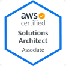

Consultor, conocedor de los distintos servicios y herramientas de AWS. Conocimiento mas teorico, como diseñar las soluciones.

Rol en el medio entre cliente y desarrolladores / implementadores de la solución.
Entiende al cliente, que quiere y que es lo que realmente necesita.
Tiene conocimiento técnico suficiente para poder diagramar una solución compuesta por una serie de servicios que trabajan en conjunto para cumplir con las necesidades del cliente.

_En este curso se va a ir más allá de la certificación, se va a agregar experiencia hands on._

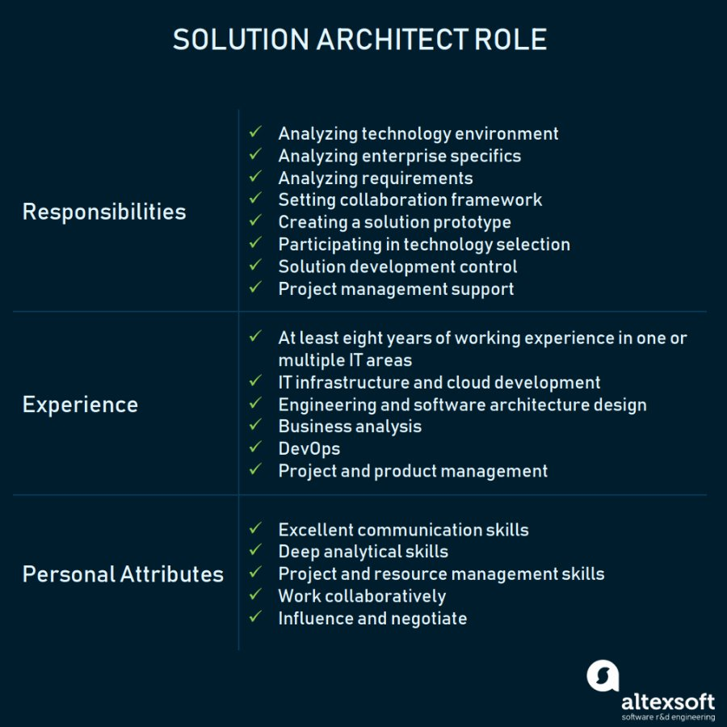

### 1. Virtualizacion

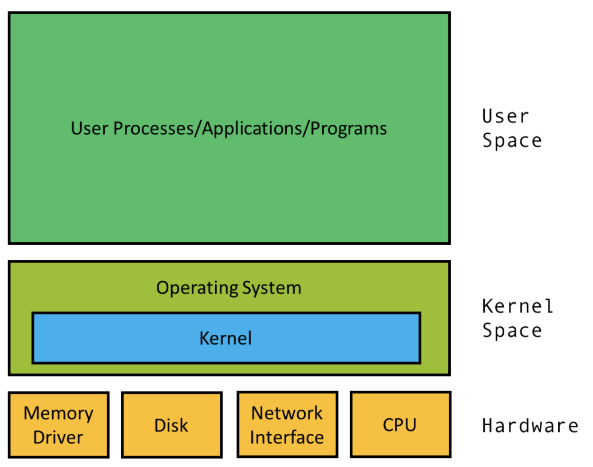

1. Recursos de sistema
    - Memoria RAM - almacenamiento temporal
    - Disco - mas lento, barato
    - CPU - procesamiento
2. Kernel - OS - modulo que coordina accesos a los recursos
3. Aplicaciones de usuarios necesitan recursos para correr

#### Evolución:
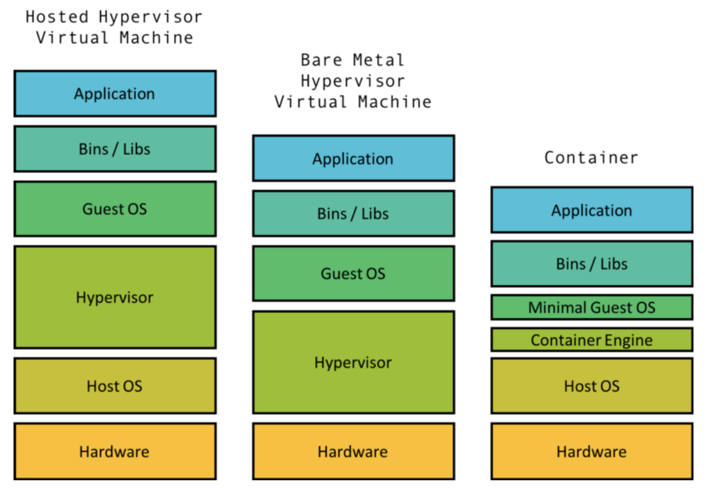

Se empieza a desacoplar el acceso al HW

1. Maquinas virtuales, hypervisor apps (virtual box, )
Maquina virtual separada del OS

2. Aparecen los contenedores (docker):
Son maquinas virtuales con OS reducido, y comparten una parte del OS con el Host OS, y se reduce el overhead de las VMs.
A < capas de VMs se pueden tener > VMs

### 2. Cloud Computing
Modelos - dependiendo de lo que me da el Cloud Provider
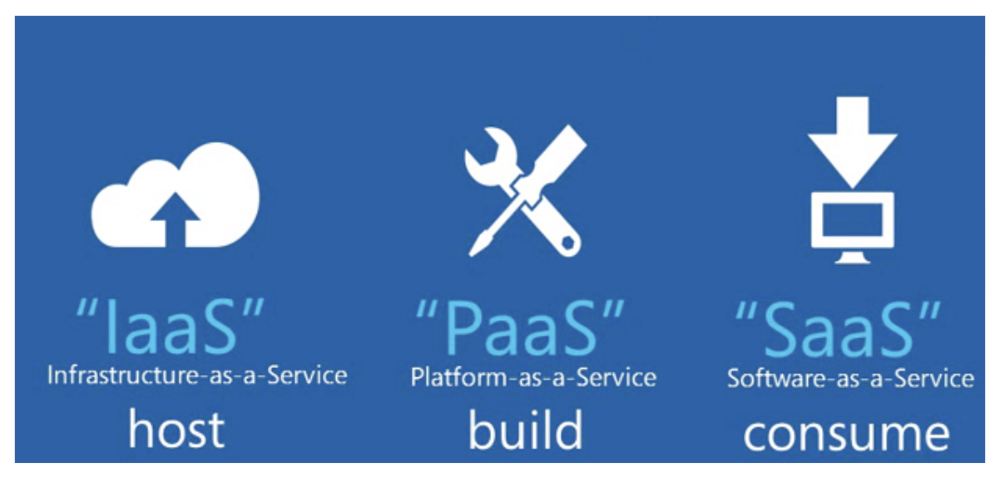

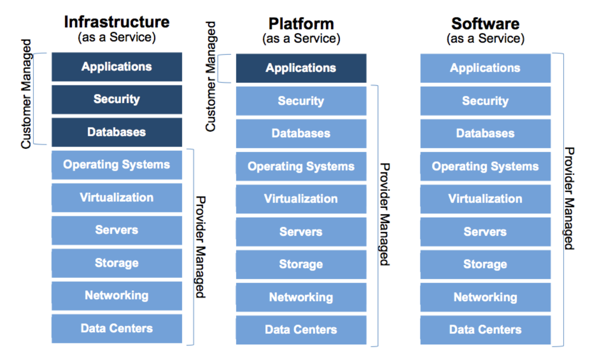

**IaaS**: Infrastructure-as-a-Service
Nos da host, configuro todo

**PaaS**: Platform-as-a-Service
Desarrolla el código, pero se olvida de la infra

**SaaS**: Software-as-a-Service
Gmail, google docs, salesforce
El usuario tienen la app funcionando y simple

Trade-off para elegir arquitectura y proveedores entre $/tiempo/desarrollo/conocimiento, 
y entre parte de negocio/técnica

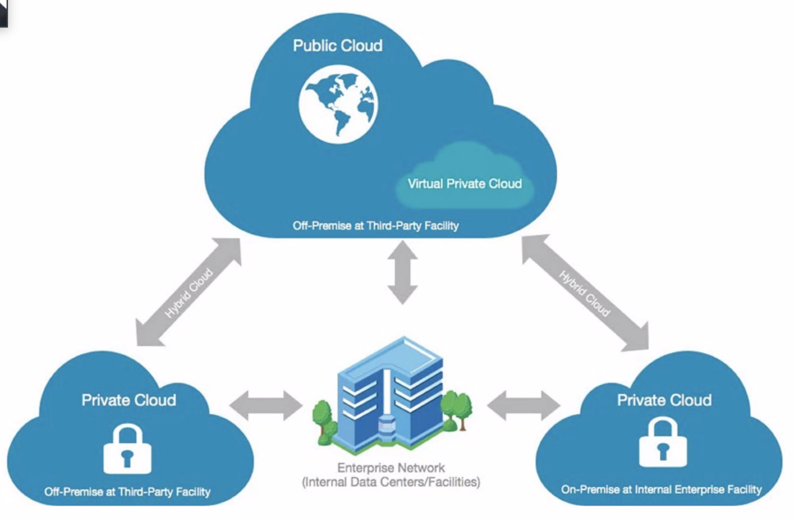

- Cloud Privadas - No accesibles desde la Web
- Cloud Publicas - Accesibles desde la www
- Cloud Privadas Virtuales (VPC) - No accesibles desde la Web, 
- Clouds Hibridas - Se usan mezclas de las 3 Nubes y On-premise Enterprise NW

### 3. Public Cloud Computing y Escalabilidad
Disponibiliza servicios a traves de internet, con APIs, programaticamente, webs, etc.

Es la prestación de servicios (servidores, almacenamiento, BDs, nw, sw, analytics e inteligencia) a traves de internet - la nube.

Se paga solo por los servicios que se utilizan, ayudando aÑ
 - reducir costos operativos,
 - ejecutar la infraestructura de la manera más eficiente,
 - escalar a medida que cambian las necesidades del negocio. 

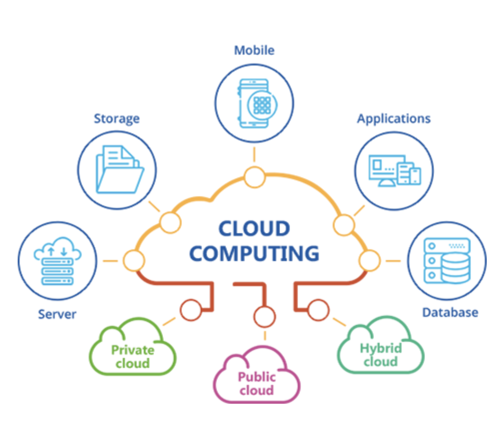

Los proveedores ofrecen web interfaces y APIs para poder aprovisionar y administrar los recursos que se necesiten y se paga mensualmente por lo utilizado.

El mercado actual se encuentra fuertemente concentrado en tres competidores donde Amazon tiene una ventaja significativa sobre el resto.

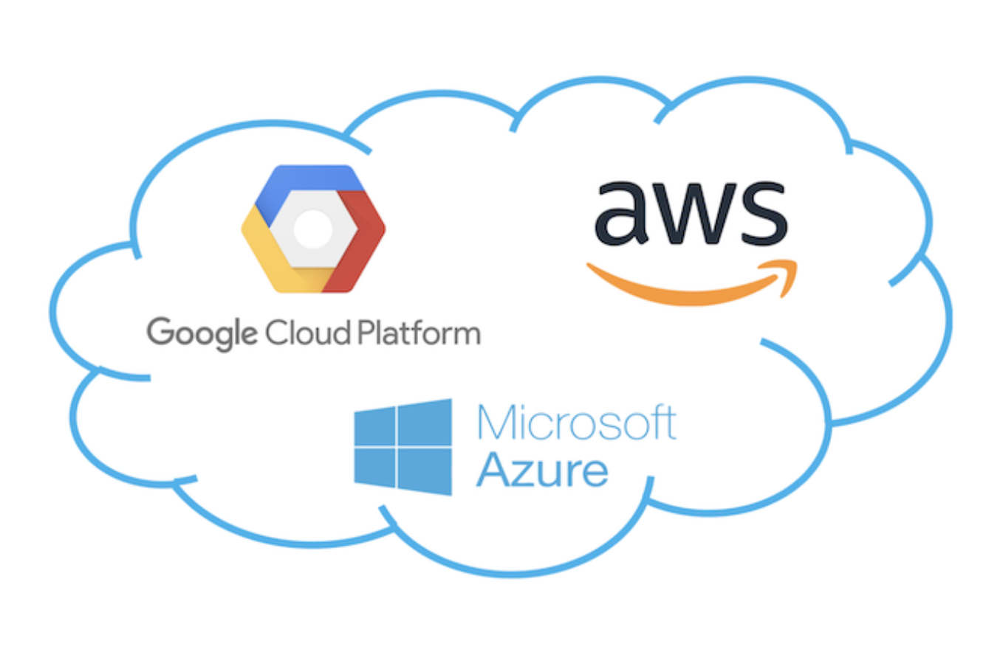

#### Ventajas:
1. Gastos variables vs inversion inicial en HW y SW
2. Dejar de adivinar la capacidad 
3. Aumentar velocidad y agilidad para disponibilizar recursos
4. Ahorro en aprovisionamiento y mantenimiento de un data centers
5. Alcance global con poco esfuerzo
6. Mayor seguridad

#### Desventajas:
1. Mayor costo para servicios 24/7 con uso de recursos estables
2. Lock-in cuando se utilizan servicios particulares del proveedor - ex. si uso servicios que solo ofrece AWS me va a ser difícil migrar a IBM
3. Menor flexibilidad de configuración de HW
4. Depender de otra empresa
5. Downtime

#### Conceptos Relevantes 
##### High-Availability vs Tolerancia a Fallas:
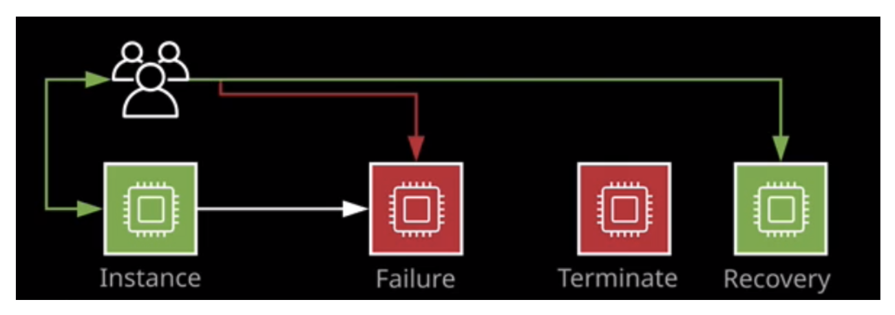
 Alta disponibilidad: tenemos un servicio o app en un VM o servicio virtual
 Si esta maquina falla, el servicio se recupera corriendo en otra maquina virtual
 Pero va a tener un tiempo de baja mientras ocurre este failover
 
 HA es el conjunto de Hw, sw y configuraciones que permiten que un sistema se recupere rápidamente en caso de falla (minimiza el tiempo de inactividad)

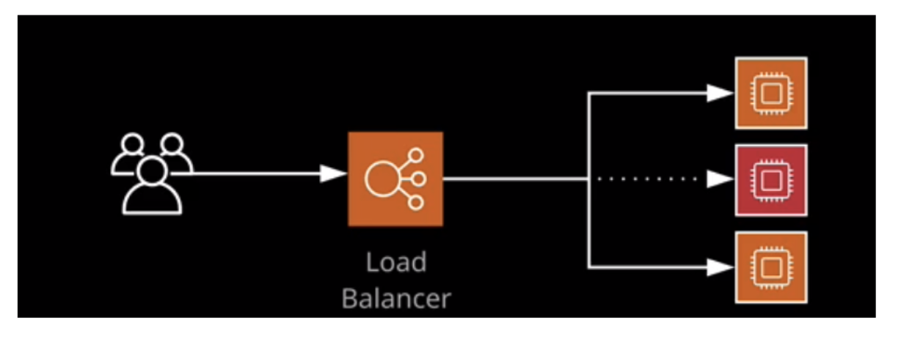
Fault tolerance: La falla de uno de los componentes (si mi servicio corre en varias maquinas) el usuario no lo nota
Se hace con un LB y un autoscaling group que aumenta o disminuye en base a metricas, y si tiene alguna falla se rutea a alguna de las maquinas que si esta funcionando bien

FT es el sistema diseñado para operar a traves de una falla sin impacto para el usuario. Es mas caro y complejo de lograr.

Trade-off: mejor serivio vs. mas $

##### Escalabilidad:
Como escalo mi servicio si le estan faltando recursos (memoria, cpu, etc)

Vertical: Le doy mas poder a mi maquina
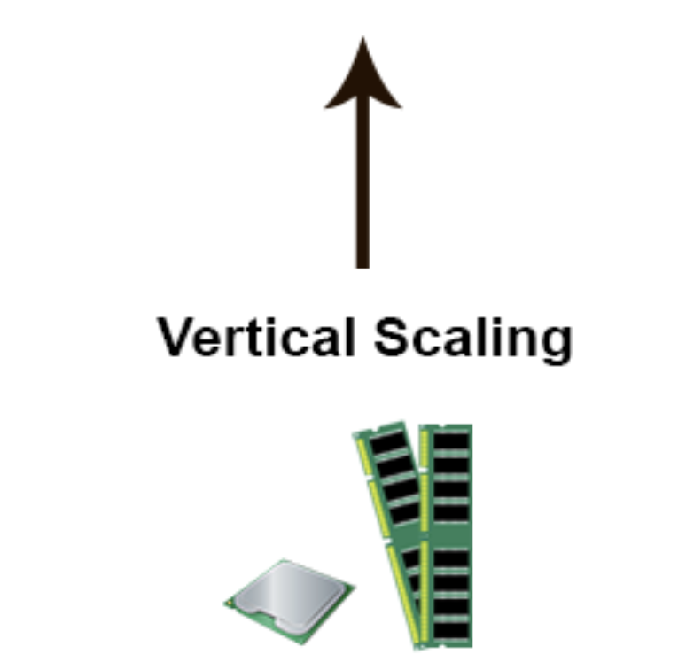

Horizontal: Agrego mas maquinas, sumando las capacidades. Ademas vas a necesitar un orquestrador.
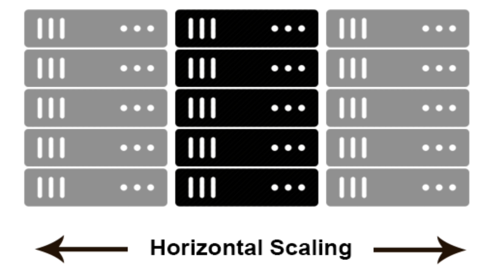

##### Clusters:
Coordina el trabajo de varias maquinas para que trabajen como si fueran una sola super machine con sus recursos sumados
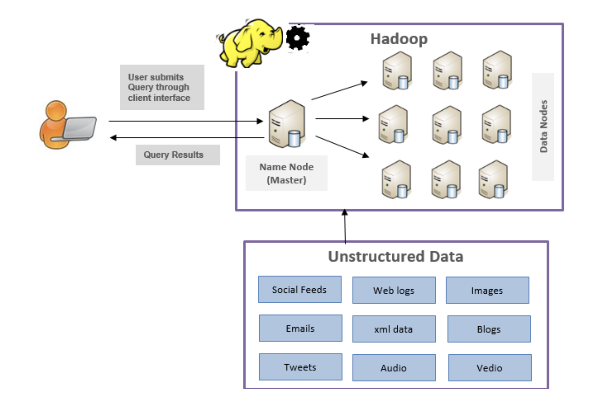

##### Arquitectura en capas:
En general las arquitecturas de apps desarrolladas por capas, tienen 3 capas. 
Si los 3 estan presentes en la misma base de codigo, se denomina aplicacion monolitica. Estos son dificiles de escalar.
Esto sucede aunque cada capa corra en serivicios independientes, pero de una sola instancia.

##### Monolitica vs componentes independientes - microservicios:
Si las capas se implementan como componentes aislados estos se pueden aprovisionar en maquinas o sistemas separados.
Esto facilita el escalado y manejo de cada capa de manera independiente ya que a menudo tienen necesidades diferentes.

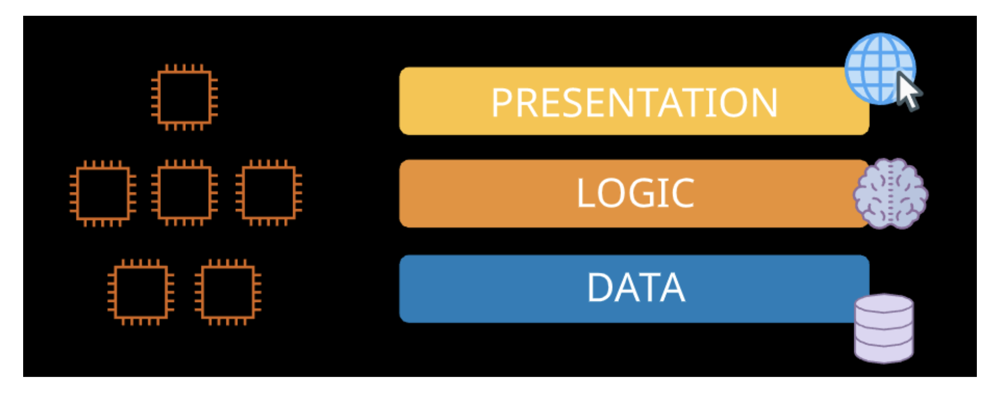

##### RPO y RTO:
**Objetivo del Punto de Recuperacion**: punto al que se revertira el sistema en caso de falla. El intervalo entre el momento de la falla y el RPO define la cantidad de datos que se perderian y que la empresa puede tolerar.
A menor RPO, mas costosa sera la solucion, pero menos impacto tendra en los clientes y negocio.

Otras soluciones son tener un servicio principal y uno secundaria, 

**Objetivo de Tiempo de Recuperacion**: duracion del tiempo y el nivel de servicio dentro del cual se debe restaurar un proceso de negocio despues de un desastre para evitar consecuencias inaceptables asocuadas con una interrupcion den la continuidad.
RTO = Cuanto tiempo tardo en recuperar despues de la notificacion del proceso comercial?

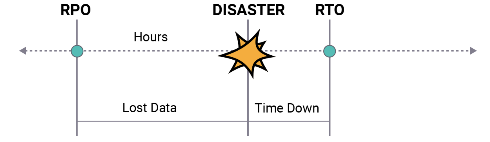

##### Estrategias de recupero
No todos los servicios ofrecen todas las estrategias, y hay que ver los trade offs para poder armar la solucion.
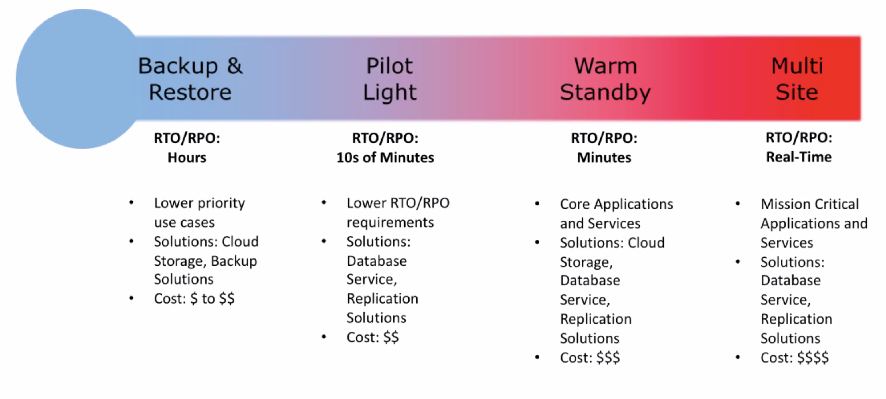

##### Cost Efficient Cost Effective

##### Security

##### Application Session State
App Web o mobile, los estados los vamos a querer ir guardando en diferentes lugares dependiendo de las necesidades.
Ej, para un juego querria un storage de estados rapido, para un banco querria uno mas seguro

##### Undifferentiated heavy lifting
Speech AWS - vos enfocate en tu area de expertise, y nosotros nos encargamos de la infrastructura

##### Porque AWS:
Cuadrantes de Gartner: Amazon es el lider del mercado
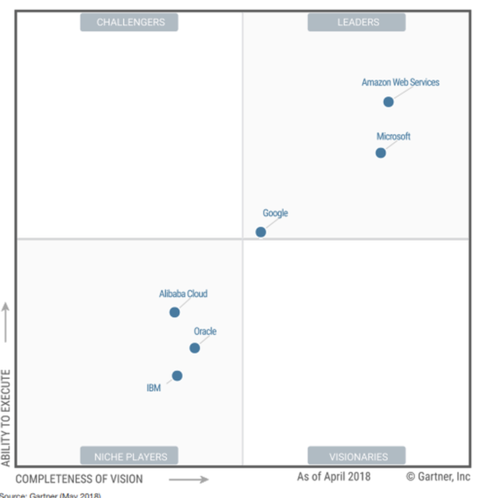

### 4. Amazon Web Services
AWS surge en 2006, ofreciento serivicios de infrastructura de IT a empresas en forma de servicios web.

AWS ofrece plataforma de infra altamente confiable, escalable y de bajo costo en la nube.
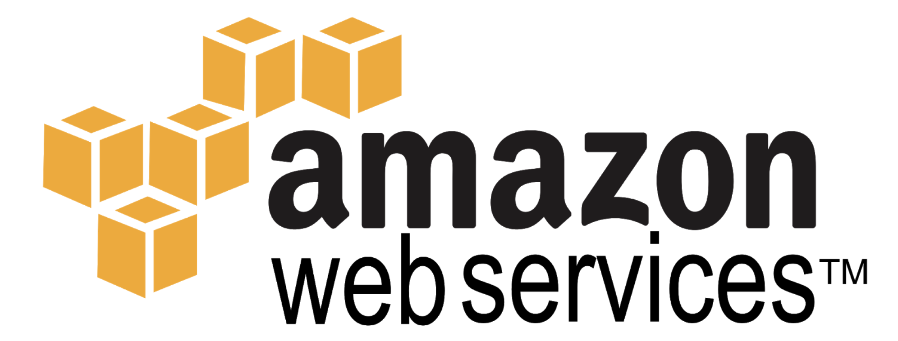

##### Clientes:
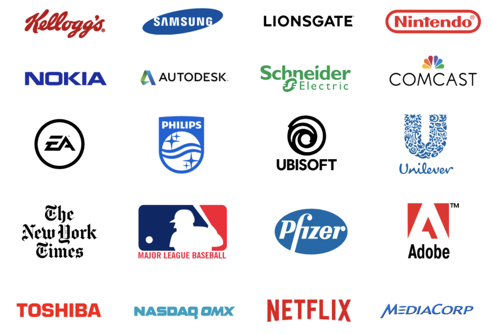

##### Data Centers de AWS:
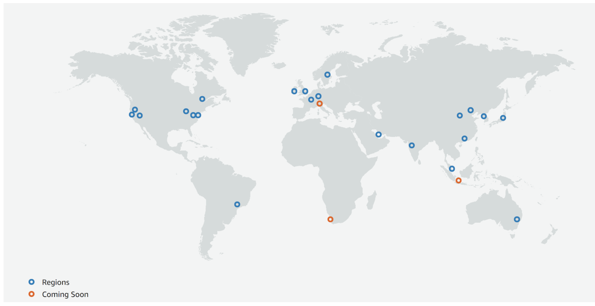

##### Availability Zones:
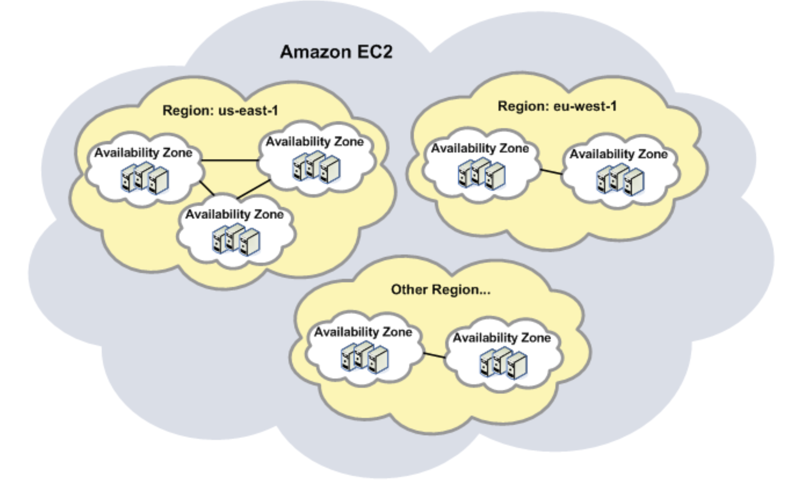

##### Servicios de AWS:
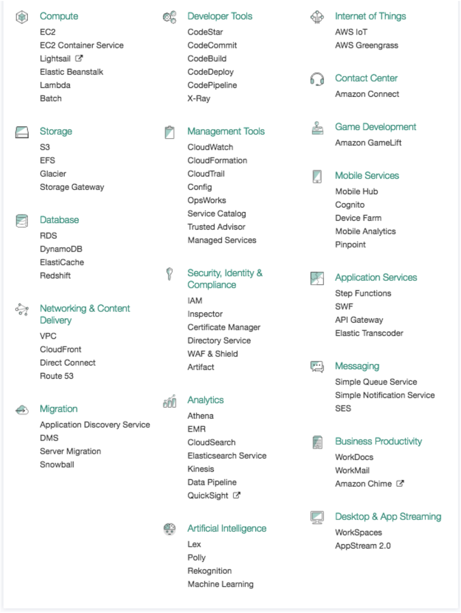

##### Modelo de Responsabilidad Compartida:
Para cada servicio hay que entender que partes de la seguridad son responsabilidad del usuario y cuales no.
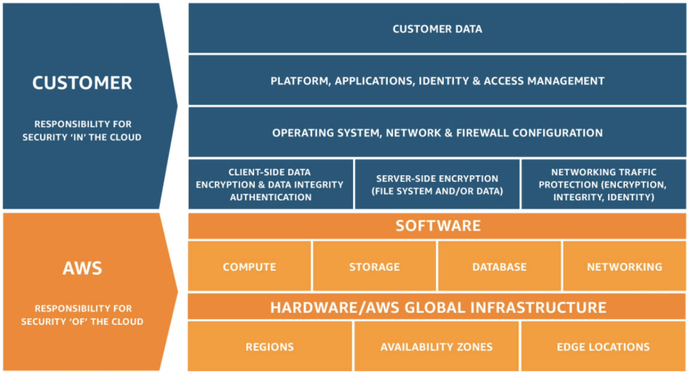

##### Cuentas de AWS:
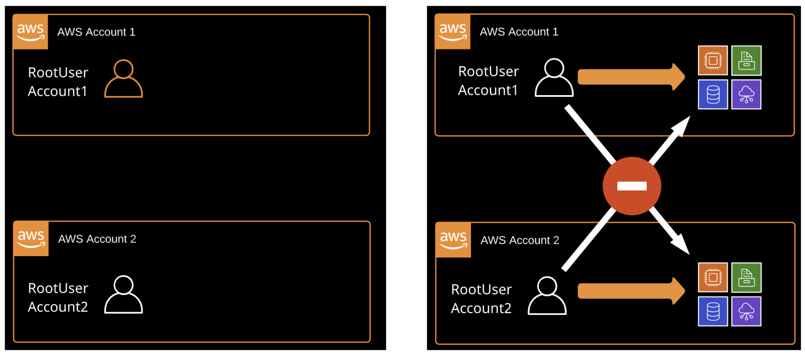

##### Billing en AWS:
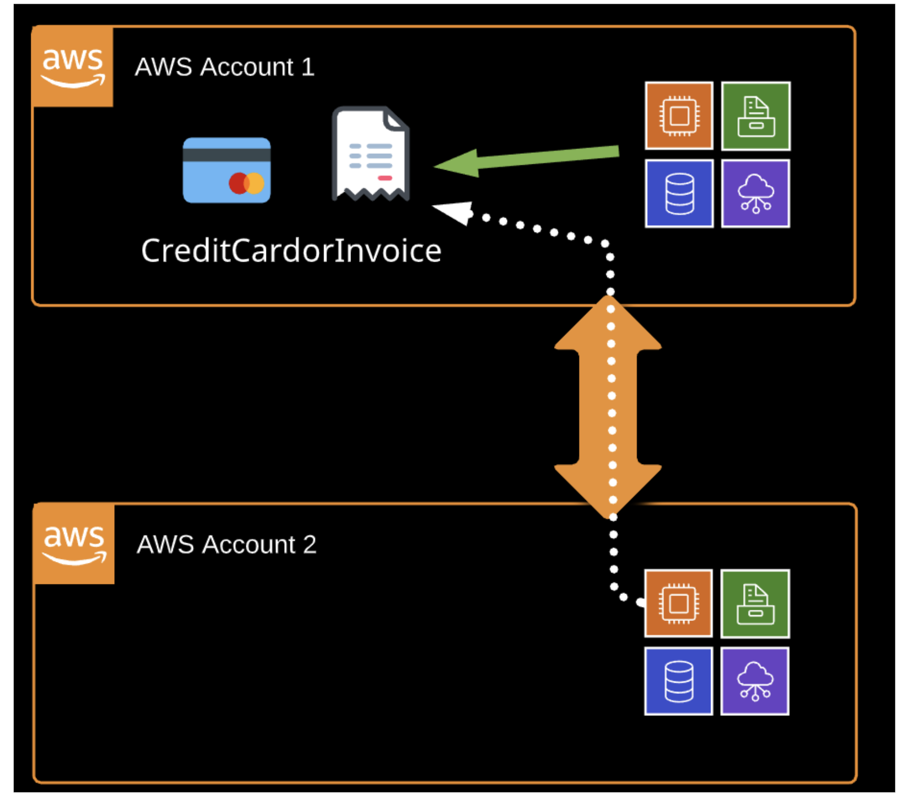

##### AWS Well Architected Framework:
-- Lo suelen tomar:

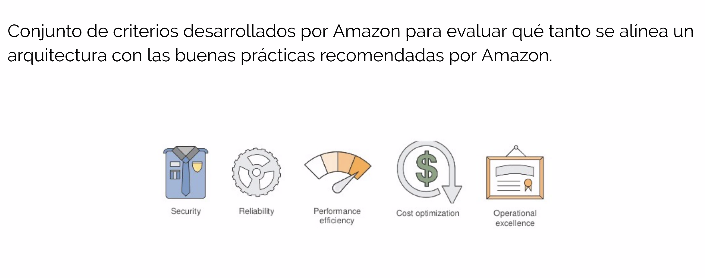

##### Reduccion de costos
1. Elegir el servicio mas adecuado segun nuestro caso de uso, know how, equipo, madurez
(segun PTO, TOR, necesidades tecnologicas, de recuperacion, de seguridad...)
2. Elegir el tipo de instancia adecuada segun nuestro workload
3. Reservar instancias que vamos a utilizar a largo plazo (pago de antemano 2 anos y baja el costo hasta un 70%)
4. Incrementar y decrementar el uso de recursos de acuerdo a las necesidades de nuestra aplicacion (autoscaling)
5. Utilizar el mercado Spot para capacidad de computo variable (precios de VM que varian segun la demanda, y se pueden obtener hasta a un 80% menos)
6. Utilizar Saving Plans (Se compromenten a utilizar una capacidad de computo por un largo plazo, y se obtiene un descuento importante)