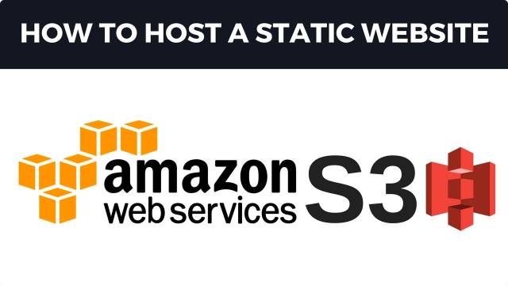
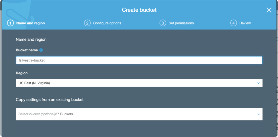
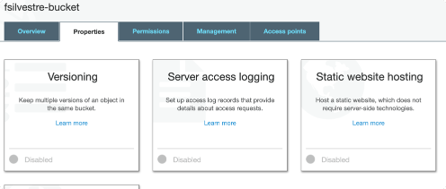
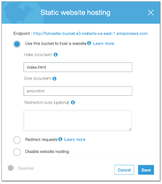
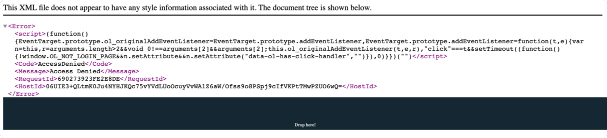
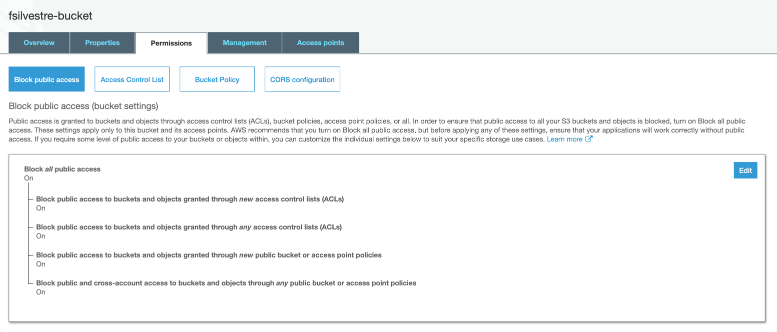
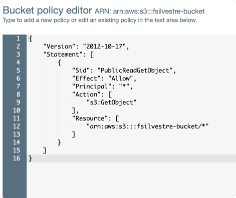
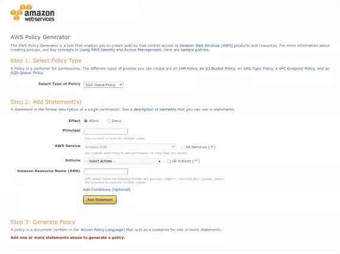
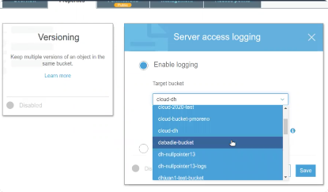
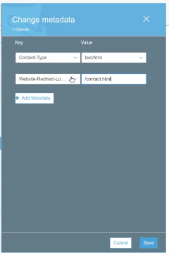

1. Elegir una web de [Drive](https://drive.google.com/drive/folders/1CPaQGsFCtdZM0tSYbEZflFat1m5eFury?usp=sharing), y probarla localmente

2. Ahora vamos a hostear la pagina web desde un bucket de Amazon S3: 
Puede alojar un sitio web estático en Amazon S3. En un sitio web estático, las páginas web individuales incluyen contenido estático. Un sitio web estático también puede contener scripts del lado del cliente. Por el contrario, un sitio web dinámico se basa en el procesamiento del lado del servidor, incluidos los scripts del lado del servidor como PHP, JSP o ASP.NET. Amazon S3 no admite secuencias de comandos del lado del servidor.

### Paso 1: Configurar el Bucket de S3

- Entrar a la consola de AWS, y dirigirse a la consola de S3 https://console.aws.amazon.com/s3/.
    
- Crear un nuevo Bucket 
   
    
- Subir la carpeta entera del sitio web al bucket
   

- Ir a las propiedades del Bucket, y Habilitar `Static website hosting`


- Choose Use this bucket to host a website.


- Completar nombre del `Index` document.
> When you configure a bucket for website hosting, you must specify an index document. 
Amazon S3 returns this index document when requests are made to the root domain or any of the subfolders. 



- Armar una pagina 404
    - Si desea proporcionar su propio documento de error personalizado para errores de clase 4XX, en Documento de error, ingrese el nombre de archivo del documento de error personalizado.
    - Si no especifica un documento de error personalizado y se produce un error, Amazon S3 devuelve un documento de error HTML predeterminado.
    

- Choose `Save`.

Si intentamos acceder a nuestro sitio en este momento obtendremos el siguiente error:



URL: https://fsilvestre-bucket.s3.amazonaws.com/index.html

### Paso 2: Editar permisos para poder acceder acceder a nuestro bucket como un sitio web estatico                       

De manera predeterminada, Amazon S3 bloquea el acceso público a su cuenta y depósitos.

- Ir a los `Permisos` de nuestro bucket, y dar `Edit`.


- Limpiar `Block all public access`, guardar y confirmar.


Ahora ya el bucket se puede hacer publico, pero por defecto sigue siendo privado.
Ahora se puede agregar una política de acceso para que los objetos del bucket se puedan leer públicamente. 


### Paso 3: Bucket Policy
After you edit S3 Block Public Access settings, you can add a bucket policy to grant public read access to your bucket. When you grant public read access, anyone on the internet can access your bucket.

- Dentro de los Permisos del bucket, ir a `Bucket Policy`.

- Copiar y pegar la siguiente policy en el `Bucket policy editor`, cambiando el `Resource` por el nombre del bucket:
    ```json
    {
        "Version": "2012-10-17",
        "Statement": [
            {
                "Sid": "PublicReadGetObject",
                "Effect": "Allow",
                "Principal": "*",
                "Action": [
                    "s3:GetObject"
                ],
                "Resource": [
                    "arn:aws:s3:::example.com/*"
                ]
            }
        ]
    }
    ```




### Paso 4: Probar el website
Entrar al endpoint desde donde se sirve nuestra web, y probar links, imagenes, etc.


Por linea de comandos:
---

Listamos los buckets:

```shell script
$ aws s3 ls --profile dh                                                               ✘ 146
2020-06-05 22:23:23 another-ls-webnonprofit
2020-06-05 19:05:21 bucket-mcasse
2020-06-05 19:02:53 cloud-dh
2020-06-05 19:30:01 dh-nullpointer13
2020-06-05 21:17:37 dh-nullpointer13-logs
2020-06-05 21:00:17 fsilvestre
```

Puedo listar los contenidos de un bucket:
```shell script
$ aws s3 ls fsilvestre-bucket --profile dh                                             ✘ 130
                          PRE aspiration/
```

```shell script
$ aws s3 ls fsilvestre-bucket/aspiration/ --profile dh
                           PRE css/
                           PRE fonts/
                           PRE images/
                           PRE js/
2020-06-10 10:05:13          0
2020-06-10 10:05:43      15726 about.html
2020-06-10 10:05:43      22117 blog-single.html
2020-06-10 10:05:43      18321 blog.html
2020-06-10 10:05:43      11978 causes.html
2020-06-10 10:05:43      10374 contact.html
2020-06-10 10:05:43        330 cors.html
2020-06-10 10:05:43      25620 index.html
2020-06-10 10:05:43      18614 prepros-6.config
2020-06-10 10:05:43      11969 services.html
```

Puedo subir un archivo:
```shell script
$ aws s3 cp error.html s3://fsilvestre-bucket/ --profile dh                            ✘ 255
upload: ./error.html to s3://fsilvestre-bucket/error.html
```

Vamos a crear un nuevo bucket con el comando mb (make-bucket):
```shell script
$ aws s3 mb s3://fsilvestre-web/ --profile dh                            ✘ 255
make-bucket: fsilvestre-web
```

Con el comando sync, podemos sincronizar una carpeta local con un bucket:
```shell script
./montana $ aws s3 sync . s3://fsilvestre-web/ --profile dh                            ✘ 255
upload: ./cors.html to s3://fsilvestre-web/cors.html
upload: css/slicknav.css to s3://fsilvestre-web/css/slicknav.css
upload: css/flaticon.css to s3://fsilvestre-web/css/flaticon.css
upload: css/owl.carousel.min.css to s3://fsilvestre-web/css/owl.carousel.min.css
upload: css/nice-select.css to s3://fsilvestre-web/css/nice-select.css
upload: css/magnific-popup.css to s3://fsilvestre-web/css/magnific-popup.css
upload: css/theme-default.css to s3://fsilvestre-web/css/theme-default.css
upload: ./error.html to s3://fsilvestre-web/error.html
...
```


Para generar policies se puede usar la siguiente herramienta, que se puede acceder desde el Policy Editor de los Buckets:
http://awspolicygen.s3.amazonaws.com/policygen.html



Nuestra policy deberia quedar:


- Loggear todos los requests que se hagan a nuestra pagina: Guardara un archivo de texto por cada persona que entra




- Redirigir el about.html -> contact.html
    
    Desde las propiedades del objeto `about.html`, editar la metadata y agregar la siguiente K-V:
    
    
    
    Si desea especificar reglas avanzadas de redirección, en `Editar reglas de redirección`, ingrese XML para describir las reglas.
    - Por ejemplo, puede enrutar condicionalmente solicitudes de acuerdo con nombres de clave de objeto específicos o prefijos en la solicitud.

- Denegar el acceso al about.html
    
    Generar una policy de `Deny` para la accion `Get-Object` al ARN /about.html
    
    

    Agregar la policy al bucket:
    
    

- Cargar por CORS un html del sitio de otro web

> **CORS**:  Cuando estas en un dominio, y queres saltar a otro dominio - no estas autorizado a cambiar de dominio asi por asi
> --  Si estoy en una web, no puedo pegarle a otra a menos que la otra web me autorice

Dentro de nuestros archivos `index.html`, al final agregamos:
  
```html
    <! Load External Page 
    <div id="cors"></div>
    <script>$("#cors").load("http://fsilvestre-bucket.s3-website-us-east-1.amazonaws.com/cors.html")</script>
    >
```

Esto nos va a pegar un pedazo de html del otro sitio web, pero para esto el otro sitio nos tiene que autorizar.

Si luego de editar nuestro `index.html` corremos el comando `sync`, solo se va a subir el archivo editado.

```shell script
$ aws s3 sync . s3://fsilvestre-web --profile dh                                                                                                                                                                                   ✘ 1 
upload: ./index.html to s3://fsilvestre-web/index.html     
```

Para habilitar el CORS desde el bucket fsilvestre-bucket:
 
 - Vamos a las propiedades de fsilvestre-bucket, Permisos, `CORS configuration` 
 
 
