# Clase 5: ELB y ASG
## Classic Load Balancer

Vamos a crear un LB clasico y vamos a hacer que reparta cargas entre 3 instancias de EC2 ya creadas (las que empiezan con ELB)

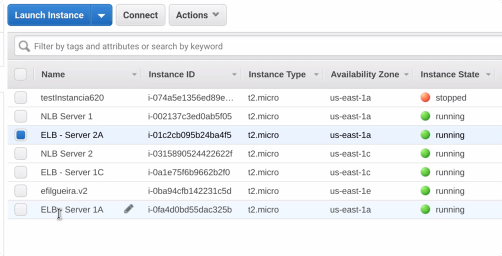

Landing page de los servidores:


Creamos un Load Balancer:
- EC2 
    - Load Balancers
        - Create Load Balancer
            - Seleccionamos **Classic Load Balancer**

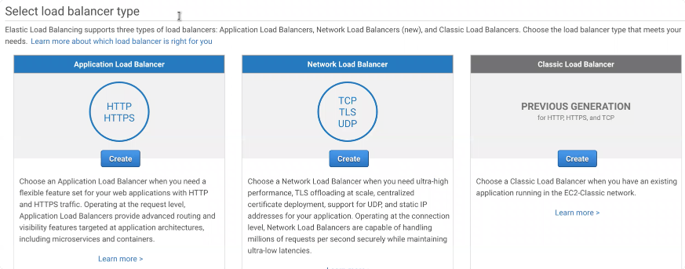

1. Definimos el LB
    

    - Por default todos los LB son externos, escuchan a internet. Tenemos la opcion **Create an internal load balancer** con lo que lo hacemos interno.
    - **Listener Configuration**: Aqui configuramos en el protocolo que va a estar escuchando este LB, y el puerto y protocolo con el que se va a comunicar con el resto de las instancias internas dentro de nuestra VPC. 
        - Escucha en capa 7, pero no toma decisiones en esta capa. 
        - Este LB esta escuchando en protocolo HTTP puerto 80 desde internet, y la instancia y puerto al que escucha desde la VPC.

2. Asignar / Crear un **Security Group**

    
    
    Escucha para todas las direcciones desde puerto TCP 80

3. Configurar los **Health Check** - Chequeo de sanidad de instancias

    
    
    Aqui configuramos la forma en la que el LB chequea que las instancias estan operativas.

4. Anadimos las instancias

    
    
    - Por defecto tenemos habilitado el **Cross-Zone Load Balancing**
    - Con **Connection draining** habilitado, si estamos usando auto scaling, si queremos reducir nuestro numero de instancias, el ELB le va a dejar de enviar trafico a las instancias que se deciden eliminar pero no va a interrumpir las sesiones que ya estaban activas. Le da tiempo para que cierre las sesiones abiertas.
    
5. Tag, Review, Create

    

    Vemos las propiedades de nuestro load balancer:
    
    
    

6. Ahora si le pegamos al DNS name del ELB de forma consecutiva, vamos a ir a los servicios de cada EC2, uno a uno.

7. Vamos a edir el Stickiness de nuestro ELB: 
    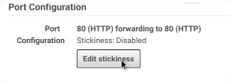
    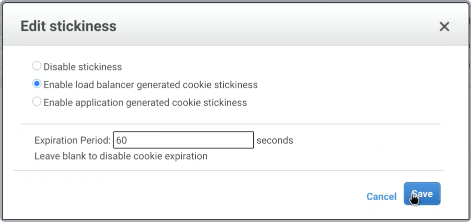
    
    Ahora por 60 segundos el ELB me va a direccionar al mismo server de EC2. 
    
    Si esta maquina esta caida, el ELB me va a redireccionar a cualquier otra.

## Application Load Balancer

Vamos a servir imagenes desde 3 Servidores de EC2 distintas, y cada servidor va a tener un grupo de imagenes propias.

- Server 1A va a tener imagenes de _montanas_, servidas bajo el subdomio /mountain/.
- Server 1C va a tener imagenes de _playas_, servidas bajo el subdomio /beach/.
- Server 2A va a tener imagenes de _desiertos_, servidas bajo el subdomio /desert/.

Vamos a crear un load balancer que nos permita dirigir el trafico a cada uno de los servidores en base al path.
Primero tenemos que crear los target groups.

1. Creamos **target group**:
    
    Vamos a: 
    - EC2 
        - Load Balancing 
            - Target Groups > **Create Target Group**

2. Seleccionamos hacia donde queremos redirigir el trafico: Instancias, direcciones IP, o funciones Lambda

    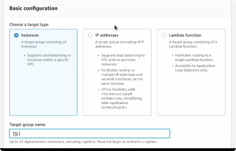
     
     - Creamos primero el TG-mountain-fsilvestre, y luego vamos a crear los grupos para beach y desert.
     - Dejamos Protocolo, puerto y VPC por default
     - En el Health Check le ponemos el archivo que debe buscar para verificar que el server esta sano.
        - En este caso *index.html*
        - Dejamos por default el resto de los parametros del health check.

3. Anadimos las instancias, en este caso el servidor 1A

    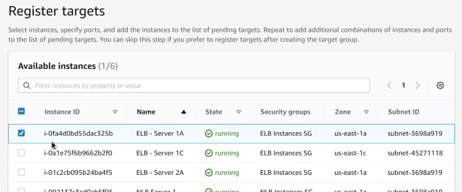
    
    - Dejamos el puerto por defecto 80
    - Click en `Include as pending below`
    
4. Creamos los otros dos TG.

    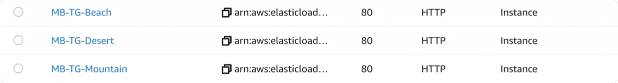

5. Creamos un Load Balancer de tipo Application
    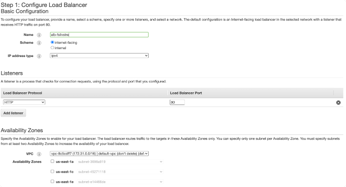
    
    - Dejamos que escuche a internet
    - En los listeners dejamos el protocolo HTTP puerto 80, que es donde va a estar escuchando a los TG
    - Vamos a seleccionar en que AZ vamos a estar trabajando, en nuestro caso `use-east-1a` y `us-east-1c`

6. Configure Routing
    
    Aqui vamos a nuestro Target Group, elijo uno solo y luego voy a elegir el resto:
    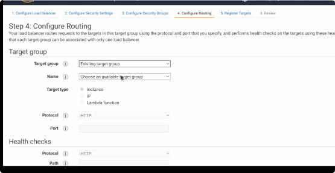
    
    - Una vez que seleccionamos nuestro TG, todas las opciones se setean con lo que configuramos cuando creamos el TG y aparecen griceadas.

7. Register targets
    
    - Aparecen las instancias que definimos cuando creamos el grupo

8. Review, Create
    

9. Nos paramos en nuestro LB, y podemos ver desde la tab de listeners las reglas de forwardeo.
    

10. Click en `View / Edit rules`
   
    Desde esta consola vamos a poder agregar las reglas para redirigir el trafico a los otros target groups.
    
    
    
    Agregamos una nueva regla de tipo IF `Path is ...`: 

    
    
    THEN 'Forward to ...':

    
    
    Creamos las reglas restantes:

    
    
11. Probamos

    

## Conexion a instancias EC2 con Windows

1. Descarga del cliente RDP: Para poder conectarse a las instancias EC2 con Windows deben tener instalado un cliente RDP (Remote Desktop Protocol).
    - Usuarios Windows: mRemoteNG
    - Usuarios Linux: Remmina
    - Usuarios MAC: Microsoft Remote Desktop

2. Conexión instancias EC2:
En cualquiera de las herramientas van a tener que crear una Nueva conexión y van a necesitar 3 datos:
    - Host
    - Usuario
    - Password

Estos 3 datos los provee AWS cuando seleccionamos nuestra instancia EC2 y hacemos click en Connect.

- Host = Public DNS 
- Usuario = User name (Generalmente es Administrator)
- Password = Hay que hacer click en Get Password y nos pedirá subir el Key Pair. Luego hay que hacer click en Decrypt Password.  


## Network Load Balancer

1. Creamos un NLB
    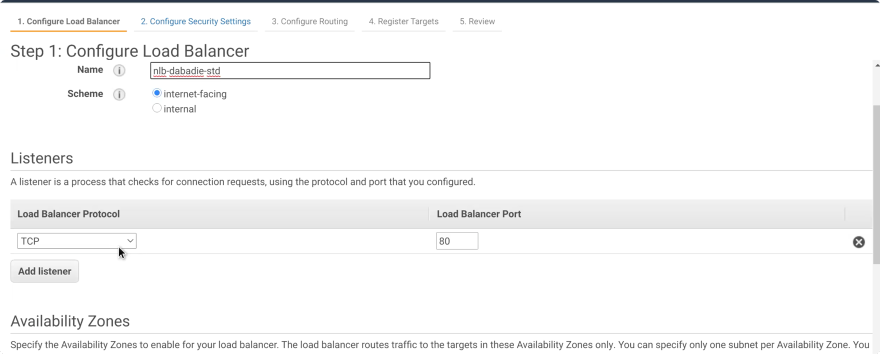
    - Nos vamos a conectar usando el puerto TCP 21
    - AZ: 1a y 1c
    
2. Creamos un nuevo target group
    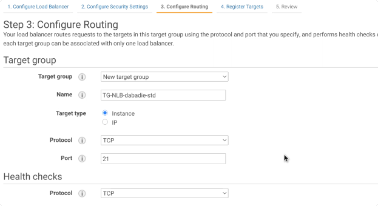
    
3. En Instancias, vamos a seleccionar las dos llamadas NLB Server 1 y 2, que tienen un Security Group y estan configuradas para recibir peticiones en el puerto 21. Cada una tiene un servidor FTP.
    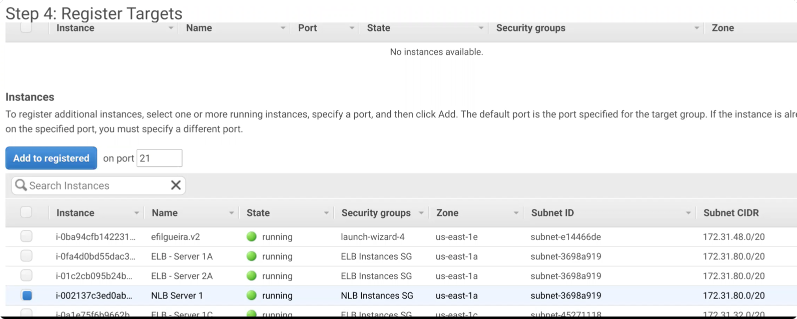

4. Review, Create, y chequeamos nuestro nuevo NLB
    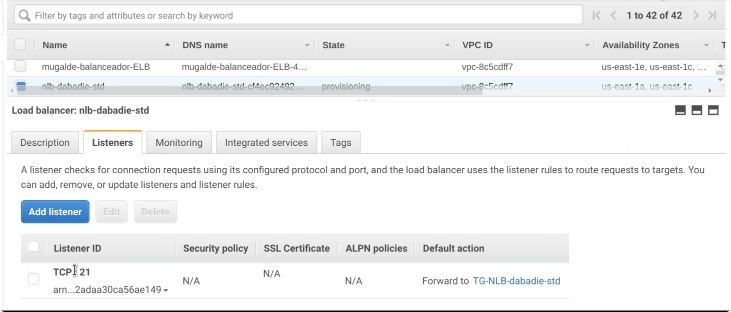

5. Ahora vamos a conectarnos usando FTP a nuestras instancias.
    Desde nuestra consola:
    
    ```shell script
    $ ftp
    $ ftp > o nlb-fsilvestre-cf4ec9226fb107.elb.us-east-1.amazonaws.com
       Connected to nlb-fsilvestre-cf4ec9226fb107.elb.us-east-1.amazonaws.com.
       220 DH Cloud Architect    Server 1
       Name (nlb-fsilvestre-cf4ec9226fb107.elb.us-east-1.amazonaws.com:flor): ^C
   $ ftp > exit
   
   $ ftp
   $ ftp > o nlb-fsilvestre-cf4ec9226fb107.elb.us-east-1.amazonaws.com
       Connected to nlb-fsilvestre-cf4ec9226fb107.elb.us-east-1.amazonaws.com.
       220 DH Cloud Architect    Server 2
       Name (nlb-fsilvestre-cf4ec9226fb107.elb.us-east-1.amazonaws.com:flor): ^C
   $ ftp > exit
    ```
    
    El NLB me va a conectar cada vez a un servidor distinto.
    
## Auto Scaling Group

1. Creamos un nuevo Launch Configuration desde:
    - EC2
        - Auto Scaling
            - Launch Configuration

2. Elegimos AMI de Amazon Linux 2
    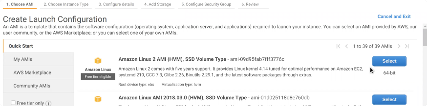

3. Instance type: t2.micro
    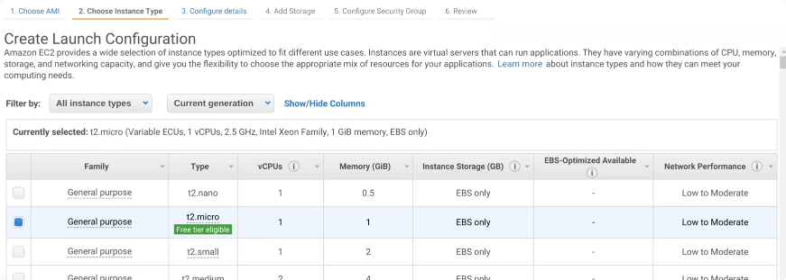

4. Configuration details
    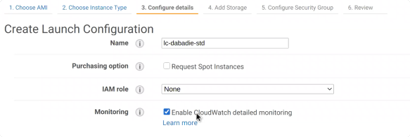
    
    - Hay que habilitar el detailed monitoring de CloudWatch. Por defecto CW monitorea toda la infraestructura de AWS cada 5 minutos. Con esta opcion se monitorea cada 30 segundos. 

5. Dejamos Storage y Security group por defecto, review y create Launch Configuration.
    - Importante guardar la Key Pair en este paso
    
    Con este template vamos a poder crear nuevas instancias.

6. Vamos a Auto Scaling group y creamos uno nuevo, seleccionando la opcion de Launch Configuration y eligiendo el LC que creamos recien.
    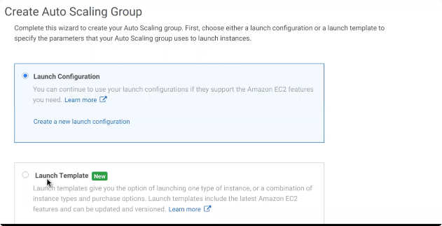

7. Configuramos nuestro ASG
    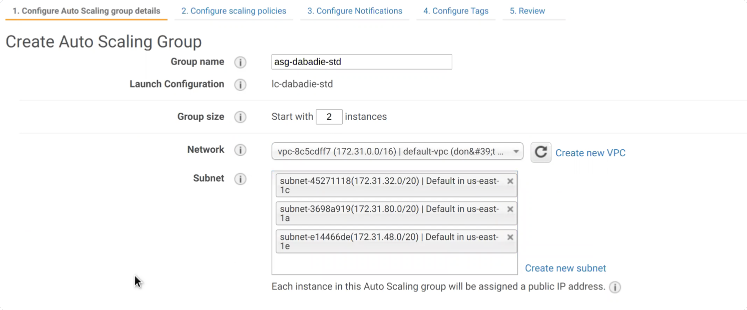

    - **Group size** es con el numero de instancias con que queremos comenzar - nuestro Desired Number Inicial.
    - Subnet ponemos las AZs que queremos que se creen nuestras instancias. Si pongo varias se van a ir repartiendo las instancias en todas ellas.
    
    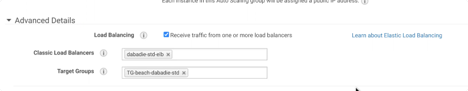
    - En Advanced Details: **Load Balancing** nos indica que queremos recibir trafico de load balancers
    - Habilitar el Detailed monitoring de CloudWatch

8. Configurar Scaling Policies
    - Seleccionamos `Use scaling policies to adjust the capacity of this group`
    
    - En `Scale between` ponemos cantidad minima y maxima de instancias
    - Seteamos el valor deseado (maximo) de Avg CPU Utilization en 80
        - Si se supera este numero va a crecer el numero de instancias.
    - **Disable scale-in**: la cantidad de servidores siempre va a crecer, pero no va a decrecer solo nunca

9. Default el resto, review, create
    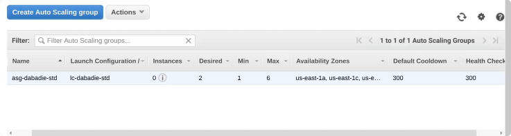
    
10. Vamos a agregar un policy nuevo a nuestro ASG, desde propiedades del ASG, Scaling Policies, `Add Policy`
    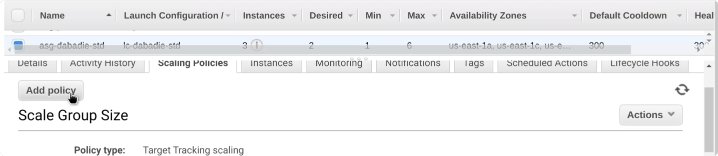

11. Seleccionamos abajo la opcion `Create a simple scaling policy`
    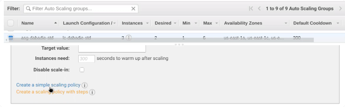
    
    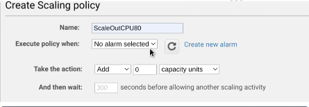

12. Creamos una nueva alarma
    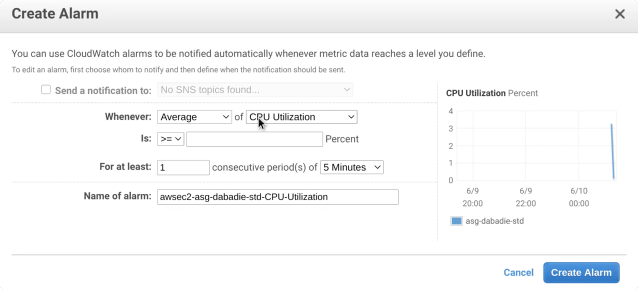
    
    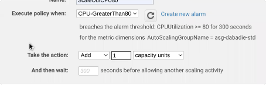
    
    Esta nueva policy va a aumentar las instancias cuando las CPU sean mayor que 80%.

13. Puedo chequear el estado de las alarmas que cree en CloudWatch
    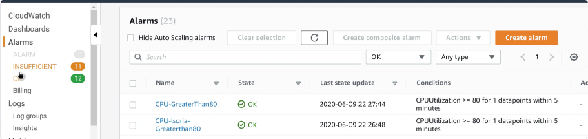