# Hands On - Resolucion de nombres

- Creamos 3 instancias en continentes distintos a las cuales les vamos a
  instalar un Servidor Web con un “Hello World”.
- Tenemos que tener un Security Group y una key en cada Region.
- Nos llevamos los DNS públicos e IPs de cada una.

1. Vamos a la consola de Amazon EC2, y vamos a crear 3 instancias nuevas de
   Linux AMI, tipo t2.micro. Cada una en una AZ distinta:

   - N. Virginia (us-east-1)
   - London (us-west-2)
   - Sao Pablo (sa-east-1)

2. En `User Data` vamos a copiar el siguiente bootstrap script, poniendole la
   zona en el mensaje de bienvenida:

   ```shell script
   #!/bin/bash
   yum update -y

   # instalamos apache y lo inicializamos
   yum install httpd -y
   service httpd start

   # lo configuramos para que arranque al inicio
   chkconfig httpd on

   # Vamos a la pagina web de nuestro apache
   cd /var/www/html

   # Escribo nuestro mensaje en el index.html de nuestro server web
   echo "<html><h1>Hello Cloud Architects! This is a Web Server in
   </h1></html>" > index.html
   ```

3. Dejamos Storage y Tags por default, y en Security Group seleccionamos o
   creamos uno apto para web servers:

   - Tipo HTTP, protocolo TCP, permitimos ingreso al puerto 80 a todo internet
     (0.0.0.0/0, ::/0)
   - Para poder administrarlo abrimos SSH/TCP, puerto 22 (0.0.0.0/0)
   - Para habilitar el PING, All ICMP - IPv4 (Capa 3), para Protocol All, Port
     N/A, Source 0.0.0.0/0

4. Review, Create, y creamos un Key Pair, o seleccionamos alguno que ya tengamos
   almacenado en nuestras maquinas.

5. Anotamos las IPs publicas de nuestros 2 servers. Esta se encuentra en la
   descripcion de la instancia como `IPv4 Public IP` 34.238.159.95 NV
   3.10.227.56 Lon 18.231.121.112 SP

   Si vamos a cada IP desde nuestro browser debemos poder acceder a nuestra web:
   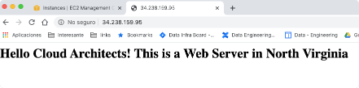

6. Apuntamos el server de North Virginia en el naked domain
   (cloudarchitects.com.ar) con un registro A

   - Vamos a Route 53, a Hosted Zones, y click en `Create Record Set`
   - `Name` lo dejamos vacio
   - `Type` A
   - `TTL` +1m
   - `Value` ponemos la IP de north virginia

7. Apuntamos el server de London en london.cloudarchitects.com.ar

   - `Create Record Set`:
   - `Name` = `london`
   - `Type` A
   - `TTL` +1m
   - `Value` ponemos la IP de Londres

8. Apuntamos el server de Sao Paulo en saopaulo en www.cloudarchitects.com.ar

   - `Create Record Set`:
   - `Name` = `www`
   - `Type` A
   - `TTL` +1m
   - `Value` ponemos la IP de San Pablo

9. Ahora para probarlo hay que tener en cuenta que el browser a veces nos oculta
   el www.

10. Una forma mas robusta de probaro: (los record set toman un tiempo en
    propagarse) https://www.whatsmydns.net/#A/www.cloudarchitects.com.ar

11. ¿Y si queremos que www.cloudarchitects.com.ar apunte a
    cloudarchitects.com.ar?

    - Modifico el registro del `www`
    - `Type` = CNAME
    - `TTL` +1m
    - `Value` = cloudarchitects.com.ar

## Routing policies

Vamos a distribuir el trafico usando cada una de las politicas de ruteado.

### Routing policy: Simple

1. Limpiamos los A y CNAME Record sets que creamos en la seccion anterior.
2. Creamos un Record Set tipo A, TTL +1m, Dominio naked (Name empty)
3. En value ponemos en lineas separadas por enter las 3 IPs de nuestros
   servidores.
4. `Routing Policy` seleccionamos `Simple`

   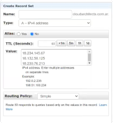

5. Cuando lo vamos a probar el browser lo va a cachear, y se va a quedar siempre
   con la misma respuesta.

   

6. Lo probamos en DNS Checker, y vemos que resuelve a las 3 IPs

   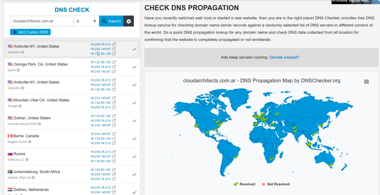

7. Desde Amazon/Route53 podemos ir a "`Test Record Set`"

   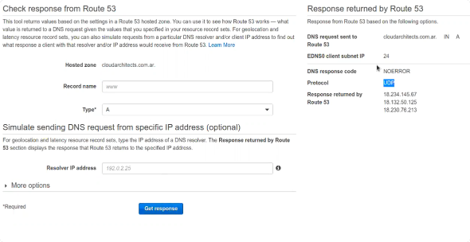

   - Si lo pido varias veces me va a ir cambiando el orden

### Routing policies: Weighted

Permite distribuir el tráfico basado en diferentes pesos asociados. Vamos a
distribuir el 80% del tráfico a Sao Paulo, el10% a North Virginia y el 10%
restante a London

1. Limpiamos los A y CNAME Record sets que creamos en la seccion anterior.
2. Creamos un Record Set tipo A, TTL +1m, Dominio naked (Name empty), en value
   ponemos la IP de nuestro servidor de San Pablo
3. `Routing Policy` seleccionamos `Weighted`

   - `Weight` = 80
   - `Set ID` = San Paulo

4. Creamos un Record Set tipo A, TTL +1m, Dominio naked (Name empty), en value
   ponemos la IP de nuestro servidor de Londres
5. `Routing Policy` seleccionamos `Weighted`

   - `Weight` = 10
   - `Set ID` = London

6. Creamos un Record Set tipo A, TTL +1m, Dominio naked (Name empty), en value
   ponemos la IP de nuestro servidor de North Virginia
7. `Routing Policy` seleccionamos `Weighted`

   - `Weight` = 10
   - `Set ID` = N. Virginia

   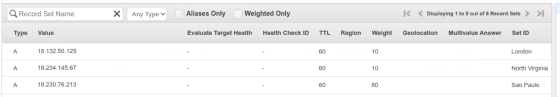

8. Lo testeamos con `Test Record Set` y `DNSChecker, y vemos que la mayoria del
   tiempo (80%) deberia contestarnos con San Pablo
   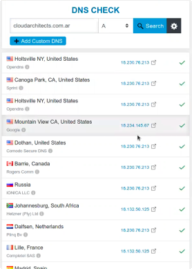

Vamos a agregar Health Checks:

1. Vamos a Route53 / Health Checks, y creamos 3 veces `Create health check`
2. Completamos para cada una de nuestras zonas:

   - Name = <Nombre de nuestra zona>
   - Specify endpoint by = IP address
   - Protocol HTTP
   - IP = <IP de nuesro server>
   - Puerto 80
   - Path /index.html

   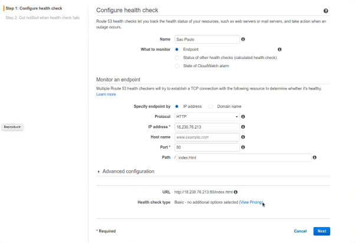

   En opciones avanzadas puedo configurar los tiempos de health check,
   reintentos, etc.

   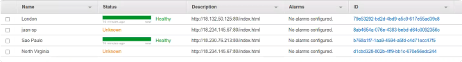

3. Volvemos a Hosted zones, y en los registros de cada zona asignamos el health
   check correspondiente con la opcion 'Associate with Health Check'

   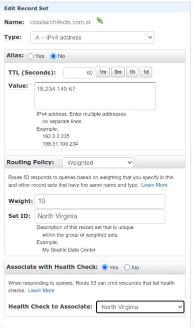

   Si alguno de los Record Set falla el Health Check Route53 lo va a remover y
   no le va a enviar tráfico hasta que no esté disponible.

4. Apagamos la instancia de Sao Paulo.

   - El Health Check debería empezar a fallar (Paciencia).

5. En el "Test Record Set" vemos como Route53 dejó de mandarle tráfico, y en
   DNSChecker deja de aparecer la ip de SP.

   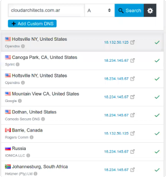

6. Volvemos a prender la instancia, y vemos que el Health check no vuelve a
   Healthy nunca porque la IP cambio (para que no cambie hay que pagarla).

7. Si vamos a querer apagar y prender maquinas, hay que allocar una IP Elastica
   y asignarla la instancia.

   - Vamos a EC2 / Network & Security / Elastic IP
   - `Allocate Elastic IP address`
   - Seleccionando la ip creada, seleccionamos 'Associate Elastic IP'
   - Seleccionamos la instancia a la que queremos asociarle la IP

   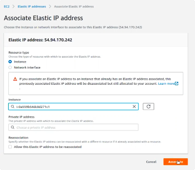

8. Colocar la nueva IP en el Health Check y en el Record Set.
9. Volvemos a testear la Routing Policy (Paciencia).

### Routing policies: Latency

Distribuye el tráfico basado en el servidor que nos responde más rápido.
_Posiblemente_ basado en la Region.

1. Limpiemos los anteriores.
2. Creamos 3 nuevos Record Sets, uno por zona.

   - Ponemos la IP del servidor de la zona
   - `Routing policy` = Latency
   - `Region` seleccionamos la region de la zona
   - `Set ID` ponemos el nombre de la zona para identificarlos mas facilmente
   - Agregamos los Health Check que creamos previamente

3. Desde nuestro Browser seguramente Sao Paulo es el que nos responde.
4. Desde [DNS Checker](https://www.whatsmydns.net/#A/cloudarchitects.com.ar)
   podemos ver como se resuelve diferente según la latencia.

   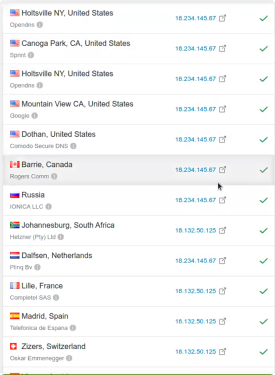
   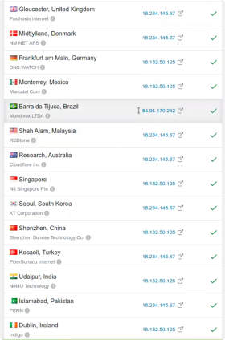

### Routing policies: Failover

Es para cuando queremos crear una configuración Activo / Pasivo o Primario /
Secundario.

Como? Utiliza también los Health Checks para saber si el primario está vivo. -
Cuando el Activo falla, switchea al Pasivo.

1. Limpiemos los anteriores.
2. Creamos dos Record Sets con `Routing Policy` `Failover`, uno con
   `Failover Record Type` `Primary`, y el otro `Secondary`

   - Agregamos a Sao Paulo como Primario y a North Virginia como Secundario.

3. Paramos la instancia de Sao Paulo.
4. Desde https://www.whatsmydns.net/#A/cloudarchitects.com.ar podemos ver como
   cambia la resolución.
5. Volvemos a prender la instancia de Sao Paulo.
6. Verificamos que volvemos al estado inicial.

### Routing policies: Geolocation

Donde va a ser enviado el tráfico basado en la ubicación de donde se origina las
queries de DNS. Por Continentes o Países.

1. Limpiamos lo anterior
2. Creamos 3 Records con `Routing Policy` `Geolocation`
   - En Location elegimos cada uno de los continentes, y ponemos en valor la IP
     del servidor apropiado.
3. Configurar para que los clientes de cada continente le peguen al servidor de
   su continente:

   - American clients to North Virginia
   - European clients to London
   - Others to Sao Paulo

   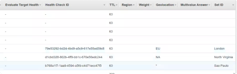

4. Desde https://www.whatsmydns.net/#A/cloudarchitects.com.ar podemos ver como
   se resuelve diferente según el continente.

### Routing policies: Multivalue

Es igual al simple pero permite poner Health Check en cada Recurso. Si falla
algún Recurso (Basado en su Health Check) Route53 lo va a remover.

1. Limpiamos lo anterior
2. Creamos 3 Record sets de tipo Multivalue
3. Les agregamos los health checks e ips de cada zona
4. Podemos verlo en el "Test Record Set".
5. Paremos Sao Paulo.
6. Vemos en "Test Record Set" como solo van a quedar dos registros.

### Propuesta Práctica

- Los sitios que deployaron la semana pasada en S3, apuntarles un subdominio
  dentro de \*.cloudarchitects.com.ar.

1. Creamos un nuevo bucket de S3 con nombre `fsilvestre.cloudarchitects.com.ar`
2. Copiamos el contenido de nuestro sitio en el nuevo bucket
3. Configuramos el bucket para que sirva como Sitio Web estatico
4. Configuramos el bucket para que sea accedible publicamente
5. Agregamos el policy para hacer el bucket efectivamente publico

6. Creamos un nuevo Record desde Route 53

   - Name: `fsilvestre`
   - Type: `CNAME`
   - Value:
     `fsilvestre.cloudarchitects.com.ar.s3-website-us-east-1.amazonaws.com`
   - Routing Policy: `Simple`

   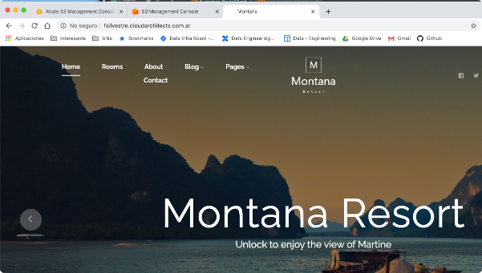

- Los sitios que deployaron el martes con ELB, apuntarles un subdominio dentro
  de \*.cloudarchitects.com.ar. (Es necesario crear nuevamente los ALB)
  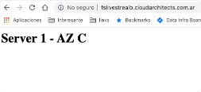
