# Registro nombres de dominio

### Registremos un dominio en nic.ar

#### Pre-requisitos

Para poder comprar un nombre de dominio desde este proveedor necesitamos una
Clave Fiscal nivel 2 de la AFIP.

[AFIP - Como sacar Clave Fiscal 2](https://www.afip.gob.ar/claveFiscal/informacion-basica/solicitud.asp)

#### [Como registar un Dominio en Nic ar](https://nic.ar/es/ayuda/instructivos/registro-de-dominio)

1. Vamos al sitio de [nic.ar](http://nic.ar) 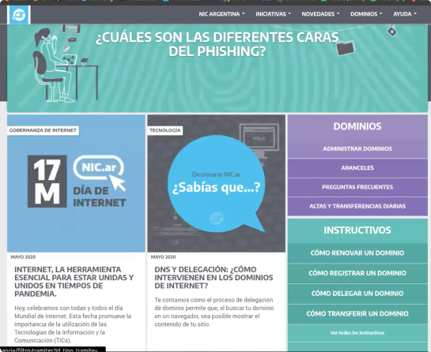

2. Click en Administrar Dominios,
3. Nos redireccionan al portal de la AFIP, en el que hay que ingresar con CUIL y
   Clave Fiscal.
4. Ingresamos el nombre de dominio que estamos interesados
   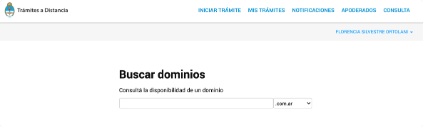
5. Si elegimos un nombre ya tomado nos va a aparecer la opcion de disputarlo
   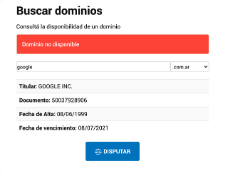
6. Cuando elijamos un nombre disponible nos va a dar la opcion de registrarlo
   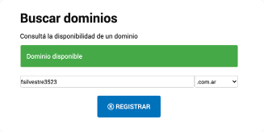
7. En el siguiente paso vamos a confirmar nuestros datos personales,
8. Y por ultimo vamos a poder pagar el tramite.

   - El valor hoy (Junio 2020) del tramite del registro de nombre de dominio es
     de \$270 (pesos argentinos).

9. Luego de realizado el pago vamos a poder ver nuestro nuevo dominio en nuestra
   lista de `Mis Dominios`

   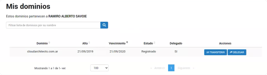

10. Damos click en `Delegar` para poder administrar nuestro DN desde Amazon.
11. Desde esta nueva consola vamos a poder configurar quien queremos que maneje
    nuestro dominio.

    - Desde `+ Agregar una nueva delegacion` podemos agregar los hosts que nos
      va a proveer el servicio desde donde vamos a manejar nuestro dominio.

    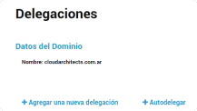

    - En el caso de Amazon, este nos va a proveer por ejemplo con los siguientes
      hosts: (Mas abajo vemos como se hace esto) 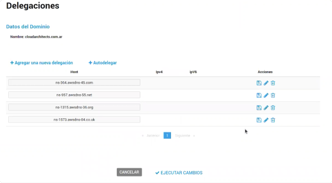

### Registremos un dominio en GoDaddy

1. Vamos al sitio de [GoDaddy](ar.godaddy.com) 

2. Vamos al tab de [Dominios](https://ar.godaddy.com/domains/domain-name-search)
   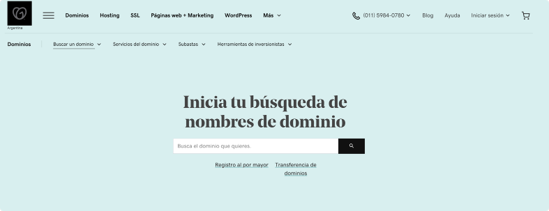

3. Buscamos el nombre que nos interese, y si esta ocupado nos va a ofrecer otras
   opciones 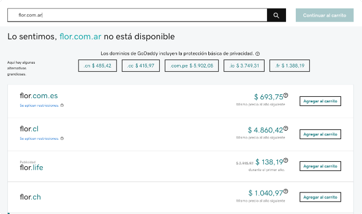

4. Cuando encontramos un dominio disponible, podemos agregarlo al carrito y
   comprarlo 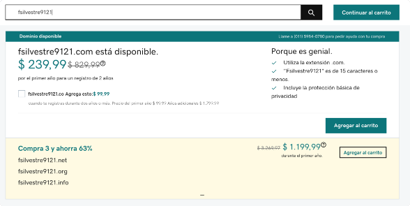

### Registremos un dominio en AWS

1. Vamos al servicio de
   [Route53 de Amazon](https://console.aws.amazon.com/route53/home?#)
   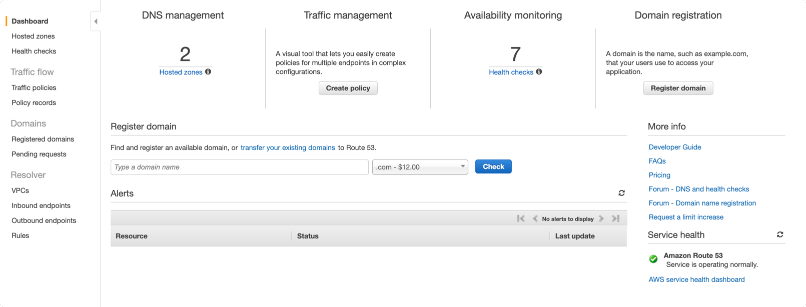

2. Buscamos el DN donde dice `Type a domain name`
3. Si esta disponible podemos agregarlo al carrito, y tambien nos va a ofrecer
   otras extensiones 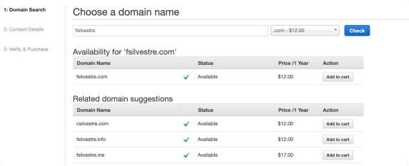

# Delegar nombres de dominio

Una vez que compramos el nombre de dominio podemos delegarlo a Amazon. Si este
DN ya lo compramos desde AWS este paso no hace falta.

1. Vamos a Route53 Hosted Zones.

   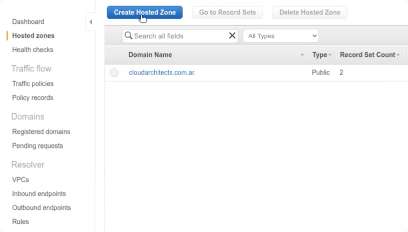

2. `Create Hosted Zones`

   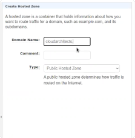

   - Ponemos el Domain Name que compramos y le damos a crear.

3. Amazon nos va a crear dos tipos de registros: NS y SOA

   - NS: Name Server
   - SOA: Start of Authority Record

4. Amazon nos va a dar 4 NS, que son los 4 tipos de dominios que manejan ellos.
   Por ejemplo:

   - ns-364.awsdns-45.com
   - ns-957.awsdns-55.net
   - ns-1315.awsdns-36.org
   - ns-1573.awsdns-04.co.uk

5. Agregamos los NS en nic.ar o GoDaddy 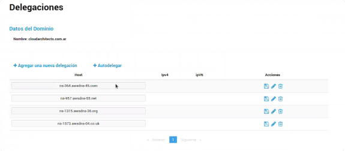

6. Hay que esperar aproximadamente una hora para poder ver nuestros cambios en
   los DNS mundiales.

   - Quizas en los DNS locales - de Fibertel, Telecentro, Telecom - podamos ver
     los cambios mucho antes que en los servidores de Amazon de Asia, Europa por
     ejemplo.

7. Si entramos a nuestro Hosted Zone vemos los registros que Amazon nos creo
   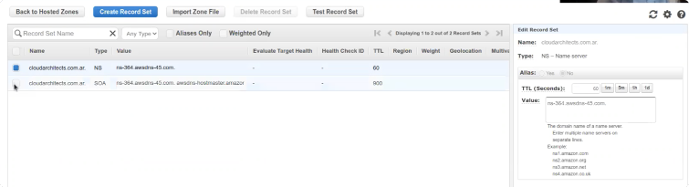

## Verificar nuestros DN

Los siguientes servicios me pueden decir quienes estan manejando los registros
(NS, SOA) de mis nombres de dominio desde los distintos servidores del mundo:

- [What is my DNS](https://www.whatsmydns.net) 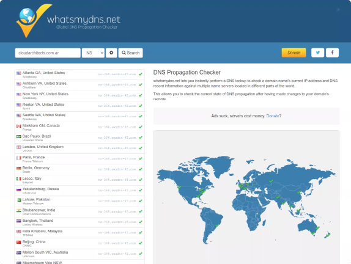

- [DNS Checker](https://dnschecker.org) 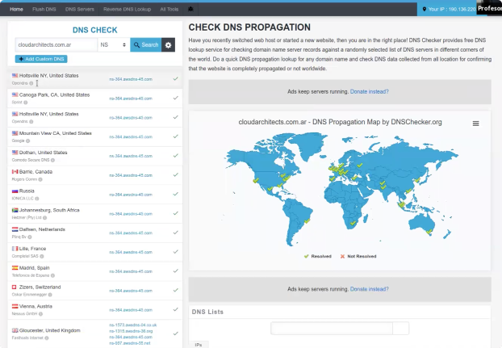

Con el comando dig puedo pedirle a mi NS (8.8.8.8 Google) los registros SOA, NS,
A de mi pagina

- dig SOA digitalhouse.com +short
  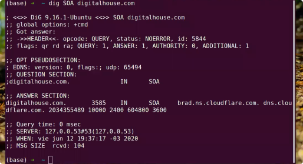
- dig NS digitalhouse.com +short
  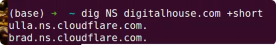
- dig A www.digitalhouse.com +short

  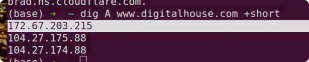

- dig CNAME www.digitalhouse.com +short
   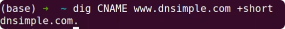

- Para informacion mas comprensiva [Ping.eu](ping.eu)
