# Networking en AWS

### Availability Zones
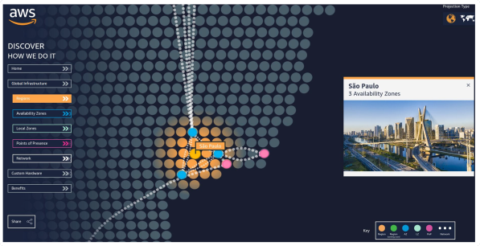

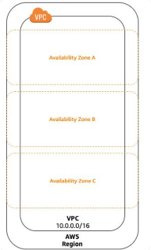

### Subnetting
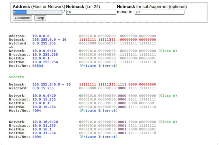

http://jodies.de/ipcalc?host=10.0.0.0&mask1=16&mask2=20

## Amazon VPC
### Virtual Private Cloud
La VPC provee una sección aislada de la Nube AWS desde donde se pueden lanzar recursos en una red virtual definida por el usuario

- IP Addresses 
- Subnets 
- Network Topology
- Routing Rules 
- Security Rules

Amazon Virtual Private Cloud (VPC)

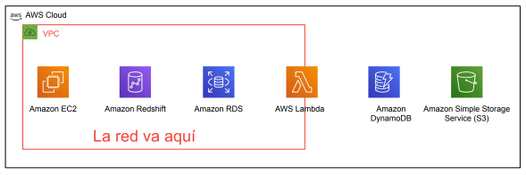

## VPC Building Blocks
### Cómo segmentar una red dentro de una VPC
#### VPC Subnets
- Pueden agregarse una o más subnets en cada Availability Zone
- Cada subnet ocupa un subgrupo del CIDR range de la VPC

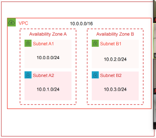

### Cómo dirigir el tráfico saliente de las Subnets
#### Subnets y Route Tables
- Cada subnet puede tener una única Route Table
- Las Route Tables dirigen el tráfico saliente desde la VPC hacia:
    - Internet Gateway
    - Virtual Private Gateway
    - VPC Endpoints
    - Direct Connect
    - VPC Peering
    - AWS Transit Gateway
- Las subnets pasan a ser “Public Subnets” cuando se conectan a un Internet Gateway

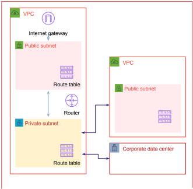

### Cómo conectar una VPC a Internet
#### Internet Gateway
- Componente VPC de alta disponibilidad (highly available), redundante y escalable horizontalmente
- Permite conectar Subnets de la VPC a internet
- Debe estar referenciada en la Route Table
- Realiza NAT entre direcciones IP públicas y privadas

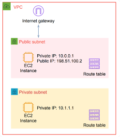

### Cómo recibe una instancia una dirección IP pública
#### Elastic IP Address
- Direcciones IPv4 públicas, estáticas y asociadas a una cuenta AWS
- Puede asociarse con una instancia o una Elastic Network Interface (ENI)
- Puede ser remapeada a otra instancia en la misma cuenta
- Bring Your Own IP Addresses (BYOIP)

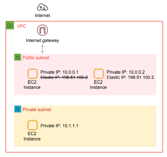

### Acceso a internet sólo de salida (outbound only)
#### NAT Gateway
- Permite conexiones de salida a internet
- No permite conexiones entrantes
- Útil para parches del SO y acceso a web services públicos
- Completamente administrado por AWS
- Alta disponibilidad (Highly available)
- Hasta 10Gbps de ancho de banda
- Soporta procolos TCP, UDP y ICMP
- Los Network ACLs se aplican al tráfico del NAT Gateway

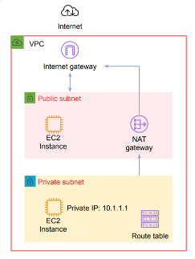

### Usar la VPC desde otra cuenta
#### VPC Compartida
- El VPC Owner puede crear y editar los Componentes de la VPC
- Los Participantes de la VPC pueden iniciar recursos en sus Subnets asignadas.
- Cada participante paga por sus propios recursos y costos de transferencia de datos

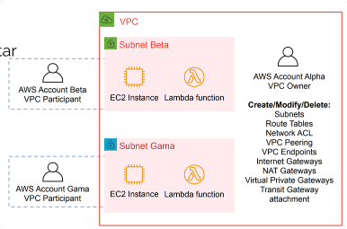

### VPC por Default
#### VPC Compartida
- El VPC Owner puede crear y editar los Componentes de la VPC
- Los Participantes de la VPC pueden iniciar recursos en sus Subnets asignadas.
- Cada participante paga por sus propios recursos y costos de transferencia de datos

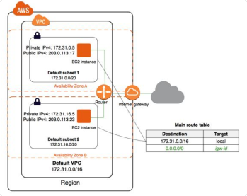

### Default VPC

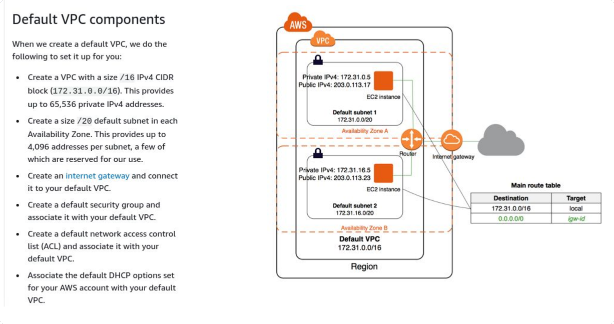

## Seguridad de la VPC
> NACLs y SGs
### Filtrado del tráfico que llega a cada instancia
#### Security Groups
- Virtual stateful firewall (conserva el estado)
- Reglas de Inbound y Outbound definidas por el usuario
- Inspección a nivel de Instancia/Interfaz
    - Micro segmentación
    - Obligatoriamente, todas las instancias tienen un Security Group asociado
- Puede ser usado con cross referencing
    - Funciona a través del VPC Peering
- Sólo soporta “allow rules”
    - Prohíbe todo lo que no está explícitamente permitido

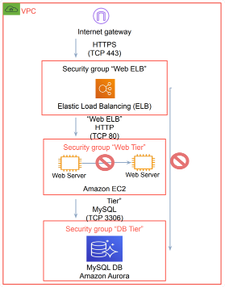

### Filtro de tráfico a nivel de Subnet
#### Network Access Control List
- Inbound y Outbound
- Inspecciona a nivel de subnet
- Nivel de seguridad opcional
- Por default, permite todo el tráfico
- Stateless (sin estado)
- Basado en puertos, IP y TCP/UDP
- Soporta “allow” y “deny rules”
- “Deny all” al final Private subnet

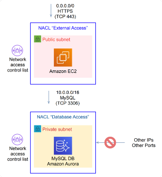

## Opciones de conectividad de la VPC 
### Conectarse de manera privada a la nube
#### VPC Endpoints
- Conecta tu VPC a:
    - Servicios AWS soportados
    - VPC endpoints de servicios powered by PrivateLink
- No requiere IPs públicas o transitar por internet
- El tráfico no sale de la red AWS
- Escalable horizontalmente, redundante y con alta disponibilidad (highly available)
- Control de acceso robusto

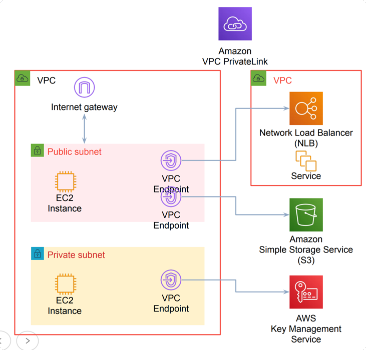

### VPC Endpoints
Hay dos clases de VPC endpoints:

**Gateway**: Un gateway es un destino para una ruta especificada en una route table, usada para el tráfico destinado a un servicio AWS soportado.
  - Servicios AWS soportados: Amazon S3 y DynamoDB
    
**Interface**: Una elastic network interface con una IP privada que sirve como punto de entrada para el tráfico destinado a un servicio soportado.
  - AWS Services soportados: https://docs.aws.amazon.com/vpc/latest/userguide/vpce-interface.html

### Cómo conectarse directamente a otras VCPs
#### VPC Peering
• Escalable y de alta disponibilidad (highly available)
• Peering entre cuentas
• De igual o diferente Región AWS
• Tráfico bi-direccional
• Los Security Groups remotos pueden referenciarse
• Criterio de rutas con Route Tables
    – No todas las subnets necesitan estar conectadas entre sí
• Sin ruteo transitivo, requiere una grilla completa ( full-mesh) para interconectar múltiples VPCs
• Sin soporte para IPs superpuestas

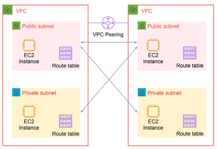

## Conectar un Data Center a AWS
> Trabajar en ambientes híbridos (AWS + on premises)
### Conectar infraestructura local a AWS a través de enlaces directos
#### AWS Direct Connect
- Conexiones de red dedicadas(1/10 Gbps, múltiples VIFs)
- Performance de red consistente
- Menor costo de networking out

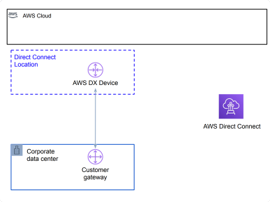

### Conectar un Data Center a AWS por internet
#### AWS Virtual Private Network
- Una VGW (Virtual Private Gateway) por VPC
- IPSec VPN Tunnels Redundantes
    - Terminando en distintas AZs
- IPSec
    - AES 256-bit encryption
    - SHA-2 hashing
- Escalable
- BGP o Static Routing

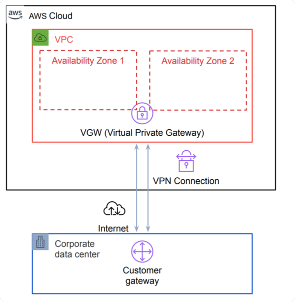

### Cómo agregar redundancia a conexiones dedicadas
#### AWS Direct Connect
- Para redundancia, DX puede funcionar con uno o múltiples:
    - Circuitos
    - Proveedores
    - Customer Gateways
    - Direct Connect Locations
    - Customer data centers
- BGP Routing para redundancia
- AWS VPN puede ser usada como path de backup

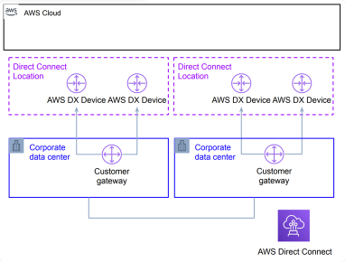

### Acceder a VPCs o AWS Public Services en un DX
#### AWS Direct Connect
- VIFs: Virtual Interface
- VIFs privados:
    - Acceso a direcciones VPC IP
- VIFs públicos:
    - Acceso al espacio de direcciones AWS Public IP/ Access to AWS Public IP address space

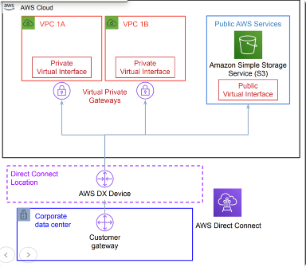

### Cómo conectar múltiples regiones y cuentas AWS en DX
#### AWS Direct Connect Gateway
- Recurso global
- Conecta a múltiples VPCs
- Las VPCs pueden estar en iguales
o distintas
    - Regiones
    - Cuentas (Con igual Payer ID)
- Permite el flujo de tráfico desde la VPC hasta la conexión DX
    - Para tráfico de VCP a VCP, considerar usar AWS Transit Gateway

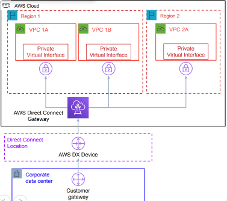

### Cómo conectar en escala entre cuentas o regiones
#### AWS DX Gateway + AWS Transit Gateway
- Transit VIF
    - Conecta al AWS Transit Gateway
- Simplifica la arquitectura de red y el manejo superior
- Crea un modelo hub-and-spoke model que abarca varias
    - VPCs
    - Regiones
    - Cuentas AWS

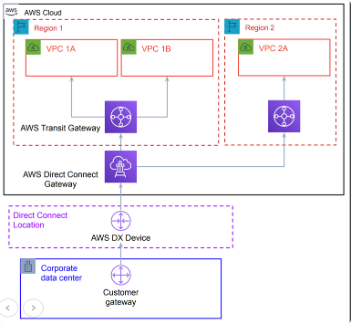

## Distribución de tráfico
> Balanceando el tráfico en la red
### Cómo escalar una app horizontalmente dentro de una VPC
#### Elastic Load Balancing
- Distribuye el tráfico entrante de redes o aplicaciones en múltiples targets
    - EC2 instances
    - Containers
    - IP address
- Múltiples Availability Zones
- Se escala automáticamente
- Los autoscaling groups pueden agregar o remover instancias automáticamente
    - Se registra automáticamente al Load Balancer

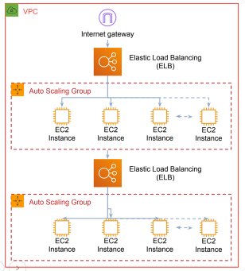

### How to solve my Domain Names to IP Address
#### Amazon Route 53
• AWS DNS service
• Domain Registration
• Domain name resolution
• 100% availability SLA
• Health Checks
• DNS Failover
• Latency Based Routing
• Geo Based Routing
• Weighted Round Robin
• Private DNS for VPC

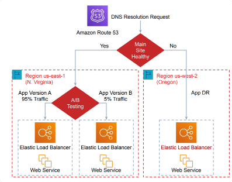

## Recomendaciones
> Algunos tips interesantes

### VPC Recomendaciones

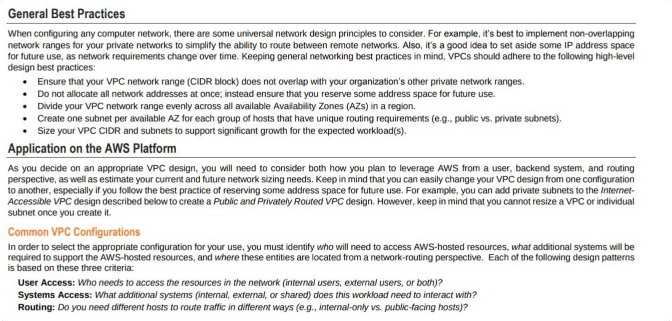

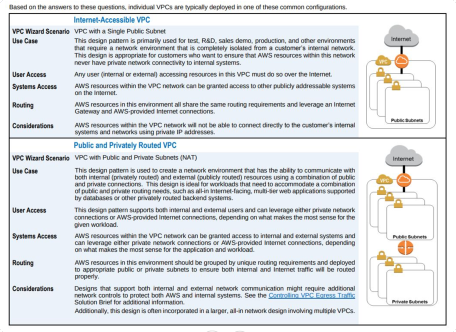

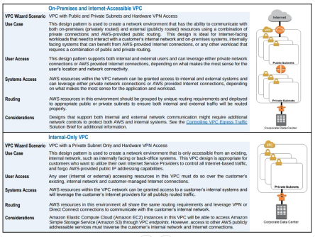

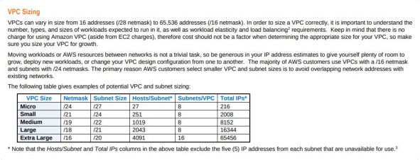

https://d0.awsstatic.com/aws-answers/AWS_Single_VPC_Design.pdf
