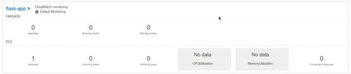
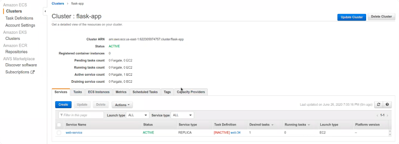
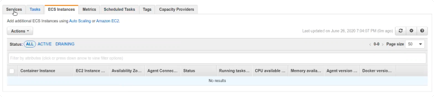
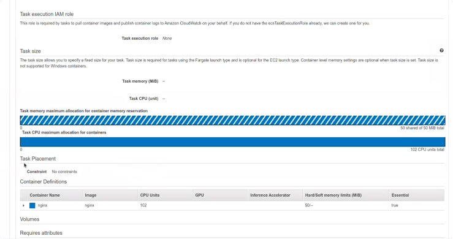
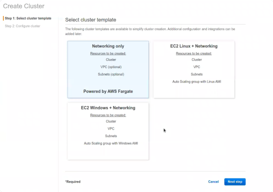
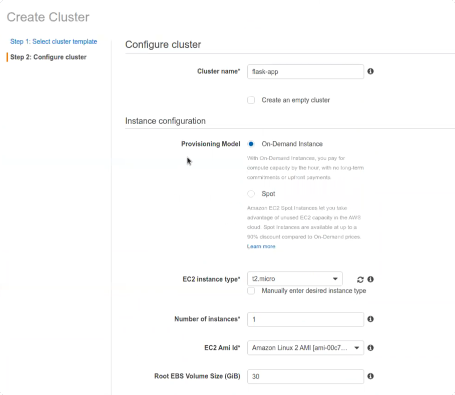

# Repaso ECS

Vemos todos nuestros Clusters en ECS: 



Cluster: Unidad computacional

Que veo en esta consola:

- Servicio asignado web (web-service)
- No hay instancias de containers registrados
- No hay pending tasks
- No hay servicios activos, el servicio asociado esta inactivo
- Vemos que tenemos Desired tasks = 1, pero como no tengo maquinas asignadas al
  cluster no la puedo levantar.

Para ver los recursos que tengo asignados al cluster puedo verlos en la tab de
ECS Instances:



Si vamos al servicio web-service:34, vemos la definicion de la tarea: Que hace
exactamente nuestro servicio.



Vemos que es simplemente un nginx.

Con la Task Definition puedo crear servicios o tareas.

- Los servicios son daemons que nunca van a terminar (como un nginx).
- Las tareas son procesamientos en batch que arrancan a demanda y terminan.

Vamos a borrar los clusters que teniamos creados, y crear uno nuevo.

1. Create cluster

   

   - Seleccionamos el template de cluster `EC2 Linux + Networking`

2. Configure cluster

   

   - Nombramos
   - Elegimos los tipos de instancias. **Estas instancias tienen que tener
     instalado el Container Agent**
     - Cantidad de instancias
     - AMIs
     - Volumenes
     - Key Pair
   - Podriamos seleccionar la opcion para elegir el cluster vacio
   - Se puede seleccionar la opcion para monitorear desde CloudWatch

Esto seria lo mismo que con CLI correr:

`aws ecs create-cluster --cluster-name flask-app`

Para ver los detalles del cluster:

`aws ecs describe-cluster --cluster-name flask-app`

Necesitamos que nuestras instancias de EC2 tengan la variable de entorno:
`CLUSTER_AGENT=flask-app`

Para hacerlo con CLI habiamos creado un Bucket S3, y subido nuestro archivo
`ecs.config` con esta variable.

`aws s3 mb s3://flask-app --region us-east-1`

`aws s3 cp ecs.config s3://flask-app`

Luego con el siguiente comando creamos una instancia de EC2 y le especificamos
que el user-data script lo tome del archivo de S3 que acabamos de subir:

```shell script
aws ec2 run-instances \
--count 1 \
--profile dh \
--instance-type t2.micro \
--image-id ami-0b22c910bce7178b6 \
--iam-instance-profile Name=ecsInstanceRoleFlask \
--key-name fsilvestre-digital \
--security-group-ids sg-934830e5 \
--user-data file://container-agent/copy-ecs-config-to-s3.sh \
--tag-specifications 'ResourceType=instance,Tags=[{Key=Course,Value=cloud_architect}, {Key=Name,Value=fsilvestre-flask-app}]' 'ResourceType=volume,Tags=[{Key=Course,Value=cloud_architect}]'
```

Vamos a crear un cluster de ECS que corra una app de Docker nuestra. Vamos a
deployar el container con flask corriendo.

Dockerfile: ./Dockerfile Flask-app: ./app.py

Vamos a probarlo local primero, y testearlo con un curl:

```shell script
docker run -d --rm --name flask -p 80:5000 fsilvestre/flask
```

Vamos a crear un task definition para tener como servicio este contenedor. En el
atributo de image le vamos a pasar el nombre de nuestra imagen de Docker que
debe estar publicada en DockerHub. ECS va a buscar la imagen ahi cuando no la
encuentre.

Vamos a registrar esta task definition:

```shell script
aws ecs register-task-definition --cli-input-json file://flask-app-task-definition.json
```

Para que el cluster de ECS se actualice la task definition que acabamos de
subir, hay que reiniciar.

```shell script
aws ecs update-service --cluster flask-app --service-name web-service --task-definition web --desired-count 0
```

Y luego puedo volver a poner el desired count en 3 (o el numero que quiera), y
estos nuevos los crea con la ultima version de la task.

Si ahora quiero actualizar el codigo de mi container,

- una forma de hacerlo es actualizar el codigo de mi app, actualizar la imagen
  de DockerHub, y luego reiniciar mi ECS cluster.
  `docker build -t fsilvestre/flask` `docker push fsilvestre/flask`

Para enviar setear varias de entorno en mis clusters de ECS, hay 3 formas:

- (La menos recomendada, pero mas rapida:) Pasar variable como secretos en el
  Task Definition
- Parameter store

Para agregar la variable de entorno se agrega al json la key `environment`:

```json
{
  "containerDefinitions": [
    {
      "name": "flask",
      "image": "fsilvestre/flask",
      "portMappings": [
        {
          "containerPort": 5000,
          "hostPort": 80
        }
      ],
      "environment": [{ "name": "ENVIRONMENT", "value": "production" }],
      "memory": 50,
      "cpu": 102
    }
  ],
  "family": "web"
}
```

Si tengo dos contenedores, uno Flask y otro Redis.

En el caso de hacerlo con `Docker-compose.yml`, nos quedaria:

```yaml
version: 3
services:
  web:
    build: .
    ports:
      - "80:5000"
  redis:
    image: "redis:alpine"
```

La task-definition de ese Docker compose seria:

```json
{
  "containerDefinitions": [
    {
      "name": "flask-redis",
      "image": "fsilvestre/flask-redis",
      "portMappings": [
        {
          "containerPort": 5000,
          "hostPort": 80
        }
      ],
      "environment": [{ "name": "ENVIRONMENT", "value": "production" }],
      "memory": 50,
      "cpu": 102,
      "links": ["redis"]
    },
    {
      "name": "redis",
      "image": "redis:alpine",
      "portMappings": [
        {
          "containerPort": 6379,
          "hostPort": 6379
        }
      ],
      "memory": 150,
      "cpu": 102
    }
  ],
  "family": "web"
}
```

Cuando registro las tasks definition y actualizo mi cluster, el scheduler va a
levantar el redis + flask juntos en la misma maquina.

**ECR**: Elastic Container Registry - Registro de Docker privado.

- Se puede acceder desde ECS / ECR / Registry
- Tenemos un Docker Registry por cada AZ, y account id.

Para poder configurar nuestro Docker CLI local para que se comunique con el
Docker Registry de AWS.

Pedimos la contrasena para logearnos con el comando:

`aws ecr get-login-password`

Y nos logeamos luego con:

`docker login -u <user> -p <contrasena> <endpoint-ECR>`

Para crear un repo:

```shell script
aws ecr create-registry --repository-name fsilvestre/flask-redis
```

Y para pushear:

```shell script
docker tag flask-redis <ECR>/fsilvestre/flask-redis

docker push flask-redis <ECR>/fsilvestre/flask-redis
```
