# Continuos Integration y Continuos Delivery

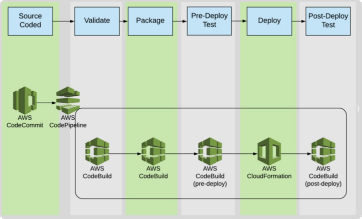

## Devops

El término DevOps, que es una combinación de los términos ingleses development (desarrollo) y operations (operaciones), designa la unión de personas, procesos y tecnología para ofrecer valor a los clientes de forma constante.

DevOps permite que los roles que antes estaban aislados (desarrollo, operaciones de TI, ingeniería de la calidad y seguridad) se coordinen y colaboren para producir productos mejores y más confiables.

**Cultura + Prácticas + Herramientas**

### Devops - Cultura

- Dev & Ops trabajan juntos. No más silos.
- Responsabilidad compartida.
- Visibilidad y comunicación
- No más superman o supergirl (Persona que se cree irremplazable)

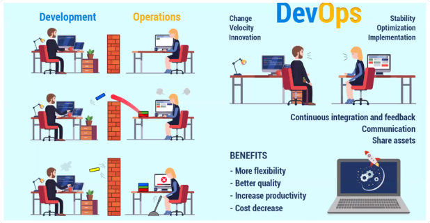

### Devops - (Buenas) Prácticas

- Actualizaciones frecuentes pero pequeñas
- Integración continua (Continuous integration)
- Entrega continua (Continuous delivery/deployment)
- Microservicios
- Infraestructura como código
- Monitorización y registro
- Comunicación y colaboración

## DevOps Pipeline

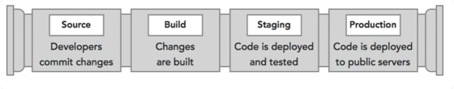

**Source**: Aqui trabajamos con el codigo fuente. Trabaja el equipo de desarrollo. En esta etapa interviene la Integracion Continua, y testeamos con Pruebas Unitarias: se van evaluando peque;as partes del codigo.

**Build**: Tomamos el codigo fuente, y construimos un ejecutable. Aqui interviene el compilador, las librerias, modulos, paquetes. Aqui se agregan mas pruebas.

**Staging**: Implementamos nuestro ejecutable en un entorno de prueba. Se simula un entorno similar al de produccion. Se agregan pruebas de integracion, estres, seguridad, QA, etc.

**Produccion**: Una vez que nuestro codigo ha sido testeado con todas las pruebas, se implementa nuestro desarrollo en el entorno productivo.

## Continuous integration

- La **integración continua** es una práctica de desarrollo en la cual los desarrolladores integran su código a un repositorio central, esto de forma periódica, varias veces por día.

- Cada vez que un miembro del equipo realiza un commit sobre el control de versiones (git por ejemplo), el proyecto se compila y se ejecutan todas sus pruebas unitarias, todo esto de forma automática.

- La integración continua hace énfasis en la ejecución automática de las pruebas unitarias. De esta forma se garantiza que los errores se detecten en una etapa temprana en el desarrollo, con lo cual se facilita la corrección de los mismos.

- Cada equipo va a definir un % de coverage a cubrir para poder aceptar un commit. En general +85%

- Tests:
    - Problemas de Diseño - [Veracode](https://www.veracode.com/)
    - Analisis de vulnerabilidad del codigo
    - [Application security tools](https://insights.sei.cmu.edu/sei_blog/2018/07/10-types-of-application-security-testing-tools-when-and-how-to-use-them.html)
    
Mientras mas automatizadas esten estos chequeos en tu pipeline, te da mas tranquilidad, trazabilidad, confianza en tu codigo.

### Continuous delivery - Continuous deployment

- Con la **entrega continua** (Continuous delivery), todos los cambios en el código se crean, se prueban y se envían a un entorno de pruebas o de no producción.

- En dicho entorno se siguen realizando pruebas sobre el desarrollo. Una vez superadas las pruebas, el desarrollo pasa a producción, siempre bajo una aprobación explícita (manual).

- Con la **implementación continua**, el envío producción tiene lugar de manera automática, sin aprobación explícita. 

### Continuous deployment - Pipeline

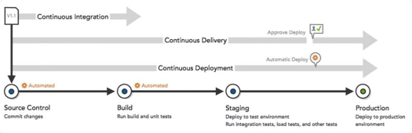

### Continuous deployment - Beneficios

- Beneficia la coordinación entre equipos de trabajo.
- Las mejoras en el producto llegan a los usuarios en menor tiempo.
- Mayor seguridad: Se invierte menos tiempo en resolver issues de seguridad.
- Mayor productividad. Los equipos de desarrollo cuentan con más tiempo para desarrollar características nuevas y generar más valor.

### CI/CD - Heramientas AWS

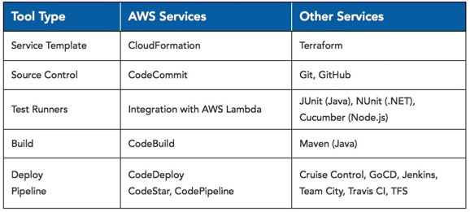

**CodePipeline**: Orquestra cada etapa de nuestro desarrollo y deployment.

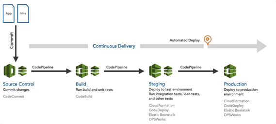

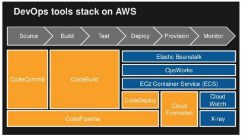

### Tipos de deploy

**Deploy in place**: Bajamos todas las instancias que tenemos corriendo, deployamos nuestro nuevo codigo y actualizaciones, y volvemos a levantar. Gran desventaja el downtime, y el riesgo de no poder volver a levantar las instancias.

**Rolling**: Vamos bajando las instancias de a una, vamos implementando las instancias de a una, y las vamos volviendo a levantar. Vamos a tener fuera de servicio solo una instancia por vez, solo que mientras hay usuarios que van a pegarle a isntancias desactualizadas.

**Rolling con batch adicionales**: Anadis una instancia nueva de manera temporal, y haces lo mismo que el deploy anterior. Cuando terminas volves a desvincular la que agregaste. De esta forma mantenes tu capacidad.

**Immutable**: Haces tu implemetacion todo en instancias nuevas. Una vez que esta probado y funciona, bajas las instancias que tenes en produccion y pones estas.

**Blue/Green**: Tenemos dos infraestructuras trabajando en paralelo. Una productiva, y la otra en standby. Aplicamos nuestros cambios a la infra que no esta productiva, y si funciona todo hacemos switch a ella. No borramos la anterior hasta no estar seguros que todo esta funcionando bien.

### Blue/green deployment

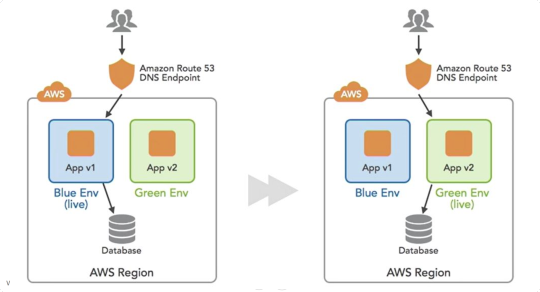

### Devops - Beneficios en el desarrollo

- Velocidad
- Entrega rápida
- Fiabilidad
- Escalado
- Colaboración mejorada
- Seguridad

# Herramientas AWS CI/CD

### AWS CodeCommit

- AWS CodeCommit es un servicio de control de código fuenteadministrado y altamente escalable que aloja repositorios Git privados. 

- Solo tiene que crear un repositorio para almacenar el código.

- No es necesario aprovisionar ni escalar hardware ni instalar software.

- Puede crear flujos de trabajo

- Utiliza HTTPS o SSH

- Usa AWS IAM para el control de usuarios

### AWS CodeBuild

- AWS CodeBuild es un servicio de integración continua completamente administrado en la nube. Solo tiene que especificar la ubicación del código fuente, elegir la configuración de la compilación y CodeBuild ejecutará secuencias de comandos de compilación para compilar, probar y empaquetar el código. 

- Servicio para Continuous Integration.

- Posee predefinidos entornos de compilación para Java, Python, Node.js, Ruby, Go, Android, .NET Core for Linux y Docker.
    - Soporta Docker Hub y ECR
    
- Puede definir CPU y Memoria para estos entornos

- Los comandos específicos que desea que AWS CodeBuild realice se especifican en un yaml llamado buildspec.yml

- Soporta como fuentes AWS CodeCommit, GitHub o Amazon S3

- Posee integración con Jenkins y AWS Codepipeline

### AWS CodeDeploy

- AWS CodeDeploy es un servicio de implementación completamente administrado que automatiza las implementaciones de software en diferentes servicios informáticos, como Amazon EC2, AWS Lambda y sus servidores locales.

- AWS CodeDeploy facilita el lanzamiento rápido de nuevas características, ayuda a evitar tiempos de inactividad durante la implementación de una aplicación y administra la compleja actualización de las aplicaciones. 

- Repeatable deployments
- Automatic scaling
- On-premises deployments
- Rolling and Blue/Green updates
- Deployment health tracking
- Stop and rollback

### AWS CodePipeline

- AWS CodePipeline es un servicio de entrega continua (Continuous delivery) completamente administrado que permite automatizar canalizaciones de lanzamiento para lograr actualizaciones de infraestructura y aplicaciones rápidas y fiables.

- CodePipeline automatiza las fases de compilación, prueba e implementación del proceso de lanzamiento cada vez que se realiza una modificación en el código, en función del modelo de lanzamiento que defina.

#### Links interesantes

- [Use CodePipeline with Amazon S3, AWS CodeCommit, and AWS CodeDeploy](https://docs.aws.amazon.com/codepipeline/latest/userguide/best-practices.html#use-cases-S3-codedeploy)
- [Use CodePipeline with Third-party Action Providers (GitHub and Jenkins)](https://docs.aws.amazon.com/codepipeline/latest/userguide/best-practices.html#use-cases-thirdparty)
- [Use CodePipeline with AWS CodeStar to Build a Pipeline in a Code Project](https://docs.aws.amazon.com/codepipeline/latest/userguide/best-practices.html#use-cases-codestar)
- [Use CodePipeline to Compile, Build, and Test Code with CodeBuild](https://docs.aws.amazon.com/codepipeline/latest/userguide/best-practices.html#use-cases-codebuild)
- [Use CodePipeline with Amazon ECS for Continuous Delivery of Container-Based Applications to the Cloud](https://docs.aws.amazon.com/codepipeline/latest/userguide/best-practices.html#use-cases-ecs)
- [Use CodePipeline with Elastic Beanstalk for Continuous Delivery of Web Applications to the Cloud](https://docs.aws.amazon.com/codepipeline/latest/userguide/best-practices.html#use-cases-elasticbeanstalk)
- [Use CodePipeline with AWS Lambda for Continuous Delivery of Lambda-Based and Serverless Applications](https://docs.aws.amazon.com/codepipeline/latest/userguide/best-practices.html#use-cases-lambda)
- [Use CodePipeline with AWS CloudFormation Templates for Continuous Delivery to the Cloud](https://docs.aws.amazon.com/codepipeline/latest/userguide/best-practices.html#use-cases-cloudformation)
- [CI/CD for Serverless and Containerized Applications (Youtube)](https://www.youtube.com/watch?v=01ewawuL-IY)
- [Use Codepipeline with EKS (CDK)](https://github.com/aws-samples/amazon-eks-cicd-codebuild)

# Infraestructura como código

- Es la capacidad de generar infraestructura computacional a través de unc onjunto de comandos.

- Estos comandos deben proveer todas las características que queremos que tenga la infraestructura.

- La solución de AWS es Cloudformation

## AWS Cloudformation

- AWS Cloudformation ofrece a desarrolladores y administradores de sistemas un método sencillo para crear y administrar una colección derecursos de AWS relacionados entre sí para aprovisionarlos y actualizarlos de una manera ordenada y predecible.

https://docs.aws.amazon.com/AWSCloudFormation/latest/UserGuide/Welcome.html

- Creación de templates con JSON/YAML

- Creación de templates con lenguajes de programación conocidos
    - Con [AWS CDK](https://docs.aws.amazon.com/cdk/latest/guide/home.html), puede utilizar TypeScript, Python, Java para generar los templates
    
- Automatiza el aprovisionamiento y la actualización de la infraestructura de una manera segura y controlada

- Previsualización de actualizaciones

- Administración de dependencias

- Administración entre cuentas y regiones

- Extensibilidad mediante Lambdas

### AWS Cloudformation - Recursos

- Networking: VPC, subnets, tablas de ruteo, gateways, etc.
- Infraestructura: Instancias, load balancers-
- IAM: Usuarios, permisos, grupos, etc.
- ETC

### AWS Cloudformation - Conceptos

- **Templates (Plantillas)**
    - Una plantilla AWS CloudFormation es un archivo de texto con formato JSON o YAML. Puede guardar estos archivos con cualquier extensión, como .json, .yaml, .template o .txt. AWS CloudFormation utiliza estas plantillas como planos para crear sus recursos de AWS.
    
- **Stacks (Pilas)**
    - Administra los recursos relacionados como una única unidad
    - Puede crear, actualizar y eliminar una colección de recursos mediante la creación, actualización y eliminación de stacks
    
- **Change Sets (Conjunto de cambios)**
    - Si necesita realizar cambios en los recursos que están ejecutándose en un stack, actualice el stack. Antes de realizar cambios en los recursos, puede generar un change set, que es un resumen de los cambios propuestos. Los change sets le permiten ver cómo afectan los cambios a sus recursos en ejecución, en especial para los recursos críticos, antes de implementarlos.

### AWS Cloudformation - Funcionamiento

- Por ejemplo, suponga que tiene una plantilla que describe una instancia EC2 con un tipo de instancia t1.micro. Cuando utiliza la plantilla para crear un stack, AWS CloudFormation llama a la API de creación de instancias Amazon EC2 y especifica el tipo de instancia como t1.micro.

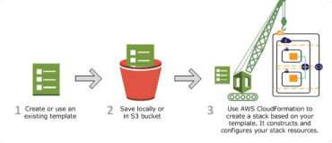

#### AWS Cloudformation - Actualizar templates

- Utilice change set para ver que recursos con afectados al actualizar el stack

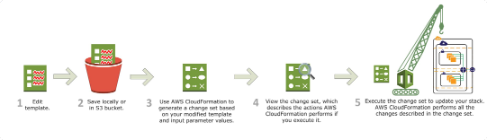

#### AWS Cloudformation - Template

https://docs.aws.amazon.com/AWSCloudFormation/latest/UserGuide/template-anatomy.html

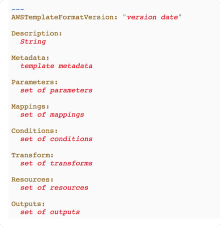

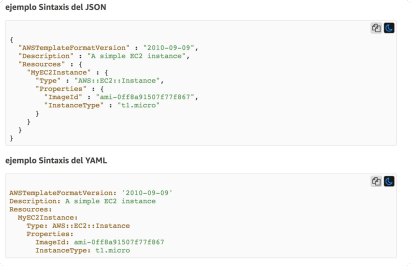

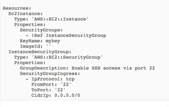

### AWS Cloudformation - Funciones Intrínsecas

- Utilice las funciones intrínsecas en las plantillas para asignar valores a las propiedades que no están disponibles hasta el tiempo de ejecución. Solo puede utilizar las funciones intrínsecas en partes específicas de una plantilla.

    - Propiedades de los recursos
    - Los resultados
    - Los atributos de metadatos
    - Atributos de las políticas

#### AWS Cloudformation - Un ejemplo más

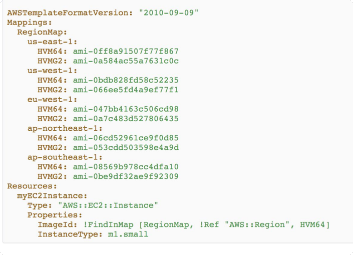