# Arquitectura de microservicios

### Arquitectura Monolítica
- Alto acoplamiento de procesos.
- Si hay mucha demanda de un proceso se debe escalar toda la arquitectura.
- Dificultad para agregar o mejorar features a medida que crece la base de codigo.
- Mayor fragilidad por la interdependencia de procesos.
- Dificultad para integrar distintas tecnologías.

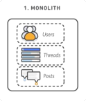

### Arquitectura de Microservicios
- Bajo acoplamiento de procesos.
- Se puede escalar cada proceso por separado.
- Al haber menos interdependencia es más fácil agregar o mejorar features.
- Mayor resiliencia dado que si un proceso falla fragilidad por la interdependencia de procesos.
- Al ser independientes cada microservicio puede usar la tecnología más apta para el problema que trata de resolver.

Se puede pensar en los microservicios como:
- Una arquitectura orientada a servicios que se comunican a través de una red
- Compuesta de elementos débilmente acoplados
- Con contextos limitados (cada servicio hace una sola cosa y la hace bien)

## Estructura de un microservicio
A grandes rasgos un microservicio tiene:
- Un storage de datos que puede o no compartirse con otros microservicios.
- Implementación de lógica en código.
- Una API para exponer su funcionalidades.

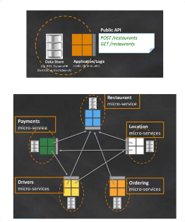

### Principios de Diseño
- Los microservicios solo interactúan a través de sus APIs.
Nunca se accede directamente a los datos de otro microservicio.

    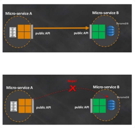

- Usar la tecnología correcta para resolver cada problema.

    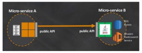

- Independientemente deployable.
    Se debe ofrecer una API consistente de manera que sea posible deployar servicios de manera independiente.

    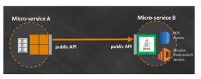

## Implementaciones de Microservicios

### Microservicios en AWS
Es posible implementar microservicios en AWS de distintas maneras.
Una forma habitual es definir un endpoint en API Gateway y usa una Lambda para procesar requests.

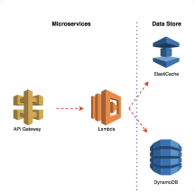

También es posible correr la lógica del servicio mediante instancias EC2 o con containers.

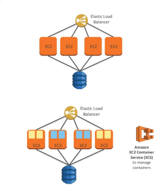

## API Gateway
Sirve crear, publicar, mantener, monitorear y proteger APIs via REST y WebSocket.

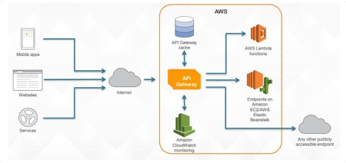

### Features
- Manejar múltiples versiones y stages de APIs (también clonar, hacer rollbacks, etc.)
- Crear y distribuir API Keys
- Auth pot AWS Sig-v4
- Throttling y monitoreo de requests
- Caché incorporado
- SDK Generation para iOS, Android y JavaScript
- Soporte de Swagger
- Transformación de datos de request/response
- Mocking de respuestas

### Implementación de Backend
Para implementar la lógica de una API se puede recurrir a distintos servicios de AWS.

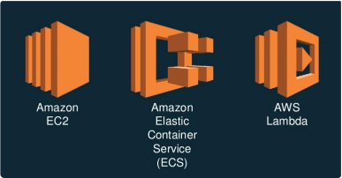

### Implementación de Backend: EC2
Recomendaciones:
- Un servicio por host
- Usar ELBs y AutoScaling groups
- Automatizar deploys de código
- Arrancar con instancias chicas

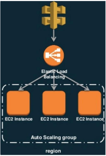

- Usar menos hosts con más CPU/RAM
- Correr servicios relacionados en el mismo host.
- Usar ELBs + Auto Scaling groups
- Se puede usar AWS Fargate para simplificar el mano de los hosts.

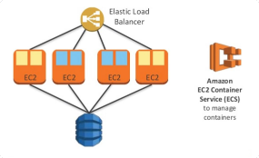

### Implementación de Backend: ECS
Otra alternativa es ir por el camino serverless y usar Lambdas.
Con esto nos liberamos en buena parte del overhead de manejo de la capa de computo.

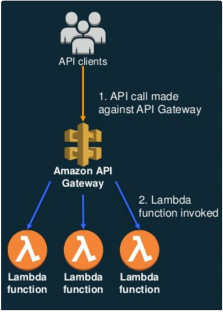

### Implementación de Backend
También es posible definir llamadas directas a servicios de AWS sin necesidad de recurrir a una etapa intermedia de cómputo.

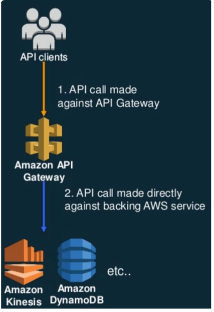

## AWS Lambda
### Características de serverless
- No se manejan ni provisionan servidores
- Se paga solo por lo que usa
- Escalamiento automático
- Disponibilidad y tolerancia a fallas de fabrica

Es una plataforma serverless basada en eventos que ejecuta código y gestiona automáticamente los recursos que necesita.

### AWS Lambda Features
- Se cobra por milisegundo de ejecución.
- Se puede definir un timeout si la ejecución toma demasiado tiempo.
- Solo se controla la cantidad de RAM disponible.
- %CPU y capacidad de red se alocan automáticamente.
- Puede correr código en variedad de lenguajes (Java, Python, Go, entre otros)

### Casos de uso

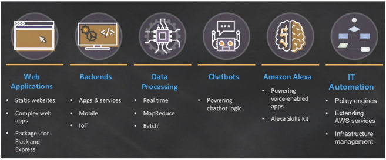

### Modelo de ejecución

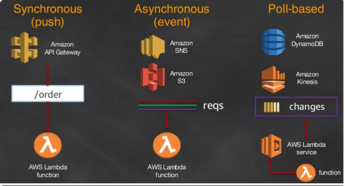

#### Ejecución sincrónica

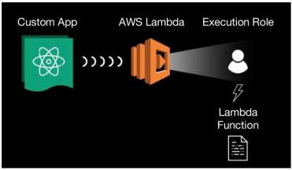

#### Ejecución asíncrona

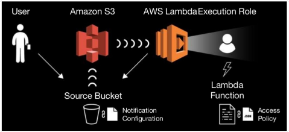

#### Ejecución en streams

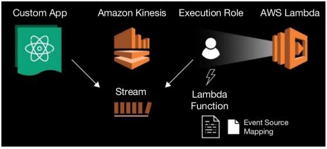

### Modelo de Programación
Aspectos clave:
- Handler: Función que se llama cuando se inicia la ejecución.
- Contexto: Objeto que se pasa a handler y proporciona métodos y propiedades de la invocación, la función y el entorno de ejecución.
- Logging: El logging realizado por default van a CloudWatch Logs.
- Excepciones: Estas también son loggeadas por default.

### Modelo de Permisos
#### IAM Role:
- Definen lo que puede hacer la Lambda
- Si la Lambda es disparada por otro servicio de AWS el rol debe tener permitida de lectura de dicho servicio.

#### Function (resource) Policy:
- Determina qué servicios o eventos pueden invocar la Lambda.

