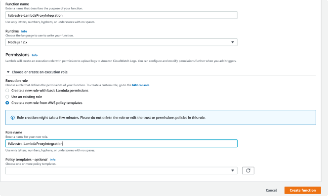
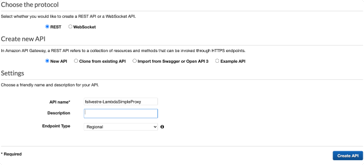
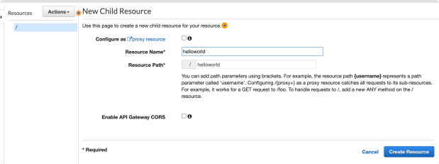
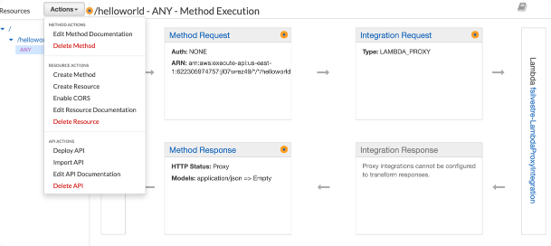
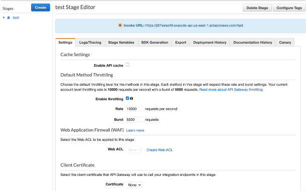
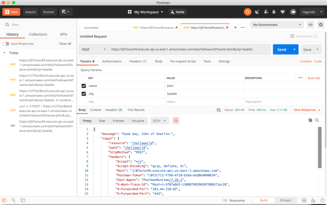

# Práctica Microservicios
- Crear una API REST utilizando los servicios API GATEWAY y LAMBDA.
- Probar la API usando el navegador y CURL.

## Crear una funcion Lambda "Hola mundo!"
1. Ir a la consola de AWS Lambda
2. Crear una nueva `Funcion`
3. Seleccionar `Author from Scratch`
4. Completar los datos de la lambda
    
5. Copiar el siguiente codigo de la funcion:
    ```javascript
    'use strict';
    console.log('Loading hello world function');
     
    exports.handler = async (event) => {
        let name = "you";
        let city = 'World';
        let time = 'day';
        let day = '';
        let responseCode = 200;
        console.log("request: " + JSON.stringify(event));
        
        if (event.queryStringParameters && event.queryStringParameters.name) {
            console.log("Received name: " + event.queryStringParameters.name);
            name = event.queryStringParameters.name;
        }
        
        if (event.queryStringParameters && event.queryStringParameters.city) {
            console.log("Received city: " + event.queryStringParameters.city);
            city = event.queryStringParameters.city;
        }
        
        if (event.headers && event.headers['day']) {
            console.log("Received day: " + event.headers.day);
            day = event.headers.day;
        }
        
        if (event.body) {
            let body = JSON.parse(event.body)
            if (body.time) 
                time = body.time;
        }
     
        let greeting = `Good ${time}, ${name} of ${city}.`;
        if (day) greeting += ` Happy ${day}!`;
    
        let responseBody = {
            message: greeting,
            input: event
        };
        
        // The output from a Lambda proxy integration must be 
        // in the following JSON object. The 'headers' property 
        // is for custom response headers in addition to standard 
        // ones. The 'body' property  must be a JSON string. For 
        // base64-encoded payload, you must also set the 'isBase64Encoded'
        // property to 'true'.
        let response = {
            statusCode: responseCode,
            headers: {
                "x-custom-header" : "my custom header value"
            },
            body: JSON.stringify(responseBody)
        };
        console.log("response: " + JSON.stringify(response))
        return response;
    };
    ```
 6. Guardar
 
 ## Crear un API Gateway para nuestra funcion
 1. Ir a la consola de AWS API Gateway
 2. `Create API` y seleccionar bajo `API REST` la opcion `Build`
 3. Completar
 
    
    
4. Create Resource como aparece abajo
    
    

5. Crear un metodo a nuestro nuevo recurso

    
 
6. Seleccionar `Deploy API`

    


API Gateway nos va a devolver la URL de nuesta API


Podemos probarla con cURL o Postman

