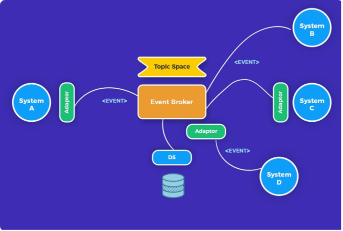
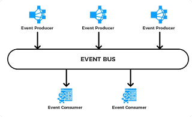
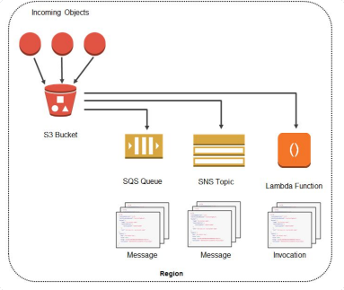
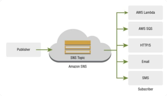
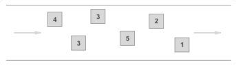
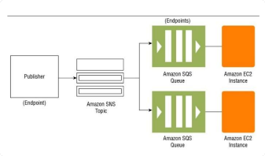
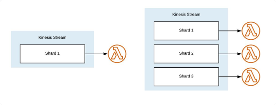
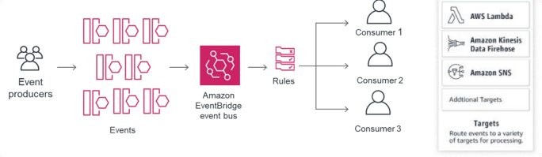

# Arquitectura orientada a eventos
## S3 Notifications, SNS, SQS

Este paradigma promueve la producción, detección, consumo y reacción a eventos.

Esto implica que los datos de la aplicación llega como flujos de eventos.

## Evento

- Es un cambio significativo en el estado. Por ejemplo:
    - Cuando un cliente lleva a cabo una acción.
    - Cuando se completa una transacción exitosa. 
- Un evento puede activar una o más opciones en respuesta.

### Evento vs Request

|                                           | Request                           | Evento                                                                |
| ---                                       | ---                               |---                                                                    |
| Quien lo dispara                          | Un pedido directo                 | Se detecta un cambio                                                  |
| Cuando se lleva a cabo la accion          | Cuando se procesa un evento       | Depende del contexto                                                  |
| Que para cuando ocurre el evento/request  | Siempre se produce una respuesta  | El evento puede ignorarse, disparar otro evento, o alterar un estado  |

### Partes de las Arquitecturas de Eventos

1. Evento: Cambio de estado de un objeto.
2. Handler: Código que se dispara ante el evento.
3. Bucle de eventos (event loop): Maneja el flujo de interacción entre un evento y Handler.
4. Capas de flujo de eventos:
    - Productor de eventos
    - Consumidor de eventos
    - Canal de eventos
    

### Ventajas

1. Es más fácil agregar nuevos eventos y procesos.
2. Es fácil revertir cambios.
3. La arquitectura basada en eventos también le brinda la garantía transaccional, es decir, se le notifica de cada transacción exitosa que ocurra.
4. Fácilmente escalable.
5. Desacopla puntos de fallo.
6. Reducción de costos siendo que se procesa solo lo necesario.

## Eventos de S3

S3 tiene la capacidad de disparar notificaciones cuando ocurren cambios en un bucket.
- Prácticamente cualquier evento que ocurra en un bucket puede disparar una notificación.
- Estas notificaciones pueden enviarse a:
    - Tópicos de SNS
    - Colas de SQS
    - Lambdas
    
    
    
### Notificaciones de S3

Cada notificación se envía como un JSON con los siguientes campos:

    - Region
    - Timestamp
    - Event Type (as listed above)
    - Request Actor Principal ID
    - Source IP of the request
    - Request ID
    - Host ID
    - Notification Configuration Destination ID
    - Bucket Name
    - Bucket ARN
    - Bucket Owner Principal ID
    - Object Key
    - Object Size
    - Object ETag
    - Object Version ID (if versioning is enabled on the bucket)
    
## SNS - Simple Notification Service

Es un sistema de mensajería de publish-subscribe (pub-sub) totalmente administrada para microservicios, sistemas distribuidos y aplicaciones serverless.

Los mensajes envían directamente a los consumidores por lo que no hay necesidad de pollear por mas data.

### Caracteristicas

- Incluye funciones de filtrado de mensajes por reglas.
- Las notificaciones se disparan apenas llegan.
- Se puede configurar para que envíe mails, SMS y notificaciones mobile cuando hay mensajes nuevos.

### Tipos de colas

#### Standard Queues
- Unlimited Throughput: Transacciones por segundo (tps) ilimitadas*.
- At-least-once Delivery: Un mensaje siempre se entrega al menos una vez, ocasionalmente más de una.
- Best-Effort Ordering: Los mensajes puede llegar fuera de orden.

#### FIFO Queues
- High Throughput
- At-least-once Delivery: El mensaje se entrega una vez y permanece disponible hasta que un consumidor lo procesa y lo elimina. No hay duplicados.
- First-In-First-Out Delivery: El orden de los mensajes siempre se mantiene.

### Usos comunes

- Replicar mensajes a múltiples colas de mensajes, puntos finales HTTP, SMS o direcciones mails
- Alertas inmediatas de problemas en servicios sistemas.
- Notificaciones por mail/SMS.
- Notificaciones por mobile.

## SQS - Simple Queue Service

Es un servicio de colas de mensajes totalmente manejado para microservicios, sistemas distribuidos y aplicaciones serverless.

### Caracteristicas

- A diferencia de SNS los mensajes se insertan en una cola y tienen un tiempo de vida determinado hasta que expiran segun el parametro “Visibility Timeout”.
- Es comparable a Kinesis a nivel funcional.
- Una vez que un consumidor consume un mensajes este desaparece de la cola.
    
    Esto contrasta con el modelo pub/sub de SNS o las colas de Kinesis.
    
### Casos de uso
- Integración de aplicaciones
- Desacoplar microservicios
- Alocar tareas en múltiples workers
- Desacoplar requests en vivo de tareas pasadas de background
- Batchear mensajes para procesarlos luego.

## Kinesis

Todos estos servicios hacen cosas que suenan similares por lo cual conviene pensar bien cual es la más adecuada para cada problema y cuando conviene combinarlos.

### Escalabilidad
En Kinesis solo se corre una instancia de lambda por shard y los mensajes se procesan en batches grandes.

Esto agrega complejidad pero mejora la performance.

### Duplicación de mensajes
- SNS por default entrega mensajes una única vez a cada suscriptor sin repetición.
- SQS cuenta con colas FIFO que garantizan delivery “Exactly Once”.
- Debido a su arquitectura Kinesis para garantizar redundancia y disponibilidad los mensajes puede llegar a duplicarse (similar a como ocurre con Apache Kafka).
=> Es necesario implementar lógica para de duplicarlos. 

### Costo
- Tanto SNS como SQS cobran por cantidad de mensajes publicados.
- En el caso de SNS los deliveries a colas SQS y Lambdas son gratuitos.
- Kinesis cobra por cantidad des shards, tiempo de retención de mensajes y volumen manejado.
=> Para volúmenes muy grandes en general Kinesis resulta ser una opción.

### Replayability
- Una característica muy importante es que los mensajes de Kinesis permanecen en la cola por todo el tiempo definido por el intervalo de retención.

Esto permite hacer un replay de los mensajes recibidos en caso de fallas o reprocesamiento de datos.

## EventBridge

Es un bus de eventos serverless para conectar aplicaciones con variedad de servicios SaaS de terceros y de AWS. (eg: Zendesk, Datadog o Pagerduty)

También incluye manejo de reglas para ruteo de eventos y manejo de schemas.

En ciertos casos se puede considerar como un upgrade de CloudWatch Events

## Conclusiones
- S3 tiene la capacidad de disparar notificaciones ante cualquier evento que ocurra en un bucket.
- El servicio de SNS sirve para a consumidores suscribirse a notificaciones push via SMS, mail, mobile o disparar lambdas.