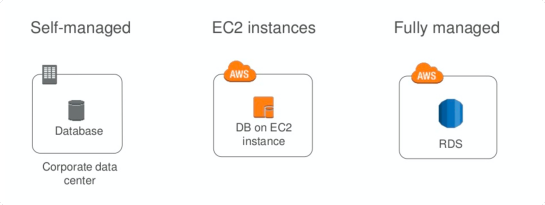
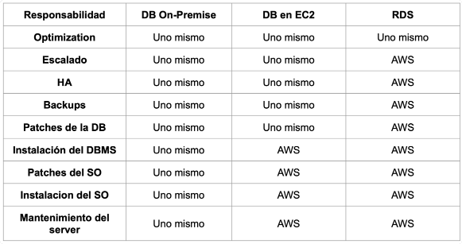
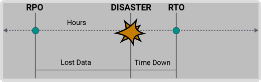
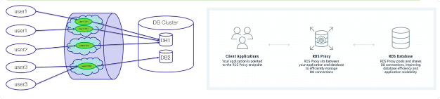
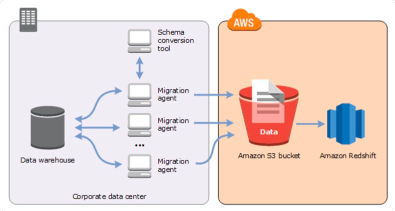
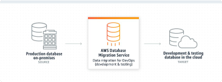
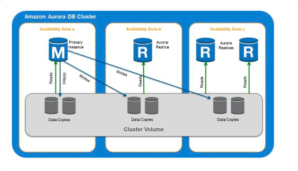
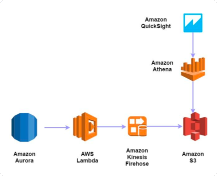
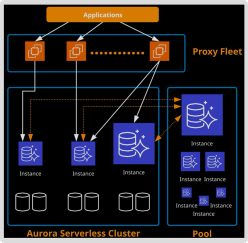

# RDS y Aurora

## Bases de Datos Relacionales

Una base de datos permite administrar grandes cantidades de registros de datos.
Los DBs pueden agruparse en distintas categorías:

- Relacionales (RDBMS)
- Analíticas.
- No relacionales. Casi todas las aplicaciones se basan en una base de datos
  para almacenar datos y registros importantes para sus usuarios.

### Bases de Datos Transaccionales

Inicialmente armamos el sistema transaccional en una base:

`login, create user, create restaurant, create order, view order, receive order, etc.`

Generalmente se usan operaciones;

`INSERT/SELECT/UPDATE/DELETE`

sobre grupos reducidos de filas.

**OLTP (OnLine Transactional Processing)**

Like:

```sql
INSERT INTO orders
VALUES (‘User1’, ‘Restaurant1’, ‘cheeseburger’);
```

### DBMS: Database Management System



### DB en premise vs DB en instancia EC2 vs instancia RDS



## RDS - Amazon Relational Database Service

Amazon RDS es un servicio que simplifica la configuración y manejo base de datos
relacionales en AWS.

RDS se encarga de tareas comunes como copias de seguridad, parches, escalado y
replicación.

- Proporciona una API que le permite crear y administrar una o más instancias de
  base de datos.
- Una instancia de DB es un entorno de base de datos aislado en la red privada
  en la nube.
- Cada instancia de DB ejecuta y administra alguno de los siguientes DBMS:
  `MySQL, PostgreSQL, MariaDB, Oracle, SQL Server y Amazon Aurora.`

- El servicio expone un endpoint como un host y un puerto consumible por
  cualquier cliente común del DBMS elegido.
- No se da acceso de shell a los hosts de las instancias y restringe el acceso a
  ciertos procedimientos y tablas del sistema.

- Los recursos de CPU y memoria de una instancia RDS están determinados por su
  clase.

  Hay una amplia variedad para elegir, desde las db.t3.micro 1 CPU y 1 GB de
  memoria hasta las db.m5.24xlarge 48 CPUs y 384 GB de memoria pasando por
  muchas otras configuraciones intermedias.

- Con la misma facilidad se puede definir el storage disponible o dejar que
  escale de manera automática.

- Muchas funciones y configuraciones de configuración comunes se exponen y
  administran mediante Parameter Groups (eg: frecuencia a de backups) y Option
  Groups (configuraciones específicas de cada DB).

- Un Parameter Group es un contenedor para los valores de configuración del DBMS
  que se pueden aplicar a una o más instancias. Se puede cambiar en un instancia
  existente, pero requiere reiniciar.

### Licenciamiento

Para los DBMS privativos (Oracle y MS SQL Server) se ofrecen las siguientes
modalidades:

- License Included:

  AWS posee la licencia y está incluida en el precio de la instancia.

  Para Oracle licencias es para Standard Edition One. Para SQL Server, es SQL
  Server Express, Web Edition y Standard Edition.

- Bring Your Own License (BYOL):
  El usuario provee la licencia y es responsable de administrarlas. (Oracle)

### Backups y Recuperación



- Al definir una política de backup es necesario considerar
  - RPO (Recovery Point Objective): Es el período máximo de pérdida de datos
    aceptable en caso de falla o incidente.
  - RTO (Recovery Time Objective): Es el periodo máximo de inactividad hasta que
    se recupera el backup y se reanudar el procesamiento.
    - Para DBs grandes, esto puede llevar horas.
    - Se puede reducir el RTO a minutos al pasar a un nodo secundario de modo
      que por lo menos se pueda recuperar la información reciente.
- RDS ofrece una forma común para realizar backups para todos los DBMS. Hay dos
  mecanismos para esto:
  - Automated backups
  - Manual snapshots

#### Automated backups

Son backups incrementales del volumen de almacenamiento completo de la instancia
en lugar de una sola DB.

- El periodo de retención puede ser de 1 a 35 días.
- Cuando están habilitados se realizan de manera con la frecuencia elegida (en
  días) durante una ventana de mantenimiento de como minimo 30min.
- Cuando se borra la instancia también se borran estos backups.

#### Manual Snapshots

- Sirven para restaurar la DB al estado específico de un snapshot en cualquier
  momento.
- Se pueden realizar con la frecuencia que se desee
- Los manual snapshots se mantienen hasta que se los elimine explícitamente con
  la consola de Amazon RDS o con la API DeleteDBSnapshot aunque la DB se haya
  eliminado.

### Deploys Multi AZ

- Los deploys Multi AZ permiten crear un clúster de DB tolerante a fallos en
  múltiples zonas de disponibilidad.
- Esto se logra creando una copia secundaria de la DB que AWS se encarga de
  mantener sincronizada.
- En caso se falla el nombre de DNS se mantiene pero AWS actualiza
  automáticamente el CNAME para que apunte a la instancia en stand by.

## Tipos de Escalamiento

- Viene en dos tipos
- Scale up/Vertical: Aumentar las capacidades de la instancia
- Scale out/Horizontal: Aumentar el número de instancias (en general mas
  complejo)

### Scale Up / Escalamiento Vertical

- Para cambiar la capacidad de cómputo y memoria, basta con seleccionar una
  clase de instancia diferente y RDS se encarga de la migración en un tiempo
  mínimo.
- Estos cambios se pueden programar para una ventana de mantenimiento.
- Si bien la oferta en clases de instancias es amplia esta tiene sus límites.
  Llegado ese punto conviene evaluar otras estrategias de escalado.

### Scale Out / Escalamiento Horizontal con particionamiento

- Particionar o fragmentar (partitioning/sharding) sirve para escalar
  horizontalmente haciendo que distintas instancias se ocupen de secciones
  distintas de los datos.
- La aplicación necesita decidir cómo enrutar las solicitudes de la base de
  datos al fragmento (shard) correcto y limita los tipos de consultas que se
  pueden realizar.
- Las bases de datos NoSQL como Amazon DynamoDB o Cassandra están diseñadas para
  escalar horizontalmente de esta forma.

### Scale Out / Escalamiento Horizontal con Read Replicas

- Consisten en usar réplicas para descargar transacciones de lectura de la DB
  primaria.
- Algunos casos de uso:
- Escalar bases más allá de la capacidad de una única instancia para cargas de
  trabajo con mucha lectura.
- Manejar el tráfico de lectura mientras la instancia de DB master no está
  disponible durante mantenimiento
- Tareas de reporting de un DWH.
- Disponible en MySQL, MariaDB, PostgreSQL y Oracle.

## Recomendaciones de Seguridad

- Limitar los permisos de los usuarios de AWS sobre el servicio RDS. (eg
  CreateDBInstance y DeleteDBInstance).
- Limitar acceso a la instancia por red mediante ACLs y subnets.
- Tener cuidado al definir los usuarios de la DB en si misma.
- Evaluar medidas de encriptación in-transit y at-rest

## RDS Proxy

Este servicio es un proxy de base de datos totalmente administrado y de alta
disponibilidad que hace permite hacer pooling de conexiones lo cual reduce el
uso de recursos y en consecuencia hace más escalable el sistema. Actualmente
soporta MySQL, Postgres y sus versiones de Aurora.



### Amazon Schema Conversion Tool

- Migrate Oracle, SQLServer and Teradata on premise databases to MariaDB (RDS)
  or Amazon Aurora.



## Amazon DMS

AWS Database Migration Service con AWS Database Migration Service, puede
replicar de manera continua los datos con alta disponibilidad y consolidar bases
de datos en un almacén de datos a escala de petabytes mediante el streaming de
datos a Amazon Redshift y Amazon S3. Admite migraciones homogéneas, como de
Oracle a Oracle, además de migraciones heterogéneas entre diferentes plataformas
de base de datos, como de Oracle o Microsoft SQL Server a Amazon Aurora.



# Aurora

- Es un motor de bases de datos relacionales desarrollado por Amazon compatible
  con MySQL o PostgreSQL.
- Aurora trabaja por default en modo cluster. Inicialmente hay un primary y/0
  réplicas. Todas acceden al mismo storage.
- El cluster cuenta con un endpoint read/write y un endpoint read only que
  balancea conexiones entre las distintas read-réplicas.
- Es posible crear una base a partir de un snapshot de RDS MySQL o PostgreSQL.



### Integración con Servicios AWS

- Los triggers de la base de datos y funciones pueden ejecutar funciones Lambda.
- Se pueden utilizar roles IAM para control de acceso a los objetos de la base
  de datos.
- Se puede utilizar CloudWatch para guardar y analizar las métricas logs de la
  bases de datos.
- Se pueden crear snapshots incrementales a S3



### Aurora: Storage

- Escalamiento automático incremental del storage
- Backups continuos e incrementales a S3
- Snapshots instantáneos a S3

### Aurora Serverless

Se definen un mínimo y máximo de ACUs (Aurora Capacity Units) y el servicio de
Aurora lo autoescala.


