# Big data & Analytics

## OLTP & OLAP

Inicialmente armamos el sistema transaccional en una base:

`login, create user, create restaurant, create order,
view order, receive order, etc.`

Generalmente se usan operaciones;

`INSERT/SELECT/UPDATE/DELETE` 

sobre grupos reducidos de filas.

**OLTP (OnLine Transactional Processing)**

Like:
```sql
INSERT INTO orders
VALUES (‘User1’, ‘Restaurant1’, ‘cheeseburger’);
```

### Pero los usuarios hacen preguntas
- Cuantas órdenes se hicieron ayer?
- Cual es el ítem más pedido?
- Dónde se hacen la mayoría de mis pedidos?
- Cuanta distancia recorre un delivery en promedio por día?

Estas preguntas involucran agregaciones sobre muchas filas (OLAP)
```
SELECT day(date), count(1)
FROM orders
WHERE date = YESTERDAY
GROUP BY day(date)
```

### Una base de datos no es suficiente
- Dónde están los deliveries en cada momento del día?
- Cuántos usuarios únicos tuvimos cada día?
- Cual va a ser el tiempo estimado de delivery de una hamburguesa el sábado a las 20hs?

#### OLAP (OnLine Analytical Processing)
Involucra tener una base de datos o sistema analítico separado de la transaccional.
Los procesos ETLs extraen los datos de los sistemas transaccionales y los llevan a las bases de datos OLAP luego de transformarlos.

## Data Warehouse Paralelos (MPP)
- Diseñados para particionar los datos y escalar a múltiples máquinas.
- Los primeros fueron Vertica Teradata, Netezza, Exadata.
- Vertica fue la primer base de datos analítica con formato columnar.
- Permiten escalar lo ETLs y mejores tiempos de respuesta.
- Muchos soportan datos semi-estructurados como XML o JSON.

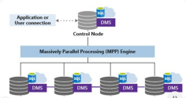

### Formatos Columnares

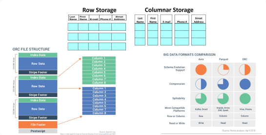

## Data Lake
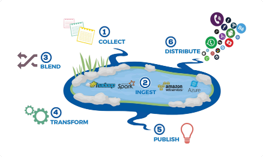

### Enterprise Data Lake
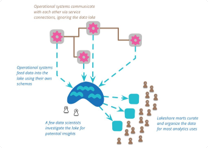

https://martinfowler.com/bliki/DataLake.html
https://martinfowler.com/articles/data-monolith-to-mesh.html

### Data Lake & Data Warehouse in AWS
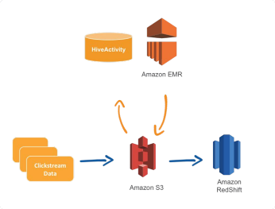

### AWS Analytics Portfolio
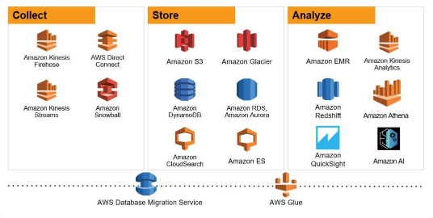

## Redshift

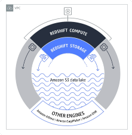

Es un Data Warehouse completamente administrado por AWS basado en PostgreSQL 8.4 con capacidades adicionales para MPP y datos columnares.

Permite consultas en petabytes de datos en storage local y exabytes de datos estructurados o formatos de archivo abiertos en Amazon S3 (Redshift Spectrum).

Costo inicial de 0,25 USD por hora sin compromisos, aumentar la escala a petabytes de datos por 250 USD a 333 USD por terabyte no comprimido al año. También permite analizar datos en S3 por tan solo 0,05 USD cada 10 gigabytes de datos analizados.

### Arquitectura Redshift

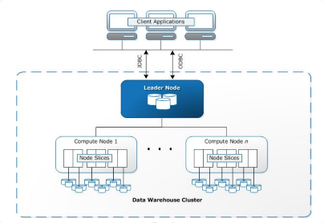

### Compresión de datos
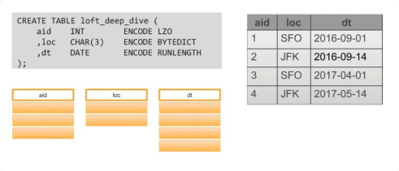

### Zone Maps
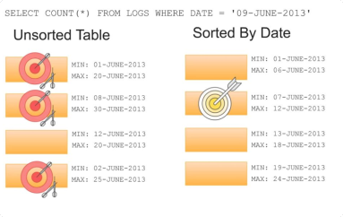

#### DISTRIBUTION AND SORT KEYS
```
create table sales(
salesid integer not null,
listid integer not null,
sellerid integer not null,
buyerid integer not null,
qtysold smallint not null encode mostly8,
pricepaid decimal(8,2) encode delta32k,
commission decimal(8,2) encode delta32k,
saletime timestamp
)
distkey(listid)
compound sortkey(listid,sellerid);
```

### INTERLEAVED SORT KEYS

Provee el mismo peso a cada columna utilizada como sort key.

Mejora la performance cuando se realizan consultas sobre columnas secundarias de la SORT KEY.

Realizar INSERTs o UPDATEs de filas afecta la performance de manera aún mayor que con la COMPOUND SORT KEY.

Ejemplo:
```
CREATE TABLE customer (
c_customer_id INTEGER NOT NULL,
c_country_id INTEGER NOT NULL)
INTERLEAVED SORTKEY (c_customer_id, c_country_id);
```

## UPDATES

Un update de una fila consiste en marcar la fila como borrada e insertar el valor nuevo. 

Redshift almacena las columnas en bloques inmutables de 1MB y un update de una sola fila implica crear un bloque nuevo de 1MB por cada columna. Por ejemplo, para columnas BIGINT hacer un UPDATE de una fila es el equivalente a reinsertar 100,000 filas.

En vez de realizar updates de filas particulares 

`UPDATE event_table SET user_id = new_user_id WHERE user_id = old_user_id`

Realizar updates de datos en bulk a partir de una tabla de staging
```
UPDATE event_table SET user_id = identify_staging.new_user_id
 FROM identify_staging
 WHERE event_table.user_id = identify_staging.user_id
```


### Loading Data: S3 Source
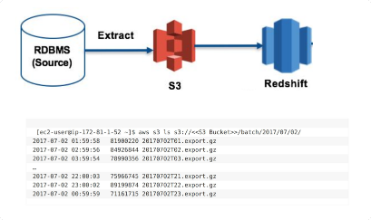

### Loading Data: COPY using Manifest File

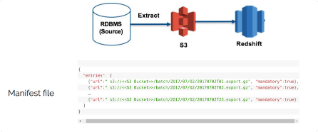

```
SET wlm_query_slot_count TO <<max available concurrency in the ETL queue>>;
COPY stage_tbl FROM 's3://<<S3 Bucket>>/batch/manifest20170702.json' iam_role
'arn:aws:iam::0123456789012:role/MyRedshiftRole' manifest;
```

### Loading Data: Aggregate and Insert

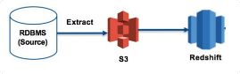

```
Begin
INSERT into ETL_LOG (..) values (..);
DELETE from weekly_tbl where dataset_week = <<current week>>;
INSERT into weekly_tbl (..)
 SELECT date_trunc('week', dataset_day) AS week_begin_dataset_date, SUM(C1) AS
C1, SUM(C2) AS C2
FROM stage_tbl
GROUP BY date_trunc('week', dataset_day);
INSERT into AUDIT_LOG values (..);
COMMIT;
End;
```

### Massive Export
```
unload
('SELECT * FROM weekly_tbl WHERE dataset_week = <<current week>>’)
TO 's3:// <<S3 Bucket>>/datalake/weekly/20170526/'
iam_role 'arn:aws:iam::0123456789012:role/MyRedshiftRole';
```

## Mejores Prácticas
- Utilizar el comando COPY sobre muchos archivos de tamaño similar entre 1MB y 1GB.
- Utilizar Workload Management para configurar distintas colas de recursos con prioridades. Las colas de operaciones ETLs deben tener pocos slots (aprox 5 ) ya que las operaciones de COMMIT son pesadas.
- Realizar mantenimiento de las tablas a menudo:
    - Utilizar VACCUM para liberar espacio después de DELETEs
    - Utilizar ANALYZE para mantener estadísticas actualizadas
    - TRUNCATE o DROP tablas intermedias para evitar VACUUM.
    - Utilizar tablas mensuales o anuales y una vista que las una
- Realizar los múltiples pasos de un proceso ETL en una sóla transacción ya que la operación de COMMIT es costosa
    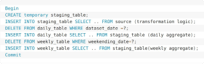
- Utilizar Redshift Spectrum para ETLs sobre datos masivos adhoc en S3

## Redshift Spectrum

Permite ampliar la consulta de datos a través de Redshift a datos almacenados en archivos en S3.

Permite utilizar formatos de datos abiertos que ya se usan, sin necesidad de cargar ni transformar los datos.

Puede utilizar sin problemas las mismas herramientas de SQL de Amazon Redshift.


### Tablas con Redshift Spectrum

```
create external schema spectrum
from data catalog
database 'spectrumdb'
iam_role
'arn:aws:iam::123456789012:role/mySpe
ctrumRole'
create external database if not
exists;
```

```
aws s3 cp
s3://awssampledbuswest2/tickit/spectr
um/sales/
s3://bucket-name/tickit/spectrum/sale
s/ --recursive
```

```
create external table spectrum.sales(
 salesid integer,
 listid integer,
 sellerid integer,
 buyerid integer,
 eventid integer,
 dateid smallint,
 qtysold smallint,
 pricepaid decimal(8,2),
 commission decimal(8,2),
 qsaletime timestamp)
row format delimited
fields terminated by '\t'
stored as textfile
location
's3://awssampledbuswest2/tickit/spectrum/
sales/'
table properties ('numRows'='172000');
```

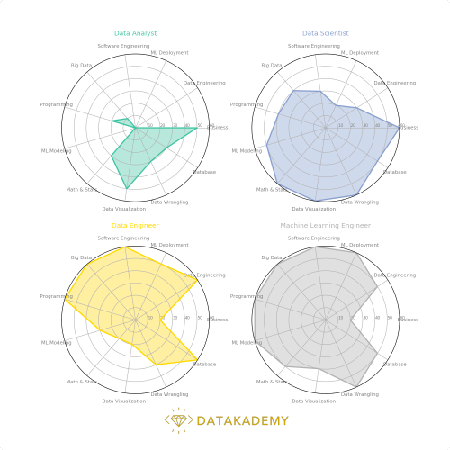

# CONCLUSIONES

– El rol de un Arquitecto de Soluciones implica conocer la oferta de productos disponibles y las necesidades de los clientes y poder planear una arquitectura que cumpla con las mismas de una manera efectiva en cuanto a costo y garantías de seguridad.
– En cuanto a las soluciones de Big Data y Analytics AWS posee muchos productos que se complementan o compiten entre sí.
– Redshift es el primer producto que permitió armar un Data Warehouse de hasta PBs y mediante Spectrum permite consultar hasta Exabytes de datos en S3.