# Práctica de Redshift

## Tarea 1: Crear el rol que va a usar Redshift

1. Ir a la consola de IAM: https://console.aws.amazon.com/iam/
2. De ahi ir a choose “Roles”.
3. Luego “Create role”.
4. Seleccionar  AWS Service group, y luego Redshift.

    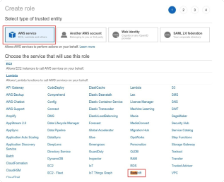

5. En “Select your use case” elegir “Redshift - Customizable” y luego “Next: Permissions”

    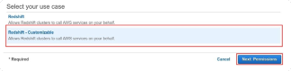

6. En “Attach permissions policies” seleccionar “AmazonS3ReadOnlyAccess” y “AWSGlueConsoleFullAccess”. Luego hacer click en “Next: Tags”.

    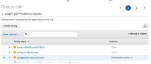


7. En “Add tags” hacer click en “Next: Review”.
8. En “Role name” poner “myRedshiftRole-[SUFFIX]”.
9. Luego hacer click en “Create Role”.
10. Finalmente ir al rol creado y copiar el ARN del mismo.

    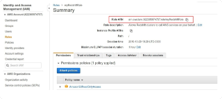

## Tarea 2: Crear una cluster de Redshift
En la consola de AWS en “Services” ir a Redshift.

Luego seleccionar “Quick Launch Cluster”:

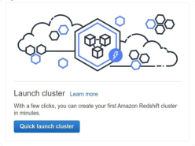

En la pagina de creación del cluster vamos a poner las siguientes opciones:

- Cluster identifier: mycluster-[SUFFIX]
- Node type: dc2.large
- Nodes: Dejamos el default de 2.
- Master user name: awsuser
- Database name: dev
- Master user password: Cloud2020
- Database port: 5439
- Available IAM roles: Elegimos el rol que creamos antes myRedshiftRole-[SUFFIX].

Finalmente hacemos click en Create Cluster. Luego de esto vamos a ver un mensaje como el siguiente:

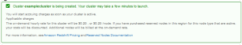

En la sección “Clusters” vamos a ver el nuevo cluster en estado “Creating”:

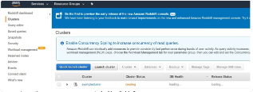

Luego de un tiempo va a pasar a estado “Available”:

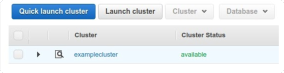


## Tarea 3: Cargar datos desde S3

Primero es necesario generar un bucket de S3 con el nombre redshift-exercise-[SUFFIX] y crear el directorio tickit dentro del mismo. Asegurarse de crear el bucket en la misma región que el cluster de Redshift.

Luego cargamos en dicho directorio el contenido del siguiente ZIP.

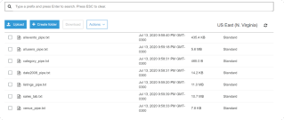

Una vez cargado estos archivos, vamos a acceder a la UI para hacer queries al cluster.

Para lograr esto ingresamos nuevamente al servicio Redshift y hacemos click en “Query editor” y completamos el cuadro de login con las credenciales que definimos al crear el cluster:

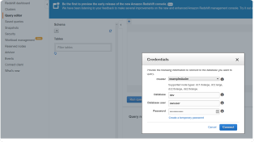

Tengan en cuenta que usamos una UI por conveniencia pero es posible conectarse al clúster como si fuese un Postgres común y corriente.

El primer paso va a ser crear las tablas que vamos a usar:

```
create table sales(

        salesid integer not null,

        listid integer not null distkey,

        sellerid integer not null,

        buyerid integer not null,

        eventid integer not null,

        dateid smallint not null sortkey,

        qtysold smallint not null,

        pricepaid decimal(8,2),

        commission decimal(8,2),

        saletime timestamp);
```

Hecho esto vamos a cargar datos usando el comando COPY. Reemplazar los datos en rojo según corresponda.

```
copy sales from 's3://redshift-exercise-[SUFFIX]/tickit/sales_tab.txt'

credentials 'aws_iam_role=arn:aws:iam::622305974757:role/myRedshiftRole-[SUFFIX]'

delimiter '\t' timeformat 'MM/DD/YYYY HH:MI:SS';
```

## Tarea 4: Hacer queries sobre los datos cargados

Ahora que tenemos cargados los datos podemos hacer queries sobre los datos cargados:

Vemos cantidad de ventas realizadas:

`select count(*) from sales;`


Resultado:
```
count

172456
```

Busquemos los 5 mejores compradores:

Vemos cantidad de ventas realizadas:
```
select buyerid, sum(pricepaid*qtysold) as total

from sales

group by buyerid

order by total desc

limit 5;
```

Resultado:

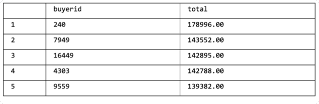

## BONUS Tarea 5: Cargar datos a S3 con UNLOAD
Primero debemos crear el directorio unload dentro de tickit. Allí se exportarán los datos resultantes de la siguiente query:

```
unload ('select buyerid, sum(qtysold * pricepaid) as total

from public."sales"

group by buyerid

order by total')

to 's3://redshift-exercise-[SUFFIX]/tickit/unload/'

iam_role: 'arn:aws:iam::622305974757:role/myRedshiftRole-[SUFFIX]';
```


¿Funcionó? ¿Hace falta una configuración adicional?

