# Amazon Kinesis y Amazon MSK
> Analizando streams de datos en tiempo real en AWS

## Punto de partida
Nos contratan para desarrollar una aplicación de telemetría: necesitamos que una app mobile grabe todos los viajes en auto de nuestros usuarios y luego muestre un tablero donde se puedan ver los recorridos del día y alguna otra información agregada como kms recorridos, horas manejadas, etc.

¿Cómo diseñarían esta plataforma teniendo en cuenta los 5 pilares de la arquitectura en AWS?
-  Excelencia operacional (DevOps)
-  Seguridad
-  Confiabilidad (Hay redundancia, no hay puntos únicos de falla, cada pieza escala con la demanda lo más autónomamente posible)
-  Performance
-  Optimización de costos

### Solución serverless 


### Casos comunes de real- time y semi real- time


### Fuentes de datos en streaming
Devices y/o aplicaciones que producen datos en tiempo real


## Kinesis

-  Una alternativa “managed” para Apache Kafka
-  Ideal para logs, IoT, clickstream
-  Para resolver problemas de Big Data “real time” o “semi real- time”
-  Los datos se replican automáticamente en 3 AZ

Kinesis Streams: Baja latencia sin límites de escala.

Kinesis Analytics: Análisis en tiempo real sobre el stream

Kinesis Firehose: “Hundir” streams en S3, Redshift, Elastic Search, Splunk.

### Configurando real- time analytics

Las tecnologías de data streaming permiten ingestar, procesar y analizar grandes volúmenes de datos a gran velocidad en tiempo real


Kinesis


### Kinesis Streams
Los streams se dividen en “shards” o particiones


-  Los datos se retienen hasta 7 días, por default 24hs
-  Los datos que viven en el shard están disponibles para reprocesar
-  Muchas aplicaciones pueden consumir el mismo stream
-  Una vez que los datos se escriben no se pueden borrar (inmutables)

### Shards
-  Cada stream se compone de muchos shards
-  Kinesis se paga por shard, sin importar la cantidad de shards
-  Desde el producer, se pueden acumular varios registros para enviar todos juntos (batching)
-  La cantidad de shards se puede modificar según la necesidad (reshard/merge)
-  Los registros se ordenan en cada shard.


### Registros
Data Blob: los datos que se envían, serializados a bytes. Hasta 1MB. Puede contener cualquier tipo de información 

Record Key: La clave asociada a un registro, sirve para agrupar. Misma clave = Mismo shard.
Hay que usar una clave bien distribuida para evitar “hot partitions”

Sequence Number: Identificador único. Lo pone Kinesis, para ordenar luego de ingestar.

 

### Configurando real- time analytics
Los PRODUCERS ejecutan la ingesta de datos desde la fuente hacia el Storage


#### Producers
1) Kinesis SDK
2) Kinesis Producer Library (KPL)
3) Kinesis Agent

Librerías de terceros:
-  Spark
-  Log4J
-  Kafka Connect
-  Nifi


#### Producers


##### Opción 1: Kinesis Producer SDK
-  Se utiliza PutRecord o PutRecords (batching)
-  El batching aumenta el troughput => Menos http Requests
-  Si nos vamos de los límites ProvisionedTroughputExcedeed
-  Mobile SDK: Android, iOS, etc
-  Caso de uso: Bajo troughput, Alta latencia, resolver problemas sencillos.

Fuentes de datos manejadas:
-  CloudWatch Logs
-  AWS IoT
-  Kinesis Data Analytics

##### Opción 1: Kinesis Producer SDK -  Excepciones
ProvisionedTroughputExcedeed
-  Se recibe cuando enviamos demasiados datos en algún shard
-  Puede ser culpa de un “hot shard”

Posibles soluciones:
-  Retry with backoff
-  Aumentar los shards (escalar)
-  Asegurar que la clave de partición es buena 

##### Opción 2: Kinesis Producer Library (KPL)
-  Librería de Java/C++
-  Para casos donde se requiere alta performance
-  Tiene un mecanismo de reintento automático y configurable
-  API sincrónica o asincrónica (mejor performance)
-  Batching
-  Collect (Juntar un batch para enviar un PutRecord)
-  Aggregate (Juntar más info en un único registro hasta 1MB)
-  La compresión se implementa del lado del usuario
-  Hace falta alguna librería para decodificar los registros (KCL u otras)

##### Batching con Kinesis Producer Library (KPL)
Tanto Aggregate como Collection vienen prendidas por default y se combinan así:


RecordMaxBufferTime controla la eficiencia (delay vs # Api Calls)

##### Opción 3: Kinesis Agent
-  Únicamente se usa para logs que se envían a KDS
-  Escrita en Java, basada en KPL
-  Se instala en servidores Linux y monitorea los logs para enviarlos a Kinesis.

Features
-  Preprocesamiento antes de enviar al stream (csv a json, transformaciones sobre la misma línea, etc)
-  Se encarga de tareas como log rotation, checkpointing y retry upon failure. 

### Escalar los shards de Kinesis Data Streams
-  CloudWatch monitorea alguna métrica del shard (p.ej. el número de usuarios/shard creció)
-  Autoscaling consulta al param store vía API G cuántos shards existen y define acción.
-  AutoSC envía un mensaje a través de API G y Lambda de modificar la cantidad de shards
-  Se actualiza el parameter store con el nuevo # de shards


### Consumers
Los CONSUMERS toman la información de los streams y la llevan a herramientas de procesamiento o destino


1) Kinesis SDK
2) Kinesis Client Library (KCL)
3) Kinesis Connector Library (en la práctica deprecada)
4) Lambda
5) Firehose

Librerías de terceros:
-  Spark
-  Log4J
-  Kafka Connect

##### 1) Kinesis Consumer SDK
- Polling: las aplicaciones consumidoras “piden” los registros a los shards con GetRecords
- Cada shard tiene 2MB de throughput en total
- GetRecords devuelve hasta 10MB de datos o 10K registros
- Máximo 5 llamados por shard por segundo (por lo tanto 200ms de latencia)
-  Si 5 aplicaciones consumen del mismo shard, la latencia se va a 1 segundo => Enhanced Fanout


##### 2) Kinesis Cliente Library (KCL)
- Librería de Java traducida a Python, Ruby, .NET y otros
-  Permite desagregar los registros producidos con la KPL
-  Checkpointing para reanudar si hay errores
-  Usa DynamoDB (¡Cuidado! DynamosDB no escala sola)
- Se puede post- procesar cada registro


##### 4) Lambda
- Desde Lambda se puede acceder a los Streams
- Hay una librería liviana para desagregar los registros de la KPL
- Se puede ejecutar ETLs livianas y enviar a cualquier servicio:
 - S3
 - DynamoDB
 - ElasticSearch
 - Etc, …
- Batch size configurable 

##### 5) Firehose


-  Totalmente manejada (mucho más fácil de gestionar)
-  Semi real- time, tiene 60 segundos de delay
-  Se puede enviar datos a 4 destinos:
 -  S3
 - Redshift
 - ElasticSearch
 - Splunk
- Soporta conversión de datos Parquet - > ORC, transformaciones con Lambda
- Compresión para escribir en S3: gzip, zip o snappy
- Se paga por uso (GB)
- Spark Streaming NO LEE de firehose.
- En firehose no hay “replay” la información no está disponible en un storage accesible

## Amazon Kinesis -  Firehose vs. Streams

Amazon Kinesis Data Streams es para casos que requieren procesamiento personalizado de cada 1 de los registros con menos de 1 segundo de latencia

Amazon Kinesis Data Firehose es para casos que requieren cero administración, la necesidad de usar herramientas de analytics existentes basadas en S3, Amazon Redshift, y Amazon ES, y una latencia de 60 segundos o más.

### Kinesis Data Analytics
Kinesis Data Analytics permite analizar los datos que viven en el buffer

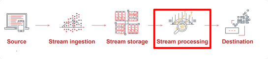

## Amazon Kinesis Data Analytics

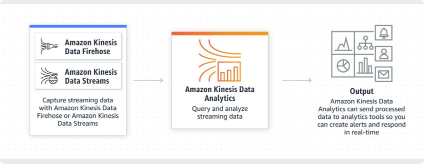

-  Permite interactuar con los datos del stream en tiempo real a través de SQL o Java
-  Permite construir aplicaciones de procesamiento de streaming elásticas y totalmente manejadas.

## KDA para SQL (aplicaciones simples)
-  Procesamiento de punta a punta en menos de un segundo
-  Existen funciones pre- built que incluyen desde sum y count distinct hasta algoritmos de machine learning
-  Las agregaciones corren continuamente utilizando operadores de ventana


### Pre- process Data Streams Usando Schema Editor
Schema editor provee un control pormenorizado del mapping a columnas SQL

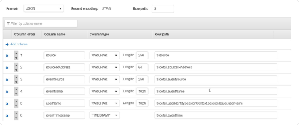

### Pre- process de Data Streams Usando AWS Lambda
La integración incorporada AWS Lambda provee pre- procesamientos flexibles antes del código SQL para:
-  Convertir otros formatos de datos (AVRO, Protobuf, ZIP) los JSON y CSV
-  Enriquecimiento customizado desde tablas de la base de datos o API calls

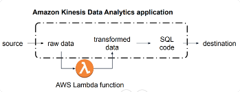

#### Interactive SQL Editor

Desarrollo ràpido e iterativo con templates SQL en la consola

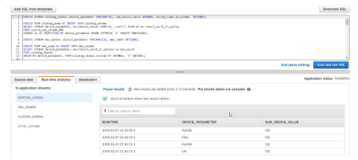

#### Escribiendo Streaming SQL

Streams (in memory tables)
```
CREATE STREAM calls_per_ip_stream(
eventTimeStamp TIMESTAMP,
computationType VARCHAR(256),
category VARCHAR(1024),
subCategory VARCHAR(1024),
unit VARCHAR(256),
unitValue BIGINT
);
```

Pumps (query continua)
```
CREATE OR REPLACE PUMP calls_per_ip_pump AS
INSERT INTO calls_per_ip_stream
SELECT STREAM "eventTimestamp",
COUNT(*),
"sourceIPAddress"
FROM source_sql_stream_001 ctrail
GROUP BY "sourceIPAddress",
STEP(ctrail.ROWTIME BY INTERVAL '1' MINUTE),
STEP(ctrail."eventTimestamp" BY INTERVAL '1' MINUTE);
```

## Aggregating Streaming Data?
-  Las agregaciones (count, sum, min,…) toman datos dispersos en tiempo real y los convierten en resultados
-  Los datos son procesados continuamente, por lo tanto hay que decirle a la aplicaciòn cuando se quieren los resultados Windows! 

### Tumbling Windows

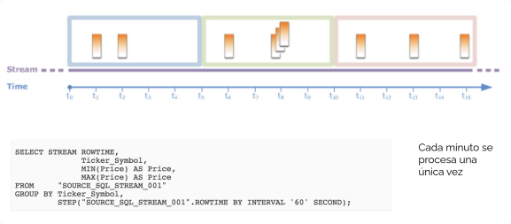

### Sliding Window
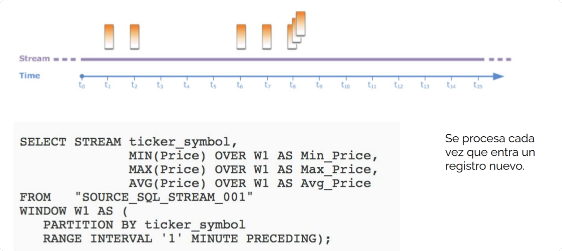

#### Enriquecer el Data Stream usando Data de Amazon S3
-  Se puede agregar una tabla SQL a la aplicación de streaming desde Amazon S3
-  Se puede actualizar periòdicamente la tabla llamando a la aplicación de actualización de la API

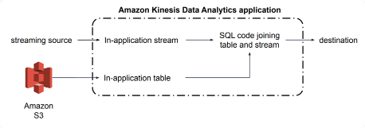

# Kinesis Data Analytics para Java

## KDA para Java (aplicaciones sofisticadas)
Utiliza Apache Flink, un framework y motor distribuido para procesamiento stateful

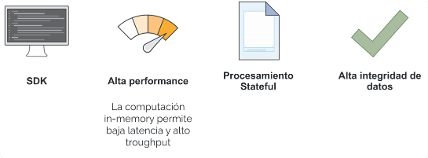

### Apache Flink soporta más de 25 operadores

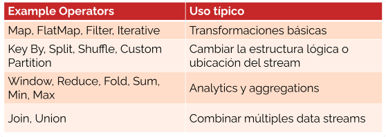

## Apache Managed Streaming para Kafka

### Comparando Amazon Kinesis Data Streams con MSK

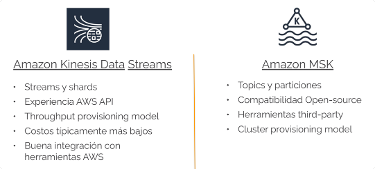

### Herramientas de cada etapa

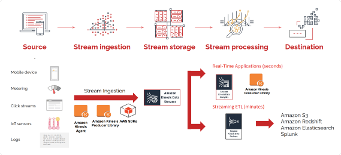

#### Patrón de uso #1: Web Analytics y Leaderboards

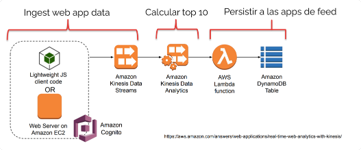

#### Patrón de uso #2: Monitoreo de IoT Devices

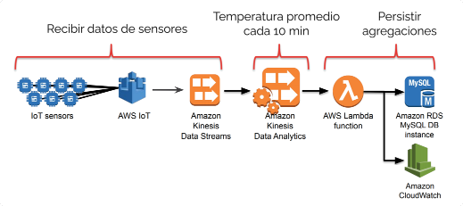

# PREGUNTAS DE EXAMEN

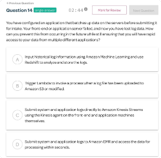

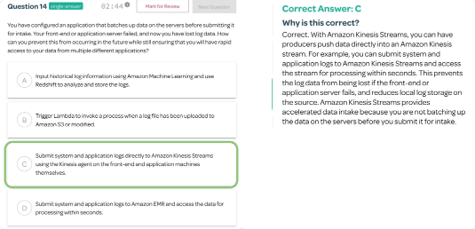

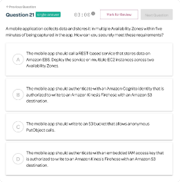

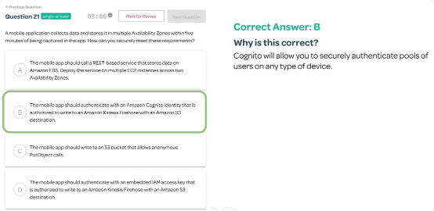

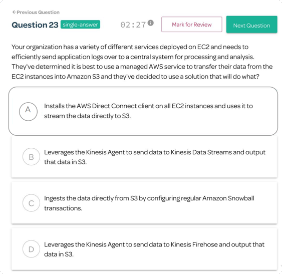

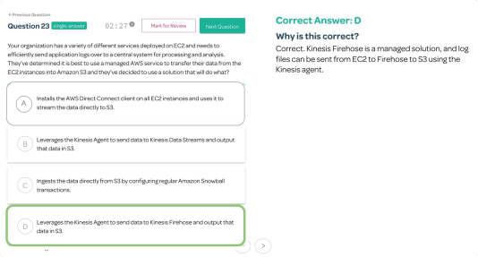

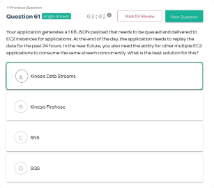

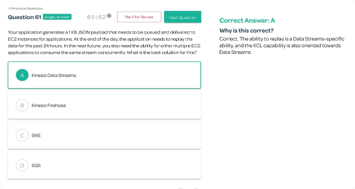
