# Big Data y Analytics 2

## Hadoop, Hive & Presto
### Enterprise Data Lake
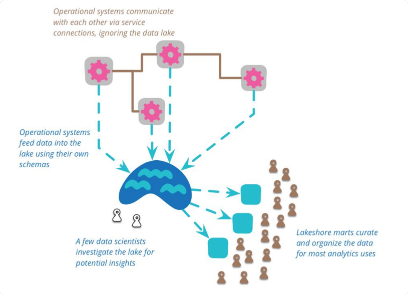

https://martinfowler.com/bliki/DataLake.html
https://martinfowler.com/articles/data-monolith-to-mesh.html

### Apache Hadoop
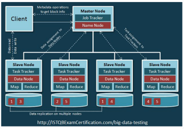

### Apache Hadoop 2

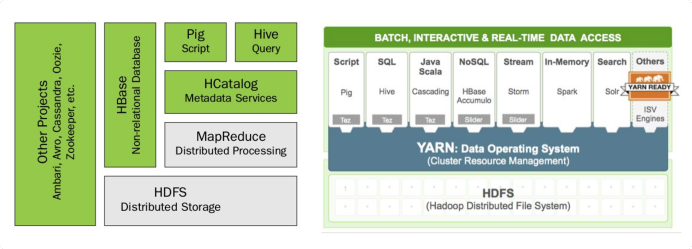

## Apache Hive
Es un sistema de Data Warehouse sobre Hadoop desarrollado por Facebook inicialmente en 2008.
Recibe consultas SQL (HiveQL) y las convierte a tareas de Map-Reduce (o similar) y las ejecuta distribuídas en el cluster de Hadoop sobre HDFS.

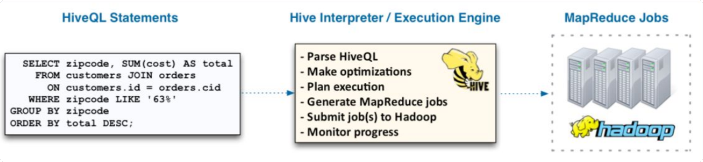

Hive posee un sistema llamado Metastore donde almacena los metadatos de cada tabla en una RDBMS (MySQL, Postgres, Oracle).

Las consultas operan sobre tablas creadas en el Metastore de Hive.

Los datos de la tabla se almacenan en paths en HDFS u otros filesystems soportados como S3. Terminan siendo archivos en directorios con el formato de la tabla.

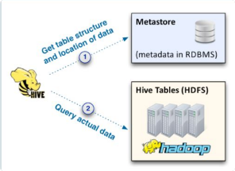

### Apache Hive: Particiones
Las tablas pueden tener particiones sobre ciertos campos que terminan reflejándose como subdirectorios debajo del directorio principal de la tabla.
Al filtrar por ciertos valores por esos campos se evita leer todos los subdirectorios.

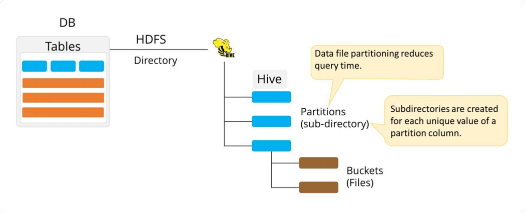

### Apache Hive: CREATE TABLE

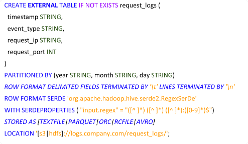

### Apache Hive: Particiones

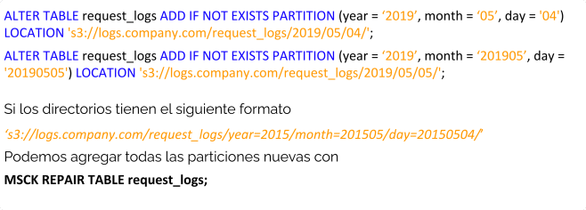

### Apache Hive: INSERT

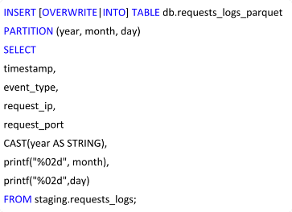

## MPP sobre HDFS

Sistemas Open Source de Procesamiento Paralelo Masivo.

Inicialmente hechos para correr sobre Hadoop y priorizar velocidad sobre estabilidad.

Basados en el paper de Google Dremel (BigQuery)

Gran ganancia de performance con formatos columnas para sumarizaciones.

Inestables para JOINs grandes e INSERTs.

### PrestoSQL

Motor masivo paralelo compatible con ANSI SQL (window functions, with, UDFs, etc).

Desarrollado por Facebook como evolución a Hive. Corre sobre la JVM.

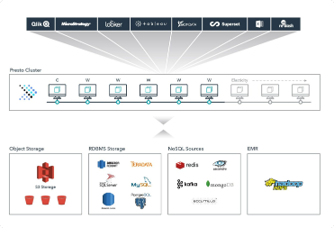

#### PrestoSQL Arquitectura

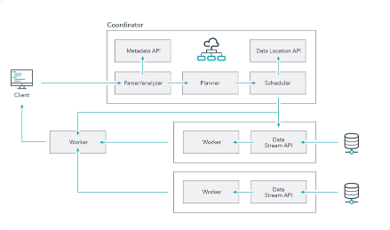

# Data Lake & Data Warehouse en AWS

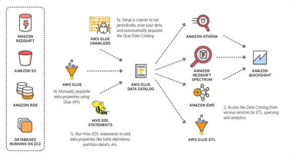

## AWS Analytics Portfolio

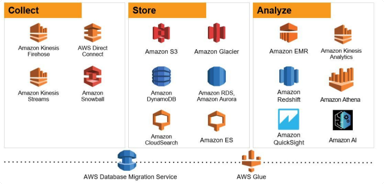

# Athena y Glue Catalog
Es un servicio serverless de consultas interactivo que facilita el análisis de datos en Amazon S3 con SQL estándar y no requiere ETLs.

Sólo se paga por las consulta unos 5 U$D por TB de datos escaneado.

Se cobra por la cantidad de bytes escaneados por redondeados al megabyte más cercano, con 10 MB mínimo por consulta.

No se cobran por operaciones de DDL, particiones o consultas fallidas.

No permite utilizar conectores que no consulten a S3

Soporta formatos como como CSV, JSON, ORC, Avro o Parquet

Soporta INSERTs desde 2019 pero no OVERWRITE.

Integración con IAM.

Resultados de una query se almacenan en S3.

API REST. Librerías en los principales lenguajes.

### AWS Glue Catalog

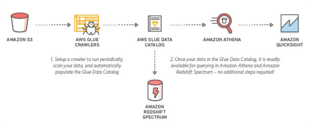

### Glue Crawlers

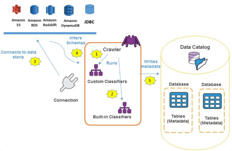

## S3 Select
Es una API de AWS que permite realizar consultas SQL simples sobre archivos en S3 sin necesidad de descargarlos:

- Soporta CSV, JSON, and Parquet con o sin compresión GZIP o BZIP2
- Se pueden hacer consultas a S3 Glacier de manera no interactiva
- Solo soporta cláusulas SELECT, FROM, WHERE y LIMIT
- No soporta subqueries o JOINs 

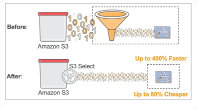

