# Big Data y Analytics 3

## Amazon EMR

### Enterprise Data Lake
 
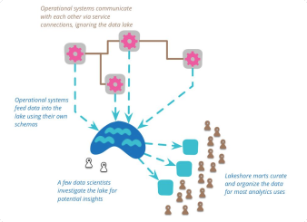

https://martinfowler.com/bliki/DataLake.html

https://martinfowler.com/articles/data-monolith-to-mesh.html

### Apache Hadoop
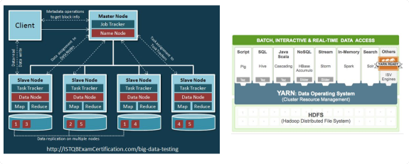

### Amazon EMR
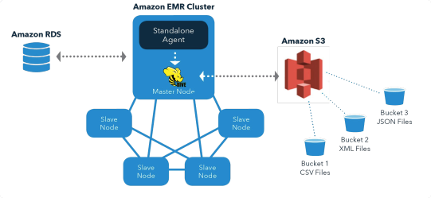

### Amazon Elastic Mapreduce
Plataforma de almacenamiento y procesamiento de grandes volúmenes de datos basada sobre Hadoop.

La plataforma es un software que se instalar por sobre instancias EC2 de Amazon Linux y se cobra un plus por sobre el valor de la instancia.

Permite instalar y utilizar de una manera simple una variedad de aplicaciones para procesamiento de grandes volúmenes de datos de manera escalable.

Para reducir costos soporta escalamiento (manual o automático), instancias spots, spot fleets y clusters transitivos con datos en S3.

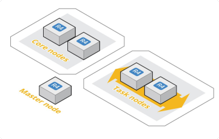

Master: contiene procesos que coordinan.
Core nodes: realizan procesamiento de datos y storage de datos mediante HDFS
Task nodes: nodos que solamente procesan datos.


#### Configuraciones de los nodos
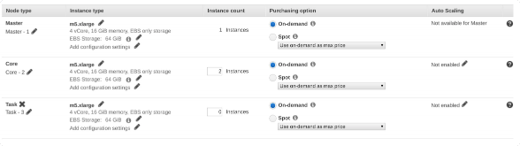

#### Aplicaciones Disponibles
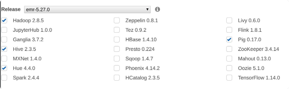

#### Opciones generales
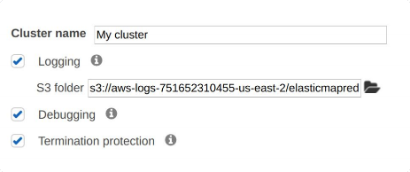

### Metastore Persistente
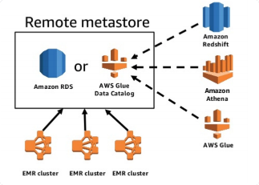

### Modelo de Persistencia
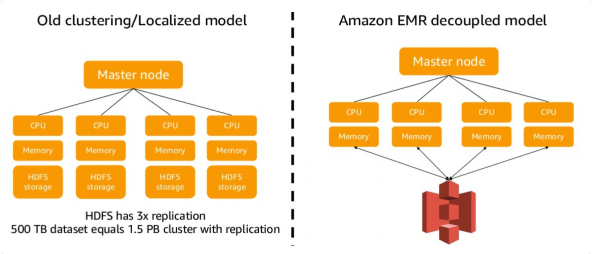

### EMRFS
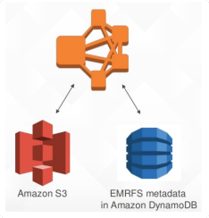

Consistencia de list-after-write y read-after-write con datos en S3.

Operaciones de listado de archivos en s3 más de 5x más rápidas.

Utilizar HDFS para workloads iterativos o caches

### Configurando aplicaciones (Presto)
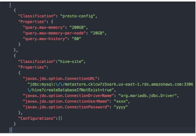

### Acciones de Bootstrap
EMR permite correr scripts te bootstrap custom. No garantiza el orden de ejecución.

Se pueden utilizar para tunear límites del SO (nproc y nofile), instalar agentes de monitoreo o configurar las aplicaciones de forma más detallada.

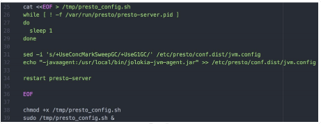

### Configurando aplicaciones (Presto)


## Data Lake & Data Warehouse en AWS
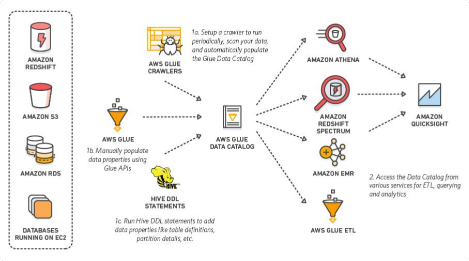

### AWS Analytics Portfolio
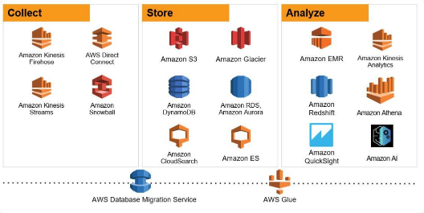

### EMR Applications

#### Operaciones con HDFS
```shell script
% hdfs dfs -copyFromLocal|-put input/docs/quangle.txt \
hdfs://localhost/user/tom/quangle.txt
% hdfs dfs -copyToLocal|-get \
hdfs://localhost/user/tom/quangle.txt input/docs/quangle.txt
```

### Sqoop
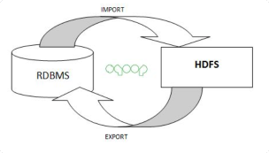

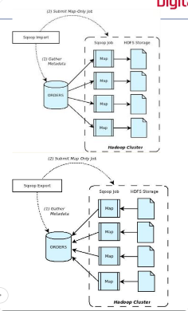

#### Sqoop Import
```shell script
$SQOOP_HOME/bin/sqoop import \
--append --check-column "modified_date" --incremental "lastmodified" \
--connect 'jdbc:mysql://db-host:3306/db' \
--username jpampliega --password-file '/user/hadoop/jpampliega-db.password' \
--table transactions --split-by "transaction_id" \
--direct -m 8 \
--hive-home "/home/hadoop/hive/" --hive-import \
--hive-table "staging.transactions" --null-string '\\N' --null-non-string
'\\N' \
--hive-partition-key day --hive-partition-value ${current_date} \
-- \
--skip-lock-tables --single-transaction --quick
```

### Hue
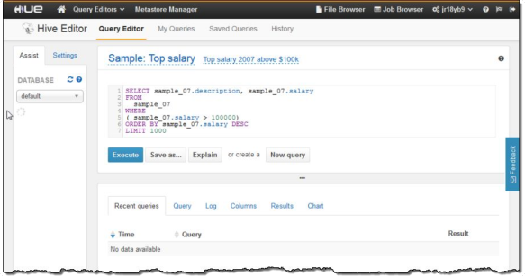

### Hive Workflow
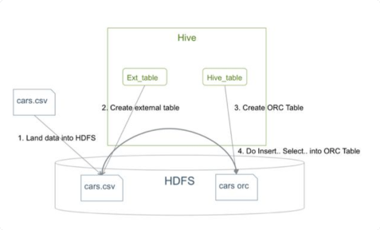

## DynamoDB

- Es un servicio de bases de datos NoSQL de formato key-value de alta disponibilidad ofrecido por Amazon.
- Fue uno de los primeros servicios en AWS de base de datos luego de SimpleDB y RDS.
- Surgió internamente en Amazon como una respuesta a como escalar una base de datos de manera simple para workloads operacionales (OLTP).
- No se puede consultar utilizando SQL salvo a través del conector de Hive pero esto implica un full scan.
- No es ideal para analytics.


### Esquema de las tablas
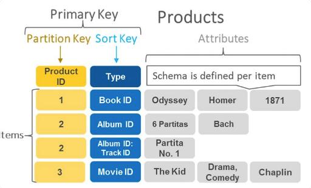

### Particiones
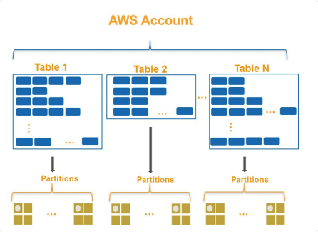

### Capacidad
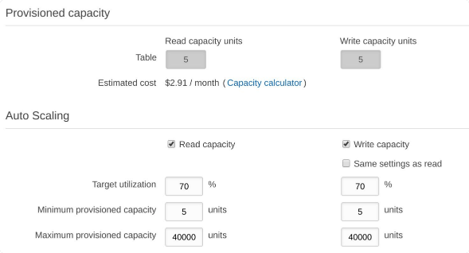

### Amazon DynamoDB Streams
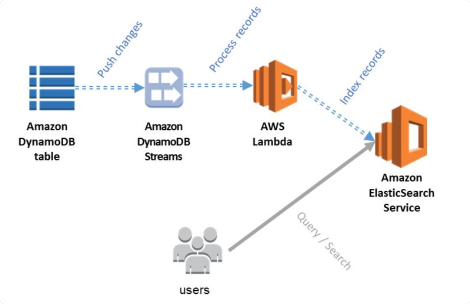