# Apache Spark y AWS Glue
## Apache Spark
- Es un sistema general de procesamiento de datos a gran escala de forma distribuida.
- Creado en 2009 como un proyecto de research en UC Berkeley RAD Lab.
- Provee librerías para Scala, Java, Python y R para ejecutar este procesamiento de forma distribuído.
- Posibilita el procesamiento batch, interactivo, continuo e iterativo de forma eficiente.

### Componentes de Spark
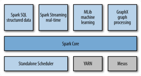

### Ejecución en Apache Spark
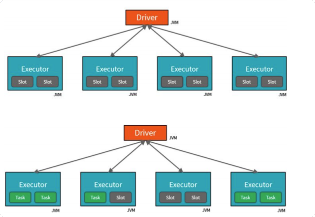

### Motor unificado de procesamiento

### Ejecución en Apache Spark
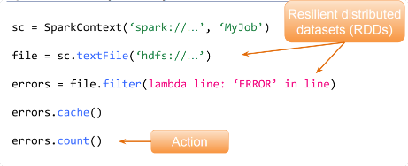

### Resilient distributed datasets (RDDs)

– Colección inmutable de objetos.
– Particionada y distribuida.
– Almacenada en memoria (permite spill a disk).
– Las particiones se re-computan ante un fallo.

### Transformaciones vs Acciones

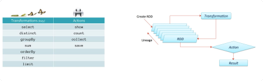

### Transformación
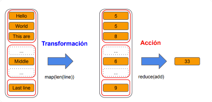

### Grafo de RDDs y Tareas

### Ejecución de un programa de Spark
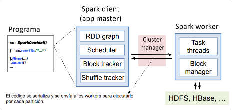

### Spark SQL
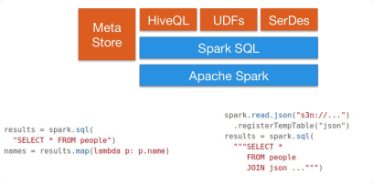

### Spark SQL: load & save
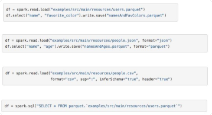

## AWS Glue
### Data Lake & Data Warehouse en AWS

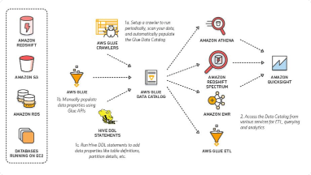

### AWS Glue
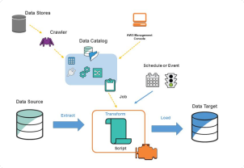

#### ETL: Job Properties
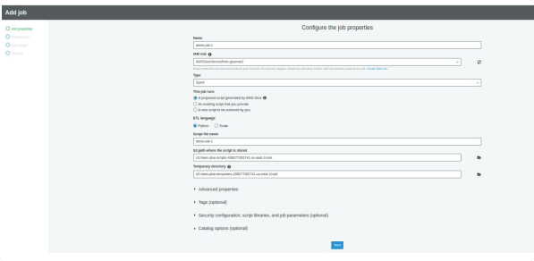

#### ETL: Data Source
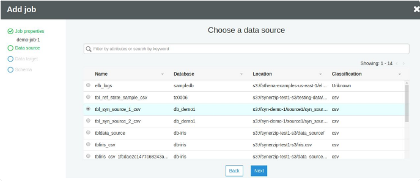

#### ETL: Data Target
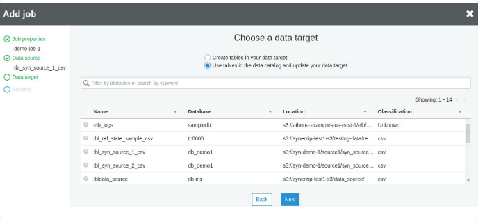

#### ETL: Create Data Target
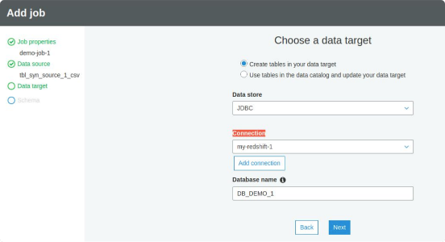

#### ETL: map fields

#### AWS Glue
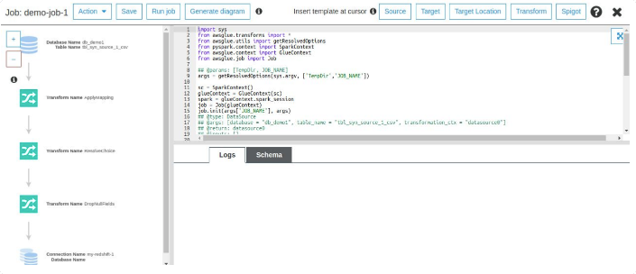

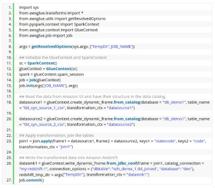

### DynamicFrame
El esquema es a nivel de fila y no a nivel de tabla.

Un campo que cambia de string a int haría que un DataFrame común falle pero esto no pasa con DynamicFrame

Tiene métodos adicionales como resolve_choice o relationalize para tratar con tipos de datos cambiantes o anidados.

Se encuentra integrado con Data Catalog entonces se pueden utilizar conexiones definidas en el mismo de manera simple. 

### Job Bookmarks
Realiza un seguimiento de los datos que ya se han procesado durante una ejecución anterior de un trabajo de ETL mediante información de estado persistente de la ejecución del trabajo.

Limitaciones:
1. Concurrencia máxima de 1 en un job
2. Fuentes de S3 o jdbc
3. Debe utilizar job.commit()

### Endpoints de Desarrollo
Su objetivo es obtener una instancia de Glue dedicada.

Uno incurre en costos por cada hora que está prendido.

Se puede desarrollar en Spark con Scala o Python.

Para conectarse uno debe configurar un certificado SSL y puede hacerlo por SSH.

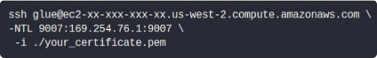

#### Endpoints de Desarrollo
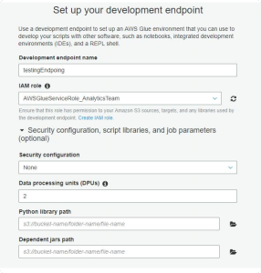

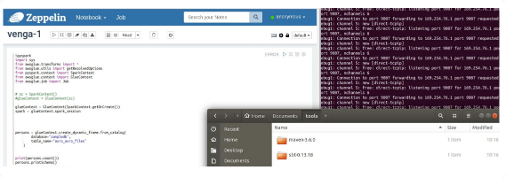

#### Workflows
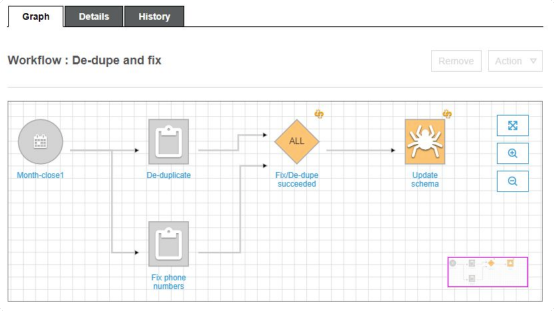

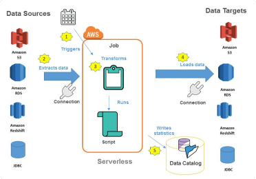