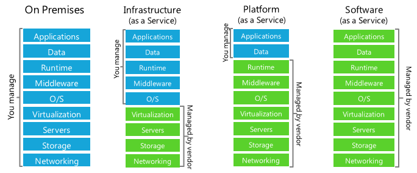
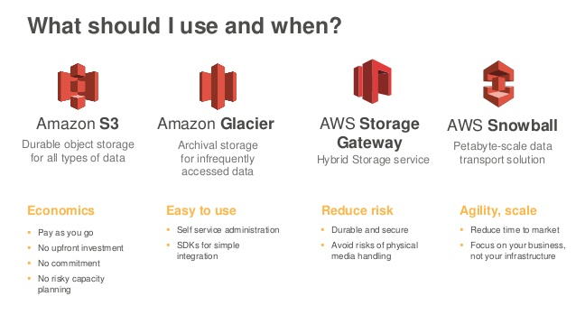
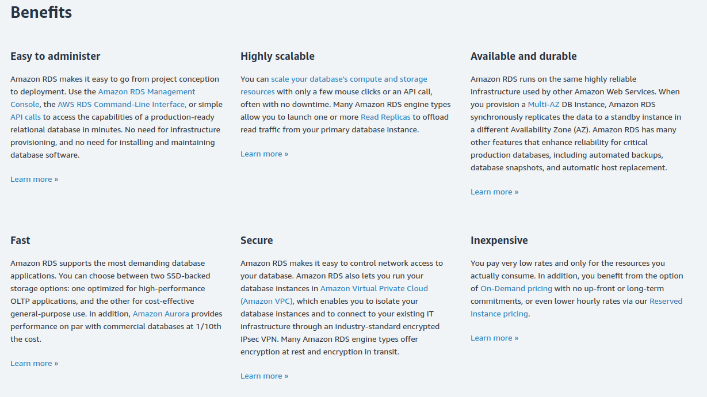
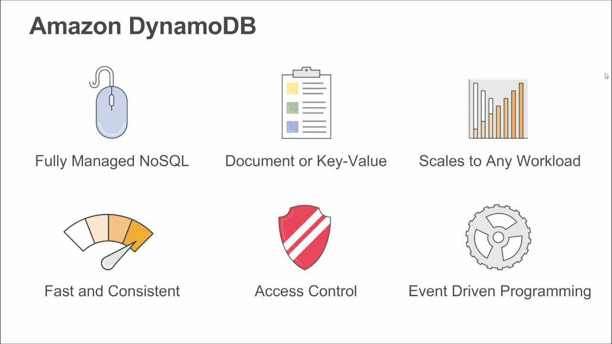

# AWS

  
## What is AWS

Data centers distributed Worldwide
On-demand delivery of IT resources 
Shared and dedicated resources

Benefits:
- economies of scale
- accounts isolated at the hypervisor level
- pay-as-you-go pricing
- no up front cost
- reduced maintenance and admin costs
- organised into product categories

Divided into geographic **regions**, chosen in order to:
- optimise latency,
- minimise costs,
- address regulatory requirements.

Each further divided into **availability zones**:
- physically isolated from each other,
- connected to each other with fast, private fiber-optic networking.

To deliver content to end users with lower latency, **Amazon CloudFront** (fast content delivery network (CDN)) uses a global network of 187 Points of Presence (176 **Edge Locations** and 11 Regional Edge Caches) in 69 cities across 30 countries.
- caches content at edge locations for high performance delivery of content
- provides DDoS protection

### Cloud Computing Models

#### IaaS: Infrastructure as a Service
Contains the basic building blocks for cloud IT
Eg. VPC, EC2, EBS

#### PaaS: Platform as a Service
AWS manages the underlying infrastructure (usually hw and os)
Eg. RDS, EMR, ElasticSearch

#### SaaS: Software as a Service
Completed product that is run and managed by the service provider. Mostly refers to end-user applications
Eg. Web-based email, Office 365, Salesforce

#### FaaS: Function as a Service or Serverless Computing
Allows you to build and run applications and services without thinking about servers. 
Eg. S3, Lambda, DynamoDB, SNS

## AWS Solutions

### [AWS Storage Solutions](https://mitrai.com/tech-guide/eight-types-of-aws-storage-services-explained/)

[Storage Cases](cases/storage-cases.md)

### AWS Database Services

RDS: Fully managed Database Service, makes easy to launch and scale DB on AWS. Services: MySQL (MariaDB, Aurora), PostgreSQL (std, Aurora PostgreSQL), Microsoft SQL Server, Oracle
DynamoDB: NoSQL Database as a Service. Serverless Service. High speed, low latency performance.
Redshift: Fast, fully managed, petabyte scalable data warehouse, based on the PostgreSQL engine. Perfect for Big Data solutions.
ElastiCache: In memory data store in the cloud, allows to retrieve information from fast, fully managed, in memory caches.
Database Migration Service (DMS): orchestrates the migration of databases over to AWS easily and securely. It also can migrate data between different database engines.
Neptune: Fast, reliable, fully managed graph database. Optimized for storing relationships, and querying the graph with ms latency. 

#### Amazon Relational Database Service

(Amazon RDS) makes it easy to set up, operate, and scale a relational database in the cloud. It provides cost-efficient and resizable capacity while automating time-consuming administration tasks such as hardware provisioning, database setup, patching and backups. It frees you to focus on your applications so you can give them the fast performance, high availability, security and compatibility they need.

#### DynamoDB

[AWS Database Services](https://www.sumologic.com/blog/migrating-aws-database-services/)
[AWS Database Services Complete Overview: RDS vs Redshift vs DynamoDB vs SimpleDB](https://www.cloudberrylab.com/resources/blog/aws-database-services-complete-overview-rds-vs-redshift-vs-dynamodb-vs-simpledb/)

## Guides
 
### Overview of AWS
- [AWS General Reference](guides/aws-general.pdf)
- [Overview of AWS White Paper](guides/aws-overview.pdf)
- [Cloud Best Practices](guides/AWS_Cloud_Best_Practices.pdf)

### Business Case for AWS
- [Introduction to AWS Economics](guides/introduction-to-aws-cloud-economics-final.pdf)
- [The Business Value of AWS](guides/aws-whitepaper-business-value-of-aws.pdf)
- [How AWS Pricing Works](guides/aws_pricing_overview.pdf)
- [AWS Answers to Key Compliance Questions](guides/AWS_Answers_to_Key_Compliance_Questions.pdf)
- [Overview of Security Processes](guides/AWS_Secutiry_Whitepaper.pdf)

## AWS Reference Links
  
[Certification](https://aws.amazon.com/certification/)

[Documentation](https://docs.aws.amazon.com/index.html)

[Whitepapers](https://aws.amazon.com/whitepapers/)

[Products](https://aws.amazon.com/products/)

[What's New with AWS?](https://aws.amazon.com/new/)
  
