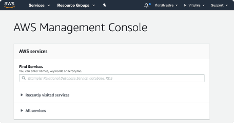

# AWS IAM
[AWS Documentation](https://docs.aws.amazon.com/IAM/latest/UserGuide/introduction.html)

AWS Identity and Access Management (IAM) is a web service that helps you securely control access to AWS resources. You use IAM to control who is authenticated (signed in) and authorized (has permissions) to use resources.

When you first create an AWS account, you begin with a single sign-in identity that has complete access to all AWS services and resources in the account. This identity is called the AWS account root user and is accessed by signing in with the email address and password that you used to create the account. We strongly recommend that you do not use the root user for your everyday tasks, even the administrative ones. Instead, adhere to the best practice of using the root user only to create your first IAM user. Then securely lock away the root user credentials and use them to perform only a few account and service management tasks.

## AWS IAM Features

- Shared access to your AWS account: Grant other people permission to admin and use resources in your AWS account without sharing psw and access keys.

- Granular permissions: Different permissions to different people

- Secure access to AWS resources for apps: Permissions between internal AWS services and resources.

- Multi-factor authentication (MFA): extra security

- Identity federation: users with passwords elsewhere (ex. corp nw, internet provider, etc) to temp access your AWS account

- Identity information for assurance - with CloudTrail. Log records with info on who made what requests for what resources in your account.

- PDI DSS Compliance: IAM supports processing, storage, transmission of credic card data by a merchant, validated by Payment Card Industry (PCI) Data Security Standard (DSS)

- Integrated with many AWS services

- Eventually consistent: AWS is HA by replicating data across multiple servers within AWS data centers around the world. Make sure to verify that changes to IAM have been propagated before production workflows depend on them (make these changes in a initialization or setup routine, run less frequently)

- Free to use

### How to access IAM
1. AWS management console
2. AWS CLI
3. AWS SDKs (ex. boto3 for Python)