# Cloud Architect
## Clase 2 - Seguridad, IAM, AWS CLI 

### Seguridad
#### Modelo de Responsabilidad compartida
AWS es el responsable de proteger la infraestructura Subyacente, el usuario de todo lo que se coloque o conecte a la nube.

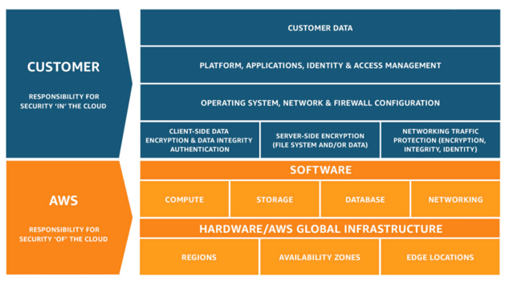

#### Disponibilidad: Regiones y Availability Zones
Son ubicaciones aisladas dentro de las regiones de los data centers desde donde se originan y operan los servicios de nube publica.
Cada region es completamente independiente, esto logra la mayor tolerancia a fallos y estabilidad posible.
Las regiones son colecciones de AZs conectadas a traves de enlaces de baja latencia.

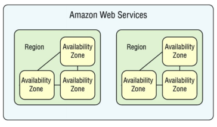

#### Seguridad y Redes

Los dispositivos de red situados en los limites de la red y en ciertos puntos internos implementar ACLs para definir el flujo de informacion a servicios especificos.

Los access points de las APIs estan limitados para facilitar su monitoreo.

Las instancias EC2:
- No pueden falsificar trafico
- Sniffear trafico
- Realizar escaneos de puertos no autorizados siendo que estos son detectados e investigados

*ACL: Access Control List
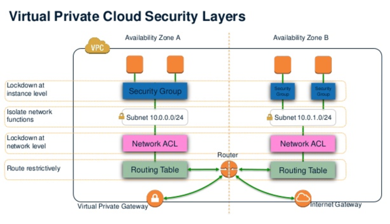

#### Uso de multiples credenciales

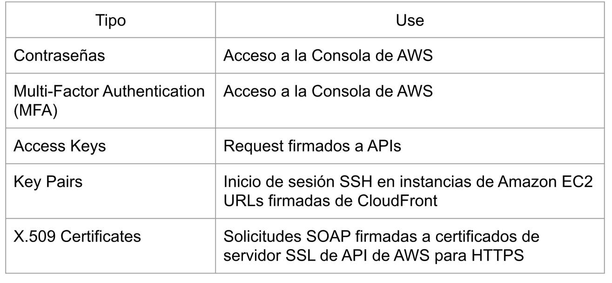

#### Tracking de API Calls: CloudTrail
Servicio que loguea las llamadas APIs a un bucket de Amazon S3 para tener mejor visibilidad de la actividad de la cuenta.

Sobre cada llamada a la API se registran los siguientes datos:
- Nombre de la API
- Identidad de quien la llama
- Hora de la llamada a la API
- Parametros enviados
- Respuesta emitida

Esto ayuda a garantizar el cumplimiento de las politicas internas y estandares reglamentarios.

#### Seguridad de EC2: Key Pairs
Uso de key pairs:
- Las instancias EC2 Linux no tienen contrase;as y usan key pairs para el login SSH
- Las instancias de Windows, utilizan un par de claves para obtener la contrasena de administrador y luego conectarse con RDP

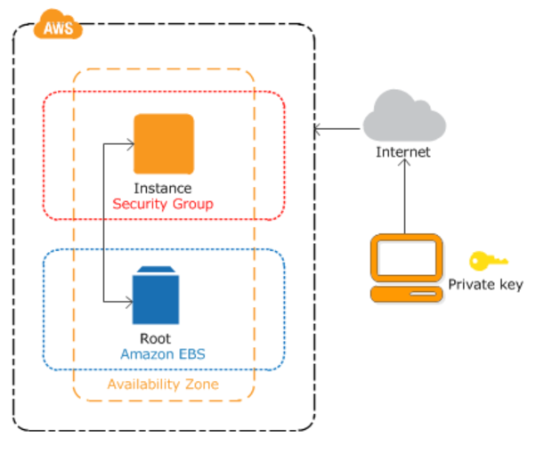

#### Seguridad de EC2: Security groups

- Funcionan como firewalls virtuales que controlan el trafico para una o mas instancias
- Cuando inicia una instancia, asocia uno o mas de estas a la misma
- Por default deniega todo el trafico salvo los puertos de login

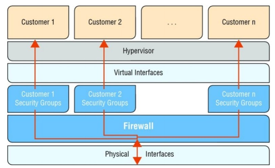
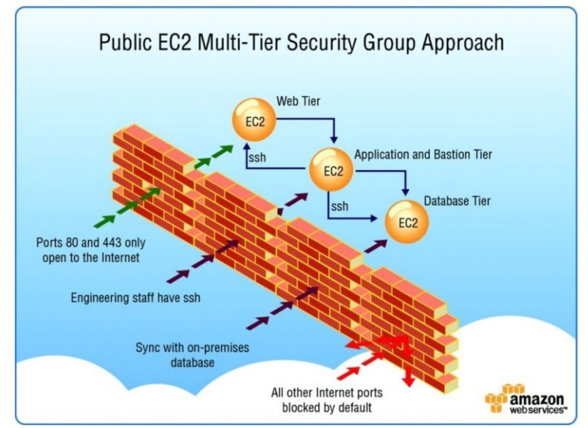
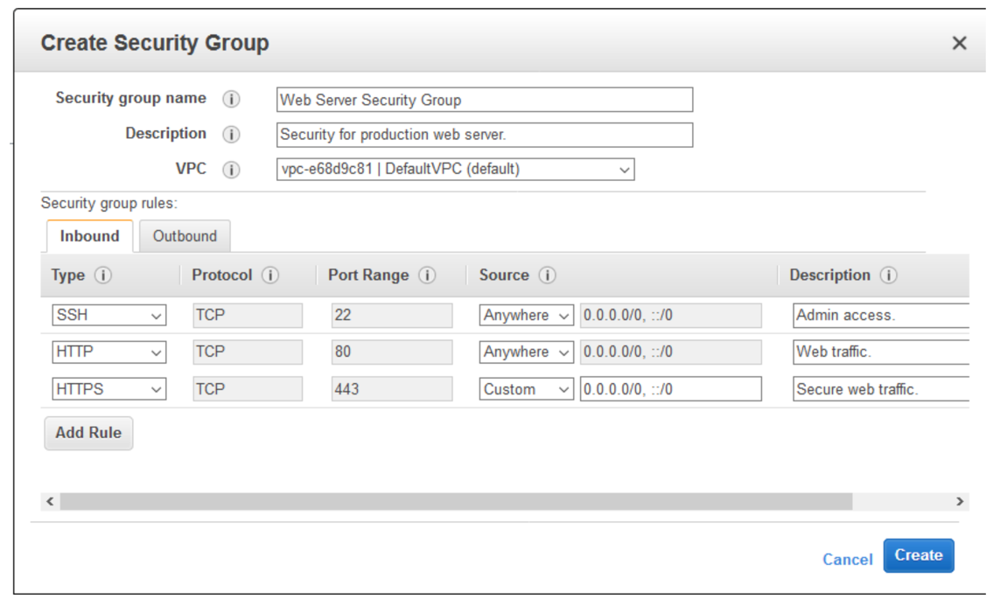

#### Encriptacion de Datos

- *in transit*: Informacion que esta siendo transmitida. Para seguridad AWS implementa HTTP en todas las APIs.

HTTPS: garantiza confidencialidad - si interceptan los datos, no van a poder acceder a la informacion.

Si firmo la llamada a la API con la access key correcta, demuestro autenticacion a AWS.

Con las dos cosas juntas, al estar firmada y enviada por HTTPS, puedo tener los dos beneficios: esta protegido y es seguro, es confidencial.

- *at rest*: Informacion que esta almacenada en un lugar fijo como seria S3 o un volumen EBS.
En ciertas situaciones este es un requerimiento regulatorio.

AWS encripta los datos, de tal forma que si alguien quiere robar datos que esten en un disco no va a poder obtener la informacion (Data loss prevention)

Varios servicios de AWS ofrecen esta funcionalidad entre ellos S3, EBS, RDS

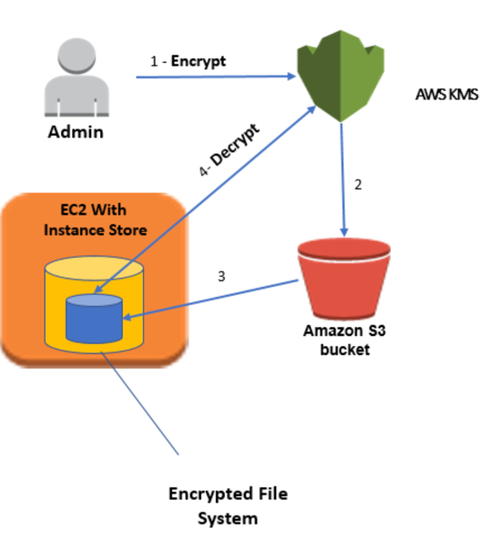

### IAM - Identity and Access Management

Servicio que maneja la autentivacion y autorizacion dentro de AWS.

Se encarga de aceptar o rechazar cada interaccion que se realice con AWS

Permite implementar politicas de control de acceso para controlar quien puede usar que servicios y recursos, y de que manera.

Manejo de identidad, pero con mucho peso a los permisos para la interaccion entre servicios. Hace de filtro para todos los servicios.

No es:
- No es un sistema de almacenamiento / autorizacion de identidad para aplicaciones
- No sirve para gestionar identidades del SO. Bajo el modelo de responsabilidad compartida esto recae en la configuracion del host definida por el usuario. 
Usted tiene el control de la consola y la configuracion de su SO.

#### Principals

Son entidades de IAM que pueden interactuar con AWS. 
Pueden representar tanto a usuarios humanos como aplicaciones.

Hay 3 tipos:
- Usuarios root
- Usuarios IAM
- Roles

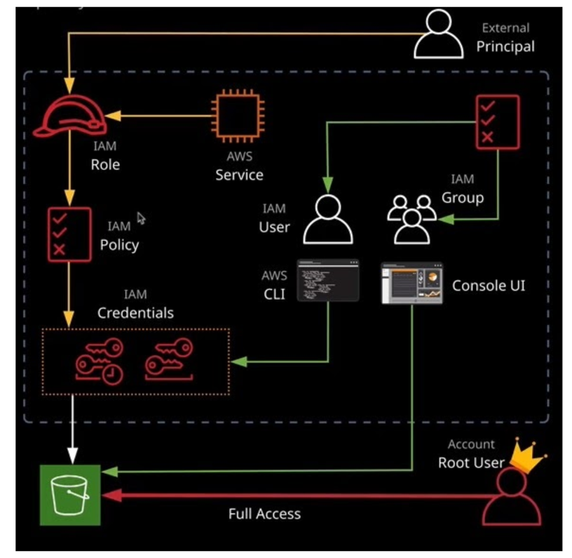

##### Usuario Root

- Se crea junto con la cuenta de AWS.
- Tiene acceso completo e irrestricto a todos los servicios y recursos por consola y API
- Evitar a toda costa usarlo en el dia a dia, incluso las administrativas. En su lugar conviene crear un usuario IAM con los permisos necesarios

##### Usuario IAM

- Se crean a traves de IAM para representar a personas o aplicaciones individuales
- Pueden ser creados por principals con privilegios administrativos de IAM
- Pueden asociarse a politicas muy granulares que definen estos permisos. Estoy ayuda a cumplir el principio de menor privilegio: limitar los permisos de la persona / app a lo minimo necesario para que lleve a cabo su tarea

##### Roles / Temporary Security Tokens

- Dan privilegios especificos a actores especificos durante un periodo de tiempo determinado.
- Cuando un actor asume un rol, AWS provee un token de seguridad temporal (STS)
- El token expira y puede durar de 15 minutos a 36 horas

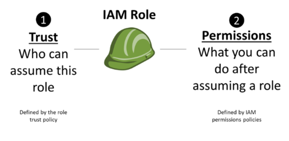

#### Autenticacion

- Login usuario + contrasena para login por consola
- Accesos programaticos por access keys + secret key
- Token de sesion: Cuando un proceso opera bajo un rol asumido, el token de seguridad temporal actua como una clave

Cuando se crea un usuario de IAM es necesario crearle un login y/o access key para qeu pueda interactuar con los servicios.

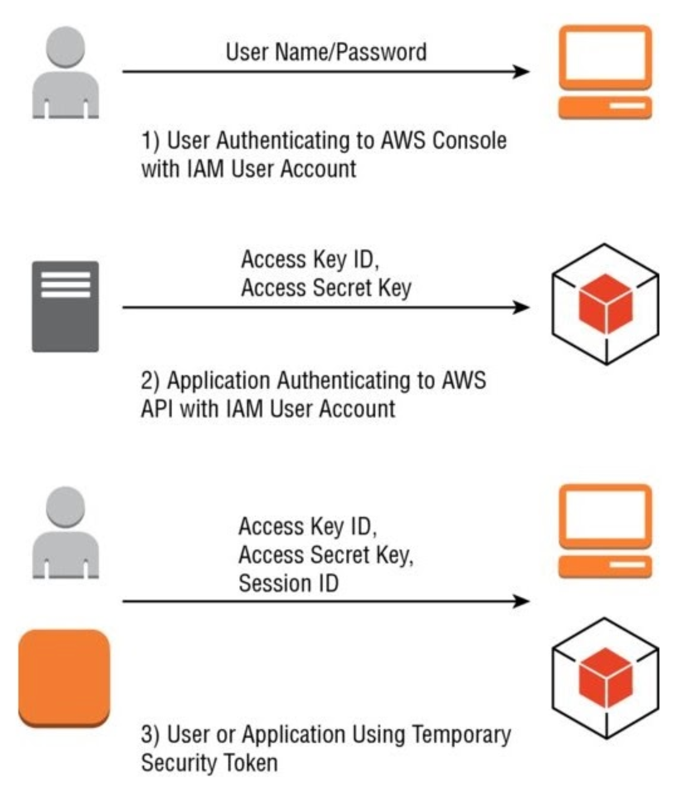

#### Policies

Los accesos de un principal se definen mediante Policies.

Una Policy es un JSON, contiene uno o mas permisos que definen:
- Efecto: Permitir o Denegar
- Servicio Afectado
- Recurso: Nombre de recurso (ARN) especifica la infraestructura especifica de AWS a la que se aplica este permiso

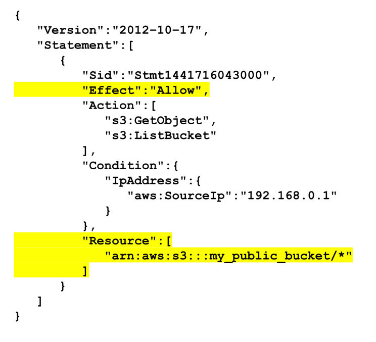

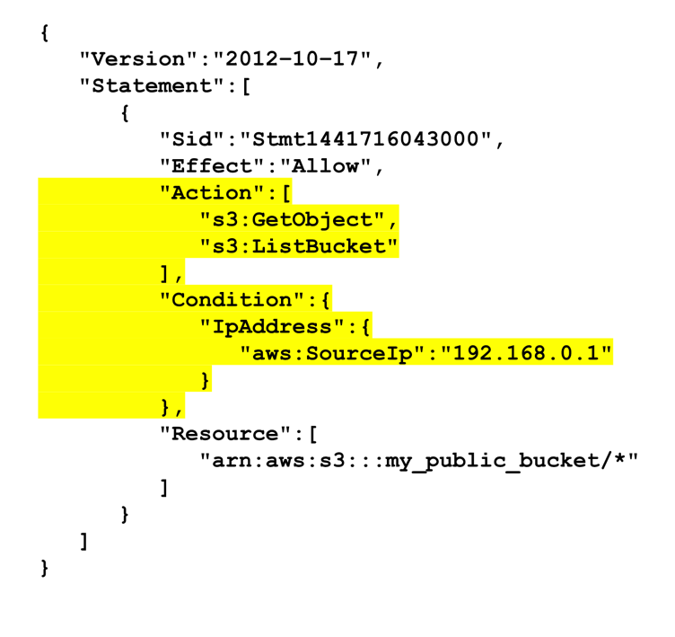

*ARN: Amazon Resource Name
El forma de los ARN varia ligeramente entre los servicios, pero el formato es basicamente:

*arn: aws: service: region: account-id: [resourcetype:] resource*

En algunos servicios se permiten comodines

#### Asociacion de Policies

Una policy se puede asociar directamente con un usuario de IAM de dos maneras:
1. User Policy: Solo existen en el contexto del usuario al que estan vinculadas
2. Managed Policies:
    - Existen independientemente de cualquier usuario individual
    - Pueden asociarse con muchos usuarios o grupos de usuarios
    - Hay una gran cantidad de politicas administradas predefinidas

#### Asociacion de Policies a Grupos

Una forma de simplificar el manejo de permisos apra muchos usuarios es usar grupos, de este modo cualquier usuario que sea miembro del grupo asume los permisos que tenga definido.

Al igual que con los usuarios las politicas de grupos se pueden manejar de dos maneras.

Una Policy se puede asociar con un grupo de dos maneras:
1. Group Policy: Solo existen en el contexto del grupo al que estan vinculadas.
2. Managed Policies: Idem usuarios pero asociadas a grupos

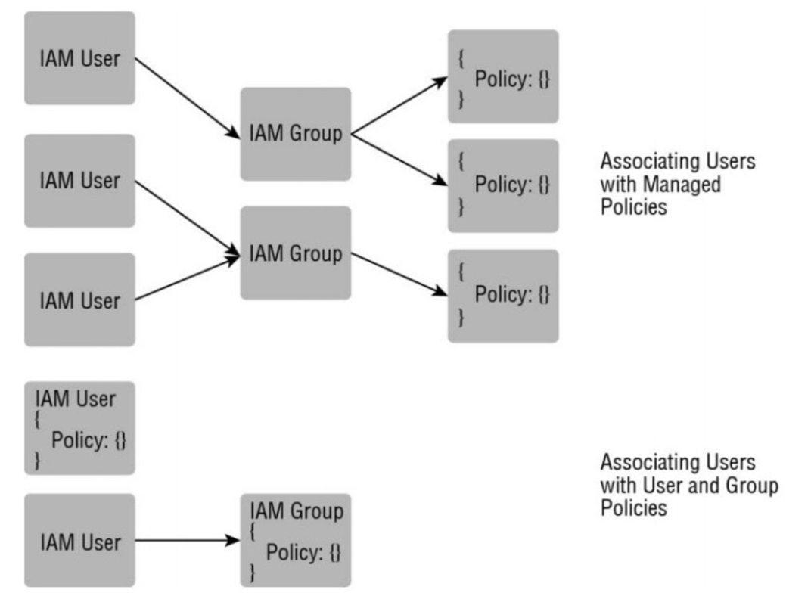

#### Resolucion de permisos

Cuando hay multiples plocies que se aplican al mismo recurso los permisos aplicados se resuelven de la siguiente manera standard:

- Inicialmente las solicitudes son denegadas por defecto.
- Si alguna de las policies matchean un "deny" la solicitud se rechaza
- Su no se encuentra un deny y pero si un "allow" en cualquier politica, se permite la solicitud
- Si no se encuentra "alow" o "deny", se rechaza la solicitud

### AWS CLI

Herramienta Open Source que brinda acceso directo a las APIs publicas de los servicios de AWS desde la linea de comandos del SO.

Aparte del acceso de bajo nivel a APIs ofrece funciones de alto nivel para facilitar la interaccion con los servicios.
Ex. Cargar archivos a S3.

`$ aws s3 cp myvideo.mp4 s3://some_bucket`

#### Instalacion

`$ pip3 install awscli --upgrade --user`

#### Configuracion

`$ aws configure`

AWS CLI almacena los datos ingresados en un perfil default para ser utilizada cuando se quiera ejecutar un comando.

En caso de que se quieran crear otros perfiles o bien usar uno distinto ya creado hay que pasar la opcion `--profile profile_name`
