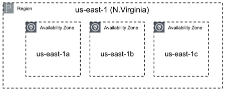

# Cloud Architect

## Clase 3 - EC2

### Amazon Cloud Services

Provee servicio de plataforma de infraestructura en la nube confiable, escalable
y de bajo costo.

Beneficios:

- Bajo costo
- Elastico y Agil
- Abierto y flexible
- Seguridad
- Alcalce Global

#### Reliability: Confiabilidad de la capacidad operativa

Los servicios de SLAs tienen disponibilidad de entre 99.9% y 100%. Amazon S3
esta disenado para tener una durabilidad de 99.99..%

Las Availability Zones estan en distintas zonas tectonicas, distintas zonas
hidricas y diferentes grillas electricas para reducir sustancialmente la
posibilidad de falla simultanea.

AWS Services Health Dashboard permite visualizar permanentemente, en tiempo
real, el status operativo de todos los serivicios provistos por Amazon en el
mundo.

 

#### Conectividad Intra & Inter-AZ

Dark fiber "spans" Optimizada para baja latencia

Infraestructura controlada por Amazon

Coordenadas geoespaciales

Dense wavelenght division multiplexing (DWDM)

#### Availability Zones

Una region se compone de AZs, y esta aislada de otras AZs (distinta red
electrica y diferentes zonas hidricas)

Baja latencia (<10ms) conexion directa entre AZs

Una AZ puede incluir multiples data centers

Distancia Fisica < 100km

### Servicios AWS

### Amazon EC2

Amazon Elastic Cloud Computing es un servicio web que provee capacidad de
computo escalable en la nube. Permite obtener y configurar capacidad de computo
con minima friccion. Reduce a minutos el tiempo requerido para obtener e iniciar
nuevas instancias de servidor, permitiendo escalar rapidamente la capacidad a
mayor o menor, segun cambien los requerimientos de computo.

- SO: Linux | Windows
- Arquitecturas de procesador: ARM y x86
- Hay instancias de proposito general y otras optimizadas para distintos
  workloads
- Tipos de instancias: Bare metal, virtual instances
- Imagenes: Packaged | Custom | Community AMIs
- Multiples opciones de compra: On-demand, RI (reserved instance), Spot (por
  sistema de subastas), Scheduled

Esquema general de EC2

1. AMI: Amazon Machine Image - servicio donde gestionamos todas las imagenes
2. Instancia con su HW donde se carga la imagen
3. La instancia se crea dentro de una VPC - red privada donde vive nuestra
   infraestructura
4. La VPC vive dentro de una AZ / Region
5. Se asocian EBS a la instancia - discos de almacenamiento
6. Se guardan los snapshots de los EBS en buckets de S3 (back ups) Cada snapshot
   es incremental, solo va guardando lo que cambio desde el ultimo snapshot

### EBS: Elastic Block Store

GIB: Memoria presentada como GibiBytes (GiB) y no Gigabytes (GB) - Unidad de
almacenamiento que usa EBS 256 GiB = 275 GB

Almacenamiento es independiente del computo Se colocan discos conocidos como
Volumenes EBS Maximo 16 TiB

#### EBS Snapshot

Como funcionan los snapshots:

#### Tamanos instancias EC2

#### Localizacion de recursos

Todos los recursos asignados a una instancias estan destinados a esa instancia,
sin superposicion

- Todos los vCPUs van a una instancia
- La memoria se asigna solo a una instancia
- Los recursos de red estan particionados para evitar "vecinos ruidosos"

##### Nomenclatura

##### EC2 SO Soportados

Windows 2003R2 / 2008 / 2008R2 / 2012 / 2012R2 / 2016 Amazon Linux Debian Suse
CentOS Red Hat Enterprise Linux Ubuntu ...

##### Eleccion de procesador y arquitectura

##### AMI: Amazon Machine Image

Provee la informacion requerida para iniciar una instancia Pueden iniciarse
multiples instancias desde una unica AMI

Incluye:

- Template para el root volume (SO, apps)
- Permisos que controlaran que cuentas de AWS podran usar la AMI
- "Block device mapping" que especifica volumen para vincular a la instancia

#### Opciones de compra

##### Layer your options

### Opciones de EC2

- Categorias:
  - Uso general
  - Burstable
  - Computo intensivo
  - Memory intensive
  - Almacenamiento (High I/O)
  - Almacenamiento intensivo
  - GPU compute
  - Graphics intensive

\+

- Capacidades:
  - Eleccion de procesador (AWS, Intel, AMD)
  - Fast processors (up to 4.0 GHz)
  - High memory foodprint (up to 12 TiB)
  - Instance storage (HDD and NVMe)
  - Accelerated computing (GPUs and FFGA)
  - Networking (up to 100 Gbps)
  - Bare Metal
  - Tamano (Nano to 32xlarge)

\+

- Opciones:
  - Elastic Block Storage
  - Elastic Graphics
  - Elastic Inference

**\= 175 tipos de instancias**

### EC2 Security Groups

Reglas de SGs:

- Name
- Description
- Protocol
- Port range
- IP Address, IP range, Security Group name

### Instance Metadata
