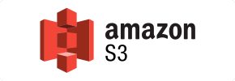
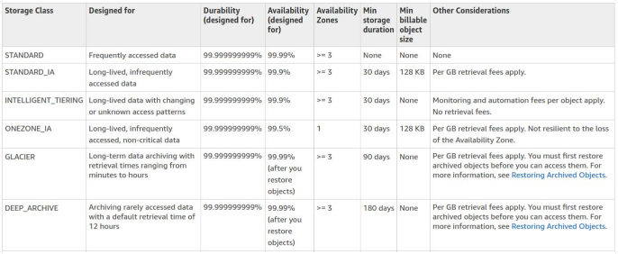

# Cloud Architect
## Clase 4 - S3

- Simple Storage Service
Uno de los primeros servicios de AWS en 2006. 
Es un gran almacen de objetos ~ archivos

Se puede interactuar desde la consolad de AWS, desde AWSClI o desde la API.

Propiedades:
- Seguro
- Disponibilidad 99.99%
- Altamente escalable
- Durabilidad 99.99% (probabilidad de que se pierda un archivo)

Archivos desde 0TB a 5TB
Almacenamiento ilimitado

### Buckets
Son carpetas en las que se depositan esos archivos
S3 define un espacio de nombres universal, por lo tanto cada bucket tiene asignado una URL unica

### Objetos
- Key: nombre del objeto
- Valor: contenido del objeto como secuenta de Bytes
- VersionId: distintas versiones del objeto
- Metadata: fecha de creacion y de modificacion, quien es el dueno
- Subresources: ACL del objeto

### Modelo de consistencia de datos:
**Read after Write consistency for PUTs of new Objects:**
Si se sube un nuevo archivo, se lo puede consultar y leer inmediatamente

**Eventual Consistency for overwrite PUTs and DELETEs (can take some time to propagate)**
Si actualizas o borras uno existente, si lo lees puede que tengas alguna version vieja en el primer segundo

> Hands-on: La vista de S3 es global. Trabajemos en us-east-1.
- Porque los nombres de los buckets tienen que ser globalmente unicos (como DNS)
- Crear un bucket con todas las opciones por defecto.
- Subir un archivo.
- Ver key y value.
- Metadata asociada.
- ¿Qué sucede si hacemos click en la URL? No pública!
- Intentar hacer público el archivo. 
- Permitir que el bucket tenga objetos públicos. (desde Permissions)
- Ahora si hacer el objeto público.
- Crear una carpeta.
- Todo lo que se puede hacer por la Web se puede hacer con el CLI

### S3 Properties
- Tiered Storage (según la frecuencia de acceso cambia el precio).
- Lifecycle management (como se mueven los datos entre tiers).
- Versioning.
- Encryption.
- MFA Delete.
- Seguridad con ACLs y Bucket Policies

## Tiered Storage
### Storage Classes: 

#### S3 Standard
Tier por default a menos que se indique otra cosa
- 99.99% disponibilidad.
- 99.99(11)% durabilidad.
- Almacenado en forma redundante en varios dispositivos en
múltiples instalaciones. Minimo 3 veces guardado en redundancia.
- Diseñado para soportar la pérdida de dos instalaciones a la vez.

#### S3 Infrequently Access
- Data accedida poco frecuentemente pero que cuando la
requerimos, la necesitamos enseguida (como un backup)
- Es más barato que S3 Standard, pero cuando solicitamos algún
dato en esta capa, se nos cobra.

#### S3 One Zone - IA
- Como el anterior pero mas baraton aun, pero sin la redundancia en varias Availability
Zones. 

#### S3 Intelligent Tiering
- Analiza el uso de los objetos mediante modelos predictivos.
- Mueve los datos entre las 3 capas anteriores buscando optimizar
los costos de forma transparente.
- No afecta la performance o la operatoria del servicio.

#### S3 Glacier
- El tiempo de devolución del dato va desde minutos hasta horas (por ejemplo datos de auditoria)
- Es MUY barato.

####  S3 Glacier Deep Archive
- El tiempo de devolución del dato es de unas 12 horas.
- Es MUY MUY barato.

#### Comparativa
Qué tan rápido vas a poder recuperar tus datos: ms vs 12 hrs

> Hands On: 
 Storage classes, a nivel de bucket o a nivel de objetos.

## Security and Encryption

### Security and Encryption
- Todos los buckets por default son privados.
- Control de acceso mediante:
    - Bucket policies (Bucket level)
    - Access Control Lists (Object level)
- Se pueden loguear todos los accesos a nuestros archivo, se
pueden mandar esa info a otro bucket y a otra cuenta.

### Encryption in transit
- Como en HTTPs, entre computadora y server.
- SSL/TLS

### Encryption at Rest
- Se encripta el archivo y luego se guarda en disco.
- Client Side Encryption, vos lo encriptas, despues lo subis.
- Server Side Encryption:
    - S3 Managed Keys - SSE-S3: AWS maneja la key
    - AWS Key Management Service, Managed Keys - SSE-KMS
    - Server Side Encryption With Customer Provided Keys - SSE-C

> Hands On: Security and Encryption
- Probar las 3 versiones de Encryption at Rest

## Versioning

- Todas las versiones escritas de un archivo, incluido si lo borran (delete marker)
- Viene desactivado por defecto
- Buena herramienta de Backup.
- No se puede deshabilitar, solo suspender.
- Se integra con Lifecycle rules.
- MFA Delete.

> Hands On: Versioning
- Creamos uno nuevo.
- Permitimos que sean públicos.
- Prender versionado.
- Subir un archivo de texto de una línea.
- Cambiar una línea de texto.
- Se pierden las configuraciones de privacidad.
- Suma de versiones es el tamaño del bucket.
- Mostrar las distintas versiones en la UI.
- Se puede borrar una versión específica, borrar la última, agrega un
delete marker.
- Si lo borramos el archivo vuelve a existir.

## Lifecycle management

> Hands On: Lifecycle Management
- Automáticamente mueve tus objetos entre diferentes tiers of storage.
- Puede usarse en conjunto con versionado, viejas y nuevas.
- En un bucket versionado.
- Crear una regla para versiones actuales y previas.
- Poner un tiempo de transición a ambas.
- Poner una regla de expiración para versiones viejas

## Cross Region Replication

- Para Disaster Recovery y High Availability.
- El versionado debe estar encendido en tanto en la fuente como en el
destino.
- Las regiones deben ser únicas.
- Los archivos de un bucket ya existente no se replican automáticamente.
- Las marcas de borrado no se replican.
- Borrar versiones individuales no se replica

> Hands On: Cross Region Replication
- Creamos uno nuevo, vemos que necesita versionado.
- Activemoslo en el anterior porque ya tiene archivos guardados.
- Creamos el bucket de destino.
- Va a replicar los mismos permisos que el de origen.
- Pero no hay ningún archivo del bucket de origen!
- Subimos una nueva versión de alguno de los anteriores.
- En el destino se va a copiar solo la última versión.
- Borramos el archivo en el bucket original
- Pero eso no se replica en el de destino

### Transfer Acceleration
Usan una Edge Location de AWS
- Los archivos se suben a la red de Cloudfront en vez de subirse
directamente al bucket.
- Transmiten desde la Edge Location hacia el bucket usando la
Backbone Network.
- Se asigna URL diferente a la del bucket
- S3 Transfer Acceleration Tool
- Sube un archivo de prueba para testear la velocidad (Paciencia)
- Nos puede servir para probar la zona de San Pablo que tiende a
ser un poco más cara que el resto.

### ¿Como nos cobran?
- https://aws.amazon.com/s3/pricing/
- Espacio utilizado.
- Requests.
- Storage Management Pricing tiers.
- Data Transfer Pricing.
- Cross Region Replication.
- Transfer Acceleration