# Elastic Load Balancer / Auto Scaling 

> Elastic Load Balancer: Reparte trafico entre diferentes entidades
- Classic Load Balancing
- Application Load Balancing: trabaja en capa 7 (app)
- Network Load Balancing: trabaja en capa 4 (transporte)

> Auto Scaling: Grupo de instancias similares que puedo hacer crecer o disminuir en funcion de la demanda
- Launch Configuration: donde se carga toda la info de las instancias que voy a querer agrupar
- Manual Scaling
- Dynamic Scaling
- Scheduled Scaling

## Elastic Load Balancer
Elastic Load Balancing distribuye automáticamente el tráfico entrante de las aplicaciones en una o varias regiones y a distintos tipos de destinos:
- EC2
- Containers
- IP
- Funciones Lambda (serverless)

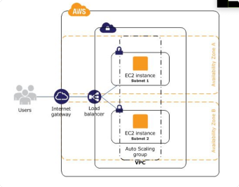

Existen tres tipos de load balancers:

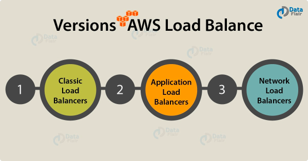

1. Classic Load Balancers (ELB): Distribuye el tráfico entre múltiples instancias EC2 (Más simple).
2. Application Load Balancers (ALB): Distribuye el tráfico de acuerdo al contenido de la petición (request). Trabaja en capa 7 del modelo OSI (Protocolos HTTP y HTTPS).
3. Network Load Balancers (NLB): Distribuye el tráfico de acuerdo al puerto. Trabaja en capa 4 del modelo OSI (Protocolos TCP y UDP).

#### Modelo OSI

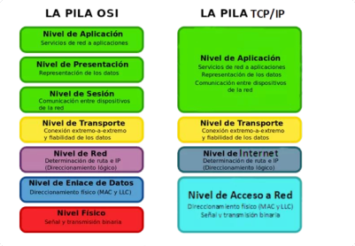

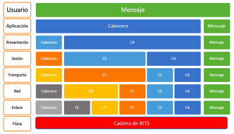

### Classic Load Balancers (ELB)

- Legacy Elastic Load Balancer.
- TCP, HTTP y HTTPS
- Capa 4 y 7: Escucha en capa 7, pero no toma decisiones en base a esta capa, solo lo va a repartir
- Sticky session: El LB recuerda las sessiones (usuarios) y los manda siempre a la misma instancia (util por si hay datos cacheados en la instancia). Se puede configurar el tiempo que queremos que el EL nos recuerde (cookie time)
- Algoritmo Round Robin: Lo va repartiendo secuencialmente, uno para cada uno
- Puede detectar instancias defectuosas (unhealthy)

Existen 2 tipos de ELB:
- Internet Facing Load Balancer (esta publicado en internet, accesible por los usuarios)
    - Distribuye el tráfico proveniente **desde internet** entre las instancias registradas.
    - Tiene asociado un nombre DNS público.
- Internal Load Balancer
    - Distribuye el tráfico proveniente **dentro de la VPC**.
    - Tiene una IP privada.
    
 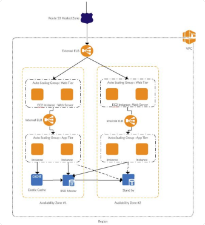
 
#### Cross-Zone Load Balancer
 
- Cuando se habilita una Availability Zone para el load balancer, Elastic Load Balancing crea un nodo balanceador en la Availability Zone. 
- Si está habilitado Cross-Zone Load Balancing cada nodo de load balancer distribuye el tráfico entre los nodos registrados en todas las Availability Zones.

##### Cross-Zone Disabled
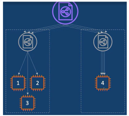

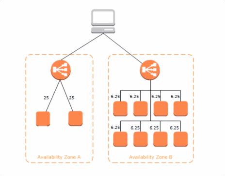

El LB va a repartir cargas de la siguiente manera:
nodo 1, nodo 4, nodo 2, nodo 4, nodo 3, nodo 4...
Esto sucede cuando tengo mas instancias en una zona que en otras.

##### Cross-Zone Enabled
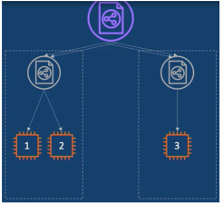 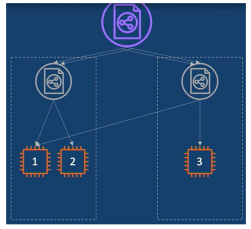

Ahora las cargas van:
nodo 1, nodo 3, nodo 2, nodo 1, nodo 3, nodo 2...

El Load Balanced (cross-zoned enabled) es el violeta, los grises son transparentes (virtuales) para el usuario (y el dev)

#### Sticky Session
Si está habilitado, permite a los usuarios utilizar la misma EC2 instance y puede ser útil si se almacena información localmente.

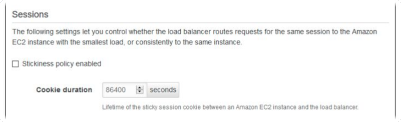

### Application Load Balancer
- Balancea tráfico HTTP y HTTPS
- Trabaja en la capa 7
- Pueden crear distintos tipos de ruteo dependiendo la petición que se envía al servidor:
    - Path-based routing (subdominios)
    - Host-based routing (de donde viene el request)
    - Custom HTTP headers and methods
- Algoritmo Round Robin
- Soporta direcciones IP como Targets (Dentro o fuera de la VPC).
- Soporta funciones Lambda como Targets.
- Permite respuestas HTTP personalizadas.
 
 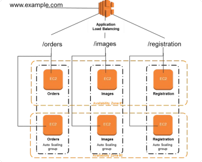
 
**Listener**
- Un Listener es un proceso que chequea por las conexiones entrantes. Ej. HTTP en puerto 80.
- Cada Listener puede tener una o más reglas, cada una de las reglas especifican la acción a tomar.

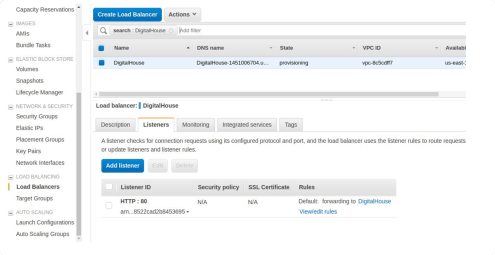

**Target Group**
- Es usado para rutear las peticiones a uno o más targets registrados. Por cada listener rule creado, tienen que especificar el target group y las conditions.

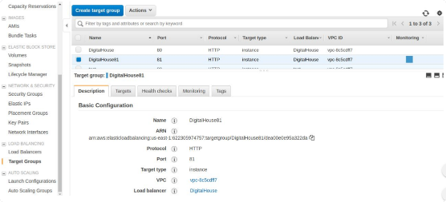

### Network Load Balancers (NLB)
- Balancea tráfico TCP/UDP/TLS.
- Trabaja en capa 4
- Puede manejar millones de requests por segundo manteniendo baja latencia.
- Extreme performance - es el mas performante, pero tambien el mas caro

Elabora reglas de direccionamiento en base al puerto de la peticion.

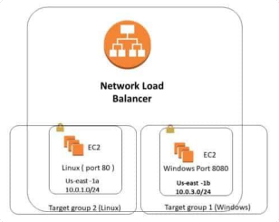

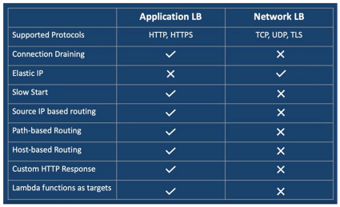

### Costo
 Se cobra cada hora u hora parcial que se ejecute el load balancer y la cantidad de unidades de capacidad de balanceo de carga (LCU) utilizadas por hora.
 
 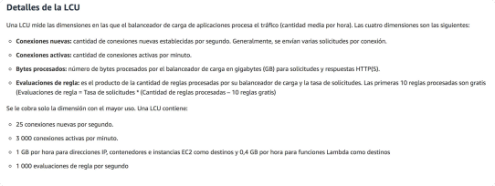
 
 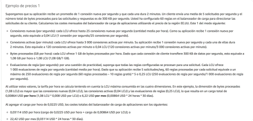
 
 [Precios ELB](https://aws.amazon.com/es/elasticloadbalancing/pricing/?nc1=h_ls)
 
## Auto Scaling Group

Una colección de instancias pueden agruparse en un Auto Scaling Group. Se puede especificar la cantidad mínima, deseada y máxima de instancias.

Amazon EC2 Auto Scaling permite tener el número correcto de instancias de EC2 disponibles para manejar la carga de peticiones para tu aplicación.
- Escalado automático
- Tolerancia a fallas
- Alta disponibilidad

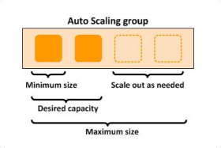

Un Auto Scaling group inicia lanzando EC2 instancias hasta completar la capacidad deseada.
Cuando encuentra que una instancia está unhealthy, la termina e inicia otra.

Tipos de escalamiento:
1. Manual Scaling
    - Seteo manual
2. Scheduled Scaling
    - Fecha y hora
3. Dynamic Scaling
    - Escala dependiendo la demanda CPU, Network, Requests
    
### Dynamic Scaling
- Target Tracking
    - Añade o quita recursos de manera automática para mantener una métrica en un valor cercano al valor objetivo.
- Simple Scaling
    - Se eligen las métricas para escalar y los valores de threshold en Cloudwatch para que la alarma se dispare. Esta alarma dispara el escalamiento (Scale In o Scale Out).
- Step Scaling
    - Similar a Simple Scaling pero con varios thresholds. El escalamiento se produce de manera progresiva.

#### Target Tracking
Metricas predefinidas:
- ASGAverageCPUUtilization - Uso de CPU
- ASGAverageNetworkIn - Trafico entrante
- ASGAverageNetworkOut - Trafico saliente
- ALBRequestCountPerTarget 

También pueden crearse customizadas

#### Simple and Step Scaling
- ChangeInCapacity
- ExactCapacity
- PercentChangeInCapacity

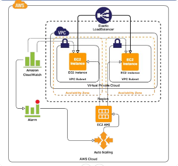
Tenemos instancias dentro de nuestra VPC, tenemos un load balancer que reparte el trafico entre estas instancias, y tenemos CloudWatch que monitorea la salud y metricas de nuestras instancias. En base a esto se crean o eliminan nuevas instancias.

#### Launch Configuration
Un launch configuration es un template para la configuración de las instancias que los Auto Scaling Group utilizan para iniciar las instancias de EC2

Se puede especificar un launch configuration para muchos autoscaling groups pero solo puede utilizarse un launch configuration a vez por autoscaling group.

No se puede modificar, para actualizarlo es necesario crear uno nuevo
