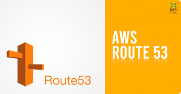
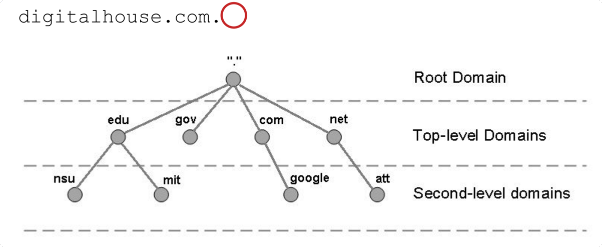
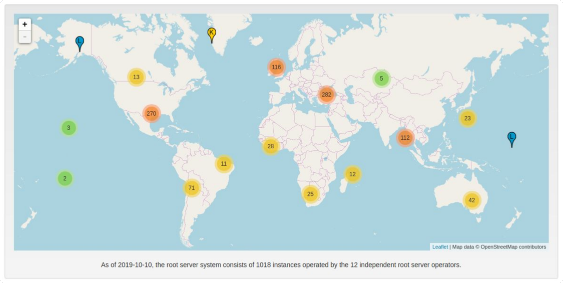
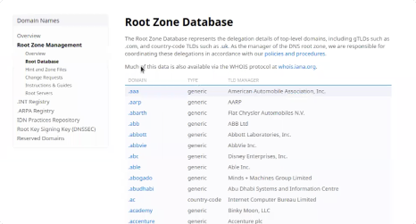
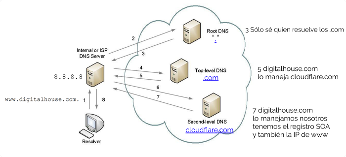

# Clase 6: Route 53

## Repaso
### IPs
Una dirección IP es un número binario de 32 bits.
- Identifica a un dispositivo en Internet.
- digitalhouse.com 
    -> 01101000000111110100111101110000
- Los agrupamos en 4 octetos: 
    -> 01101000 00011111 01001111 01110000
- Y pasamos cada uno de ellos a decimal: 104 031 079 112
- No solemos usar los 0s adelante y los separamos por puntos: 104.31.79.112
- El espacio es de 32 bits: 2^32 = ~4300M de direcciones
- Todo eso es IPv4.
- En 1983 para ARPANET eran suficientes.
- 31/01/2011 se agotaron oficialmente 😱
- Por eso AWS cobra el uso de una IP pública.

#### IPv6
- Una dirección IPv6 es un número binario de 128 bits.
- 8 grupos de 4 dígitos hexadecimales.
- digitalhouse.com -> 0000:0000:0000:0000:0000:ffff:681f:4f70
- Se pueden eliminar los bloques de ceros
    - :::::ffff:681f:4f70 
    - 0:0:0:0:0:ffff:681f:4f70
    - ::ffff:681f:4f70

Se puede convertir entre IPv4 y IPv6: [IPv4 Converter](https://www.vultr.com/resources/ipv4-converter/?ip_address=104.31.79.112)
- El espacio es de 128 bits: 2^128 = 3.4 x 10^38
- 340 undecillion == 340 billion billion billion billion.

Se dice que las direcciones de IPv4 son un camión lleno de granitos arena.
- Las direcciones de IPv6 llenarían todo el sol ¿Serán suficientes?
- "640K is more memory than anyone will ever need on a computer" [*]
- En este mundo están conviviendo los dos sistemas.
- Mientras migramos a IPv6 estamos usando CIDR y NAT para enmascarar IPs.

### DNS
Protocolo de capa 7 que mapea nombres con números. (Es una aplicacion)
- ¿Que nombres? Nombre de dominio: digitalhouse.com
- ¿Que números? Direcciones IP: 104.31.79.112
- El servicio de DNS de AWS: **Route53**
- ¿Por qué 53? Porque es el puerto de DNS.

Sería muy difícil navegar una World Wide Web solo con sus direcciones IP.
- DNS nos hace esa traducción transparente - Es como las viejas agendas telefónicas.
- Se encarga de Resolución de nombres de dominio

## Nombres de Dominio
Los nombres de dominio tienen 3 niveles: 
- Analicemos un nombre dominio, de derecha a izquierda:
 
 
 - A la izquierda del tercer punto (que no se ve) es el Root-level Domain.
 - Luego tenemos el Top-level Domain,
 - y por ultimo tenemos el Second-level Domain
 
### Root Domain - Root Servers
 Hay 13 root servers **a**.root-servers.net a **m**.root-servers.net
 
 
### Top Level Domains
- .com es un Top Level Domain (TLD)
    - generic TLDs: .com .edu .gov
    - country-code TLDs: .ar .co .uk
- Controlados por Internet Assigned Numbers Authority (**IANA**).
- Se pueden ver todos acá [IANA Domains](https://www.iana.org/domains/root/db)

### Registradores de Dominio
- IANA delega el control de unicidad a Registradores de Dominio (a través de ICANN).
- En el caso de .com.ar se delegó a nic.ar (Secretaría Legal y Técnica).
- .com a GoDaddy, AWS, etc.

- Cada nombre de dominio queda registrado en directorio central llamado **WhoIS**.
- En la terminal podemos consultarlo a través de nslookup.
- Este directorio se implementa como una gran Base de Datos compuesta de registros que se distribuyen en servidores de todo el mundo.
- Todo nombre se resuelve de forma jerárquica.

### Delegación de dominios
- Route53 Hosted Zones.
- Deleguemos el dominio comprado a Route53.
- Va a crear dos tipos de registros: NS y SOA
- Agregamos los NS a nic.ar

### Registro: Start of Authority Record (SOA)
- Todo dominio inicia en una "Zona de autoridad" 👮
- Indica quién es el servidor responsable de esa zona.
- La versión actual del registro.
- El tiempo en segundos que podemos tener en cache este registro: **Time to Live** (TTL)

### Registro: Name Server (NS)
- Le indican a los Top Level Domain servers donde buscar nuestro dominio.
- Siempre que deleguemos un dominio o subdominio, se indica con este registro

#### Ejemplo de resolución de nombres

## Registro: Address (A)
- El servidor que tiene el registro SOA es el que nos va dar las IPs buscadas.
- Las pueden tener otros servidores pero sería una respuesta Non-Authoritative.

## Comando dig
- Cada nombre de dominio queda registrado en directorio central llamado **WhoIS**.
Lo podemos consultar utilizando **dig**.
- dig SOA digitalhouse.com +short
- dig NS digitalhouse.com +short
- dig A www.digitalhouse.com +short

-- +/- 45:00

## Registro: Canonical Name (CNAME)
- Es para resolver un dominio con otro, como un sinónimo.
- dig CNAME www.dnsimple.com
- www.dnsimple.com. 3571 IN CNAME dnsimple.com.

## Registro: Address (ALIAS)
- Son parecidos a los CNAME, se utilizan para mapear un dominio a:
    - Elastic Load Balancers.
    - Distribuciones de CloudFront.
    - Buckets de S3 configurados como Websites.
- Recursos internos de AWS de los cuales no necesitamos la IP exacta.
- CNAME no se puede usar en los naked domain names (cloudarchitects.com.ar)
- Este nombre tiene que resolver a un registro A o ALIAS

## Otros registros
- Mail Exchange (MX) ¿Quien es el servidor de mail que maneja la cuenta @cloudarchitects.com.ar?
- Pointer (PTR) Búsquedas inversas, de IP a nombre.
- IPv6 (AAAA)