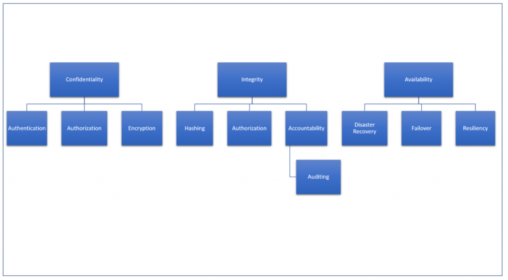

# Concepts

## High Availability :anchor: 

 A High Availability system is one that is designed to be available 99.999% of the time, or as close to it as possible. Usually this means configuring a failover system that can handle the same workloads as the primary system.
 
 For physical infrastructure, HA is achieved by designing the system with no single point of failure; in other words, redundant components are required for all critical power, cooling, compute, network, and storage infrastructure.

One example of a simple HA strategy is hosting two identical web servers with a load balancer splitting traffic between them and an additional load balancer on standby. If one server goes down, the balancer can direct traffic to the second server (as long as it is configured with enough resources to handle the additional traffic). If one load balancer goes down, the second can spin up.

The load balancer in this situation is key. HA only works if you have systems in place to detect failures and redirect workloads, whether at the server level or the physical component level. Otherwise you may have resiliency and redundancy in place but no true HA strategy.

## Fault tolerance :broken_heart: 

 Describes a computer system or technology infrastructure that is designed in such a way that when one component fails (be it hardware or software), a backup component takes over operations immediately so that there is no loss of service. The concept of having backup components in place is called redundancy and the more backup components you have in place, the more tolerant your network is hardware and software failure.

For example, a single application running at the same time on two servers. The servers essentially mirror each other so that when an instruction is executed on the primary server, it is also executed on the secondary server. If the primary server crashes or loses power, the secondary server takes over with zero downtime. There are two small drawbacks of fault tolerance however; it is more costly because both servers are running all the time and there is a risk of both servers going down if there is a problem with the operating system that the servers are using.

## Disaster Recovery :fire: 

Refers to the set of policies and procedures in place to ensure the continuity and recovery of mission critical systems in the event of a disruptive event such as a power outage, flood, or cyberattack. In other words, how quickly can you get your computers and systems up and running after a disastrous event?

Eg. In healthcare, HIPAA requires that every organization has a disaster recovery plan in place for the backup and recovery of health data. Even if your office is not located in a geographical area where natural disasters such as earthquakes and hurricanes are common, events like a water pipe bursting in your server room or a fire in your building can happen to any organization at any moment. Furthermore, the cost savings of having a disaster recovery plan are enormous. According to a study conducted by the Multihazard Mitigation Council, every $1 spent on hazard mitigation, such as a disaster recovery plan, saves your organization roughly $4 in future benefits.
 
## Scalability :large_blue_circle: 

Scalability is an attribute that describes the ability of a process, network, software or organization to grow and manage increased demand. A system, business or software that is described as scalable has an advantage because it is more adaptable to the changing needs or demands of its users or clients.

Scalability is often a sign of stability and competitiveness, as it means the network, system, software or organization is ready to handle the influx of demand, increased productivity, trends, changing needs and even presence or introduction of new competitors.

## Elasticity :yin_yang: 

Elasticity is the ability of an IT infrastructure to quickly expand or cut back capacity and services without hindering or jeopardizing the infrastructure's stability, performance, security, governance or compliance protocols.

Although the words scalability and elasticity are sometimes used as synonyms, scalability is more often used to describe the ability a system has to successfully cope with an expanding workload, while elasticity implies that the system is also capable of decommissioning capacity or resources when they are no longer needed.

In this sense, elasticity is a synonym for adaptability. Attributes of an elastic IT environment include the environment's ability to expand and contract in response to business needs. In a cloud service environment, elasticity may also imply that the ability the service can expand and contract in real time, using service level agreements (SLAs) to make changes autonomically, instead of relying on human administrators. 

Customers for cloud services that are described as being elastic pay only for the capacity and resources they use.

## Cost efficiency :dollar: 

The Cost Optimization pillar includes the ability to run systems to deliver business value at the lowest price point.

### Design Principles
There are five design principles for cost optimization in the cloud:

**Adopt a consumption model**: Pay only for the computing resources that you require and increase or decrease usage depending on business requirements, not by using elaborate forecasting. For example, development and test environments are typically only used for eight hours a day during the work week. You can stop these resources when they are not in use for a potential cost savings of 75% (40 hours versus 168 hours).

**Measure overall efficiency**: Measure the business output of the workload and the costs associated with delivering it. Use this measure to know the gains you make from increasing output and reducing costs.

**Stop spending money on data center operations**: AWS does the heavy lifting of racking, stacking, and powering servers, so you can focus on your customers and organization projects rather than on IT infrastructure.

**Analyze and attribute expenditure**: The cloud makes it easier to accurately identify the usage and cost of systems, which then allows transparent attribution of IT costs to individual workload owners. This helps measure return on investment (ROI) and gives workload owners an opportunity to optimize their resources and reduce costs.

**Use managed and application level services to reduce cost of ownership**: In the cloud, managed and application level services remove the operational burden of maintaining servers for tasks such as sending email or managing databases. As managed services operate at cloud scale, they can offer a lower cost per transaction or service.

## Security :lock: 
[AWS Cloud Security](https://aws.amazon.com/security/)
[Security Concepts and Mechanisms](https://www.ibm.com/support/knowledgecenter/en/SSFKSJ_9.1.0/com.ibm.mq.sec.doc/q009730_.htm)
[Information Security Concepts](https://danielmiessler.com/study/infosecconcepts/)
[Computer Security](https://www.wikiwand.com/en/Computer_security)

Confidentiality, Integrity, and Availability. All security activities exist to support and protect these three qualities of data. Other key security concepts branch off of these foundational concepts.

**Confidentiality**
Simply put, confidentiality means that data should be made available only to those authorized to view it. The key concepts that branch off of confidentiality are authentication, authorization, and encryption.

Authentication is the process of a user proving that they are who they claim to be within a system. This can be done in three ways: by something you know (password or PIN), something you have (token), or something you are (biometrics). Only data classified as public should be available to those who haven’t been authenticated. Authentication is a basic need of almost every website.

Authorization is not the same thing as authentication. Authorization is the process of determining if the authenticated identity is allowed to perform an action or see a piece of data. For example, logging into your bank’s website doesn’t give you access to see every account balance in the system. Instead, you are authorized only to view your own account balances.

Finally, encryption is a major method of ensuring confidentiality. When data is at rest or in transit, encryption can prevent any snooping eyes from seeing the real data, thus protecting its confidentiality. Sticking with the bank example from above, banks use an HTTPS connection to encrypt what is sent back and forth between client and server. This means that sensitive information such as login credentials, account numbers, or social security numbers are not readable by someone eavesdropping on the connection.

**Integrity**
While confidentiality ensures that data is seen only by those authorized to see it, integrity ensures that data is changed only by those authorized to change it.

Integrity is ensuring that the data you see is the real data and hasn’t been changed in transit or at rest by someone else. The key concepts branching off of integrity are hashing, authorization, accountability, and auditing.

Authorization is discussed above in connection with confidentiality, but it also impacts on integrity. It is important for a system to have the ability to determine which identities are authorized to see the data (confidentiality) as well as change the data (integrity). If an unauthorized party is able to change data, a failure of integrity has occurred.

Another key concept dealing with integrity of data is accountability. Accountability is the ability of a system to know who changed what and when. While it is preferred that unauthorized changes are not made to your data, accountability helps if that unfortunate event does occur. It will ensure that the change is at least detected and can be repaired if necessary in a timely fashion.

A related principle is non-repudiation, or ensuring someone cannot deny that they did something. This is usually handled by logging events inside an application. Important events can be logged with information including the user who completed the action, the action taken, and what time the action occurred.

Non-repudiation helps facilitate auditing at a later date, if that is required for compliance purposes. This action also ensures that if data is changed for some reason, the records for who changed it and for what purpose can be retrieved if needed.

Finally, hashing is a tool that can be used to ensure integrity. Hashing involves passing data through a one-way function so that the hash of the data is easy to compute, but given the output, the input is near impossible to figure out. Also, if even one bit changes in the input, the output is completely different.

Through the process of hashing, if you have a hash of data stored somewhere, you can compute a new hash; if they match, you can be assured that the data hasn’t changed. For example, this mechanism is used by Windows Update to ensure that updates haven’t been changed in transit or by some other means.

**Availability**
Availability is the assurance that the system and its data will be accessible to authorized users when needed. This process ensures that your website is up when users need it, or your REST service is available when your clients want to call it. Denial of service (DoS) and distributed denial of service (DDoS) attacks are attacks against availability.

Some major topics related to availability include disaster recovery, failover, and resiliency.

Disaster recovery plans assist in the recovery of systems in the event of a major disaster, whether natural or man-made. You should understand what will happen if your servers are destroyed by a flood or other disaster. Web developers may not always create these plans, but they should know what they contain.

Failover is achieved by redundancy; in the case of a loss of service, another instance of that service can instantly take over, providing near-constant availability. Think of a set of Docker containers that can be spun up or destroyed when problems arise. This redundancy also is achieved through load-balancing that can redirect traffic if something goes wrong with a server environment.

Resiliency is a system’s ability to withstand attack. Whether it’s a DDoS attack or another type of attack, a resilient system will not simply go down at the drop of a hat. Avoiding single points of failure is the best first step in resiliency.

The CIA triad is the foundation of all security principles. It should be understood by developers because developers will need to build functionality into their systems that support confidentiality, integrity, and availability.

Check out this graphic as an easy reference for how different concepts branch off of the three foundations of security.

1. The CIA triad – What forms the foundation of security and what pieces are built on top of that foundation.
2. Least privilege – Allow your application only the access it needs for only the time it needs it.
3. Complete mediation – Don’t allow any code paths to bypass authorization.
4. Cryptography/Cryptographic agility – Know your algorithms and design your application to switch them when necessary.
5. Threat modeling – Understanding how bad guys may attack your software and design  countermeasures.
