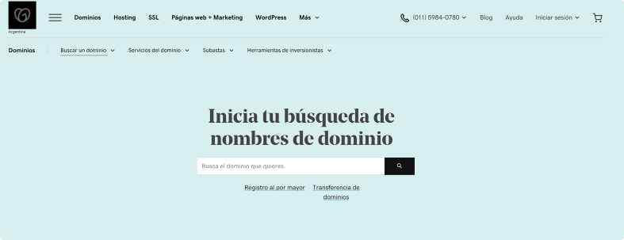

# Registro nombres de dominio
### Registremos un dominio en nic.ar

#### Pre-requisitos
Para poder comprar un nombre de dominio desde este proveedor necesitamos una Clave Fiscal nivel 2 de la AFIP.

[AFIP - Como sacar Clave Fiscal 2](https://www.afip.gob.ar/claveFiscal/informacion-basica/solicitud.asp)

#### [Como registar un Dominio en Nic ar](https://nic.ar/es/ayuda/instructivos/registro-de-dominio)

1. Vamos al sitio de [nic.ar](http://nic.ar)
    

2. Click en Administrar Dominios, 
3. Nos redireccionan al portal de la AFIP, en el que hay que ingresar con CUIL y Clave Fiscal.
4. Ingresamos el nombre de dominio que estamos interesados
    
5. Si elegimos un nombre ya tomado nos va a aparecer la opcion de disputarlo
    
6. Cuando elijamos un nombre disponible nos va a dar la opcion de registrarlo
    
7. En el siguiente paso vamos a confirmar nuestros datos personales, 
8. Y por ultimo vamos a poder pagar el tramite.
    - El valor hoy (Junio 2020) del tramite del registro de nombre de dominio es de $270 (pesos argentinos).

9. Luego de realizado el pago vamos a poder ver nuestro nuevo dominio en nuestra lista de `Mis Dominios`
    
    
    
10. Damos click en `Delegar` para poder administrar nuestro DN desde Amazon.
11. Desde esta nueva consola vamos a poder configurar quien queremos que maneje nuestro dominio.
    - Desde `+ Agregar una nueva delegacion` podemos agregar los hosts que nos va a proveer el servicio desde donde vamos a manejar nuestro dominio.
     
    
    
    - En el caso de Amazon, este nos va a proveer por ejemplo con los siguientes hosts: (Mas abajo vemos como se hace esto)
    
    
### Registremos un dominio en GoDaddy

1. Vamos al sitio de [GoDaddy](ar.godaddy.com)
    

2. Vamos al tab de [Dominios](https://ar.godaddy.com/domains/domain-name-search)
    

3. Buscamos el nombre que nos interese, y si esta ocupado nos va a ofrecer otras opciones
    
    
4. Cuando encontramos un dominio disponible, podemos agregarlo al carrito y comprarlo
    
    
    
### Registremos un dominio en AWS 

1. Vamos al servicio de [Route53 de Amazon](https://console.aws.amazon.com/route53/home?#)
    
    
2. Buscamos el DN donde dice `Type a domain name` 
3. Si esta disponible podemos agregarlo al carrito, y tambien nos va a ofrecer otras extensiones
    


# Delegar nombres de dominio

Una vez que compramos el nombre de dominio podemos delegarlo a Amazon. Si este DN ya lo compramos desde AWS este paso no hace falta.
1. Vamos a Route53 Hosted Zones.
    
    

2. `Create Hosted Zones`
    
    
    - Ponemos el Domain Name que compramos y le damos a crear.

3. Amazon nos va a crear  dos tipos de registros: NS y SOA
    - NS: Name Server
    - SOA: Start of Authority Record

4. Amazon nos va a dar 4 NS, que son los 4 tipos de dominios que manejan ellos. Por ejemplo:
    - ns-364.awsdns-45.com
    - ns-957.awsdns-55.net
    - ns-1315.awsdns-36.org
    - ns-1573.awsdns-04.co.uk

5. Agregamos los NS en nic.ar o GoDaddy
    

6. Hay que esperar aproximadamente una hora para poder ver nuestros cambios en los DNS mundiales. 
    - Quizas en los DNS locales - de Fibertel, Telecentro, Telecom - podamos ver los cambios mucho antes que en los servidores de Amazon de Asia, Europa por ejemplo.

7. Si entramos a nuestro Hosted Zone vemos los registros que Amazon nos creo
    

## Verificar nuestros DN
Los siguientes servicios me pueden decir quienes estan manejando los registros (NS, SOA) de mis nombres de dominio desde los distintos servidores del mundo:
- [What is my DNS](https://www.whatsmydns.net)
    

- [DNS Checker](https://dnschecker.org)
    

Con el comando dig puedo pedirle a mi NS (8.8.8.8 Google) los registros SOA, NS, A de mi pagina
- dig SOA digitalhouse.com +short
    
    
    
- dig NS digitalhouse.com +short
    
    
    
- dig A www.digitalhouse.com +short
    
    

- dig CNAME www.digitalhouse.com +short    
    

- Para informacion mas comprensiva [Ping.eu](ping.eu)

# Hands On - Resolucion de nombres

- Creamos 3 instancias en continentes distintos a las cuales les vamos a instalar un Servidor Web con un “Hello World”.
- Tenemos que tener un Security Group y una key en cada Region.
- Nos llevamos los DNS públicos e IPs de cada una.

```shell script
#!/bin/bash
yum update -y

# instalamos apache y lo inicializamos
yum install httpd -y
service httpd start

#lo configuramos para que arranque al inicio
chkconfig httpd on

# Vamos a la pagina web de nuestro apache
cd /var/www/html

# Escribo nuestro mensaje en el index.html de nuestro server web
echo "<html><h1>Hello Cloud Architects! This is a Web Server in
</h1></html>" > index.html
```


- Apuntamos el server de North Virginia en el naked domain con un registro A
- Apuntamos el server de London en london.cloudarchitects.com.ar
- Apuntamos el server de Sao Paulo en saopaulo en www.cloudarchitects.com.ar
- El browser a veces nos oculta el www.


- Los record set toman un tiempo en propagarse:
https://www.whatsmydns.net/#A/www.cloudarchitects.com.ar
- ¿Y si queremos que www.cloudarchitects.com.ar apunte a cloudarchitects.com.ar?


## Routing policies
Si queremos distribuirle trafico a esos tres servidores, tenemos varias formas de hacerlo:
- Simple
- Weighted
- Latency
- Failover
- Geolocation
- Multivalue


### Routing policies: Simple
- Route53 distribuye el tráfico de forma equitativa a cada uno de ellos
    - 54.236.13.51
    - 35.176.161.146
    - 18.228.22.87
- El browser se va a quedar siempre con la misma respuesta.
- En el "Test Record Set" podemos ver como Route53 los ordena de distinta forma en cada query.


### Routing policies: Weighted 
- Permite distribuir el tráfico basado en diferentes pesos asociados.
- Por ejemplo ahora le vamos a distribuir el 80% del tráfico a Sao Paulo, el10% a North Virginia y el 10% restante a London
- En el "Test Record Set" podemos ver como Route53 nos los devuelve con la distribución de probabilidad que cargamos.


#### Routing policies: Weighted - Health Checks
- Agreguemos un Health Check a SaoPaulo 18.228.22.87 cloudarchitects.com.ar / index.html
- Agreguemos un Health Check a North Virginia 54.236.13.51 cloudarchitects.com.ar / index.html
- Agreguemos un Health Check a London 35.176.161.146 cloudarchitects.com.ar / index.html

- Se los asignamos a cada registro.
- Si alguno de los Record Set falla el Health Check Route53 lo va a remover y no le va a enviar tráfico hasta que no esté disponible.
- Apagamos la instancia de Sao Paulo.
- El Health Check debería empezar a fallar (Paciencia).
- En el "Test Record Set" podemos ver como Route53 dejó de mandarle tráfico.

- Volvemos a prender la instancia ¿Que pasó?
- Allocar una IP Elastica y asignarla la instancia.
- Colocar la nueva IP en el Health Check y en el Record Set.
- Volvemos a testear la Routing Policy (Paciencia).


### Routing policies: Latency
- Distribuye el tráfico basado en el servidor que nos responde más rápido.
- Posiblemente basado en la Region.
- Limpiemos los anteriores.
- Desde nuestro Browser seguramente Sao Paulo es el que nos responde.
- Desde https://www.whatsmydns.net/#A/cloudarchitects.com.ar podemos ver como se resuelve diferente según la latencia.

### Routing policies: Failover
- Es para cuando queremos crear una configuración Activo / Pasivo o Primario / Secundario.
- Utiliza también los Health Checks para saber si el primario está vivo.
- Cuando el Activo falla, switchea al Pasivo.
- Limpiemos los anteriores.
- Agregamos a Sao Paulo como Primario y a North Virginia como Secundario.

- Paramos la instancia de Sao Paulo.
- Desde https://www.whatsmydns.net/#A/cloudarchitects.com.ar podemos ver como cambia la resolución.
- Volvemos a prender la instancia de Sao Paulo.
- Deberíamos volver al estado inicial.


### Routing policies: Geolocation
- Donde va a ser enviado el tráfico basado en la ubicación de donde se origina las queries de DNS.
- Continentes o Países.
- American clients to North Virginia
- European clients to London
- Others to Sao Paulo
- Desde https://www.whatsmydns.net/#A/cloudarchitects.com.ar podemos ver como se resuelve diferente según el continente.


### Routing policies: Multivalue
- Es igual al simple pero permite poner Health Check en cada Recurso.
- Si falla algún Recurso (Basado en su Health Check) Route53 lo va a remover.
- Podemos verlo en el "Test Record Set".
- Paremos Sao Paulo.
- Vemos en "Test Record Set" como solo van a quedar dos registros.


### Traffic Flow
- Permite construir flujos de tráfico bastante complejos basados en todas las policies anteriores.
- Permite que Route53 rutee tráfico a tus recursos basado en las ubicación de tus usuarios y de los mismos recursos.
- Se puede agregar un peso o bias a cada recurso también.


### Propuesta Práctica
- Los sitios que deployaron la semana pasada en S3, apuntarles un subdominio dentro de *.cloudarchitects.com.ar.
- Los sitios que deployaron el martes con Dario con ELB, apuntarles un subdominio dentro de *.cloudarchitects.com.ar. (Es necesario crear nuevamente los ALB)