Creamos un LB clasico y vamos a hacer que reparta cargas entre 3 instancias de EC2 (los que empiezan con ELB)

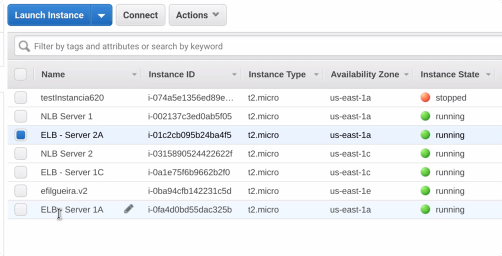

Landing page de los servidores:

1. Creamos un Load Balancer

1.1. Definimos el LB

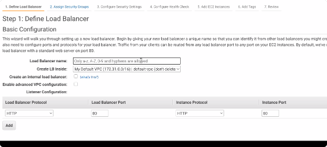

Este LB esta escuchando en protocolo HTTP puerto 80 desde internet, 
y la instancia y puerto al que escucha desde la VPC.

1.2. Asignar / Crear un security group

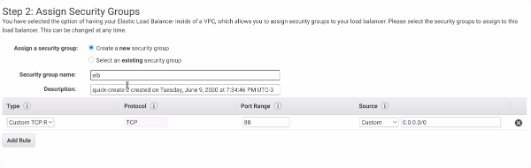

Escucha para todas las direcciones desde puerto TCP 80

1.3. Configurar Chequeo de sanidad de instancias

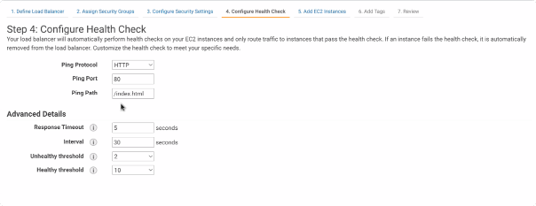

Como identifica el LB que las instancias estan sanas

1.4. Anadimos las instancias

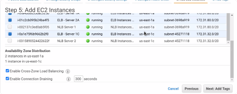

Tag, Review, create

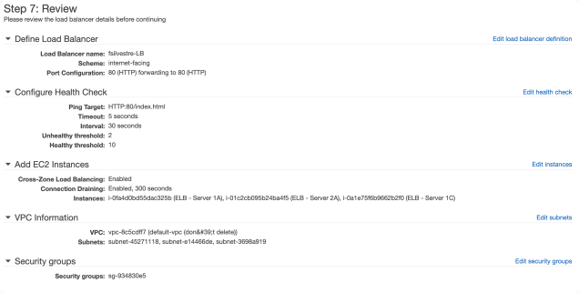

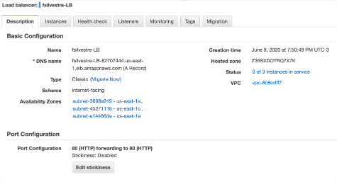

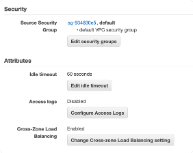

2. Creamos target group

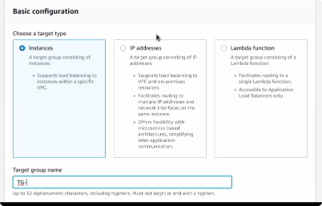

3. Creamos un App LB

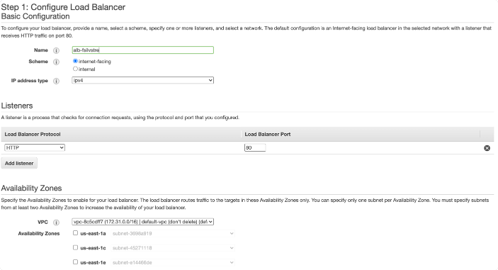

3.1 target group
Elijo uno solo y luego voy a elegir el resto:
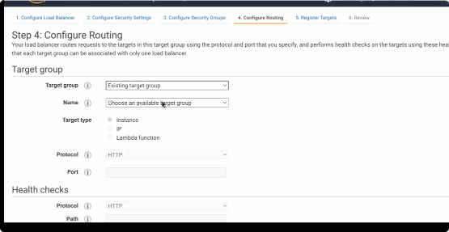

3.2 register targets
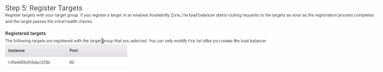

review, create

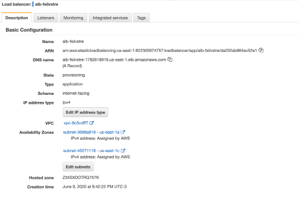

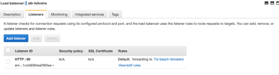

view / edit rules

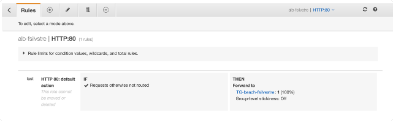

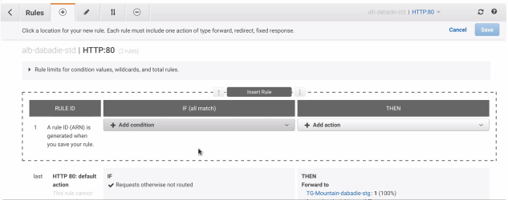

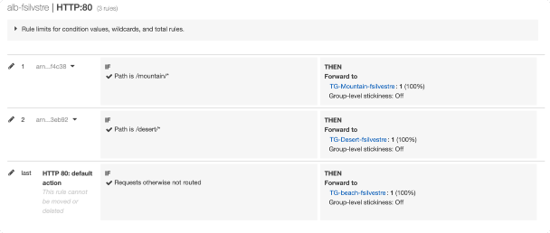

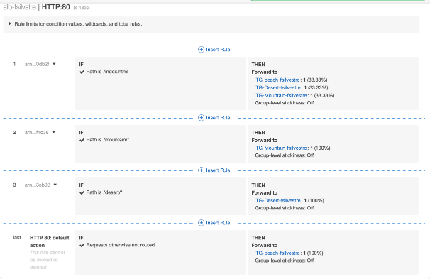

