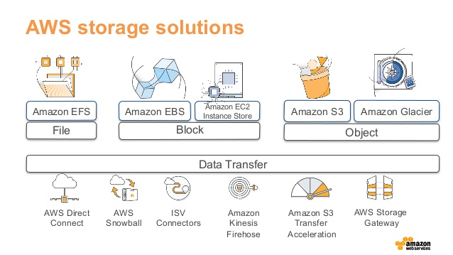
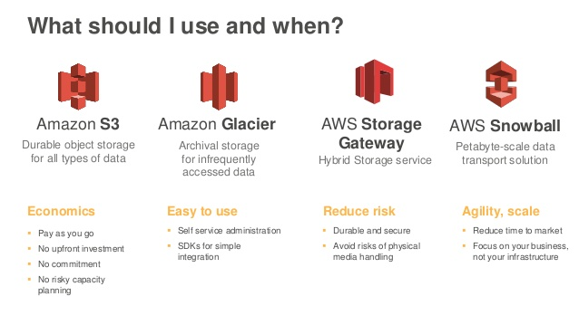
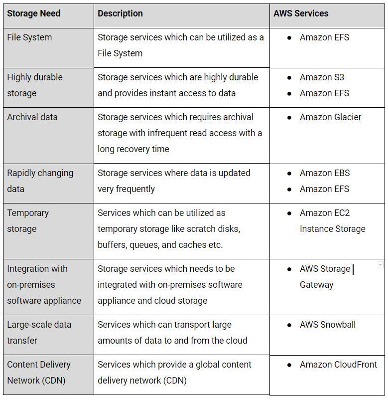
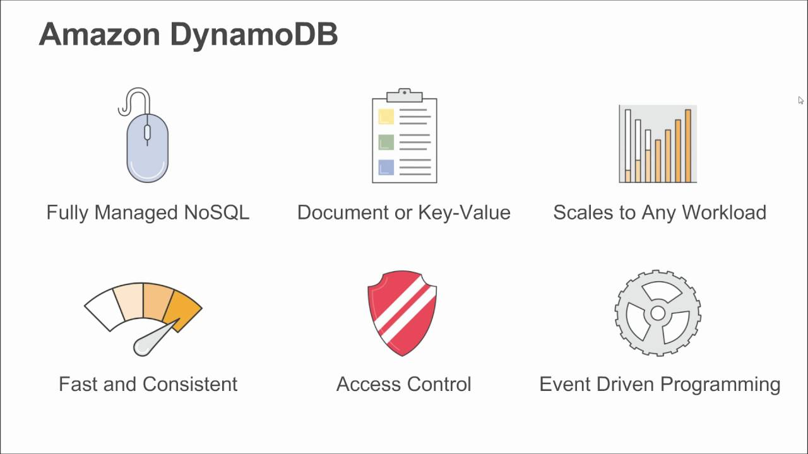

# AWS

## About this Guide

## Index
1. What is AWS
2. Cloud Computing Models
3. AWS Solutions
. Guides
. Links
. Links

### What is AWS

Data centers distributed Worldwide
On-demand delivery of IT resources 
Shared and dedicated resources

Benefits:
- economies of scale
- accounts isolated at the hypervisor level
- pay-as-you-go pricing
- no up front cost
- reduced maintenance and admin costs
- organised into product categories

Divided into geographic **regions**, chosen in order to:
- optimise latency,
- minimise costs,
- address regulatory requirements.

Each further divided into **availability zones**:
- physically isolated from each other,
- connected to each other with fast, private fiber-optic networking.

To deliver content to end users with lower latency, **Amazon CloudFront** (fast content delivery network (CDN)) uses a global network of 187 Points of Presence (176 **Edge Locations** and 11 Regional Edge Caches) in 69 cities across 30 countries.
- caches content at edge locations for high performance delivery of content
- provides DDoS protection

### Cloud Computing Models

#### IaaS: Infrastructure as a Service
Contains the basic building blocks for cloud IT
Eg. VPC, EC2, EBS

#### PaaS: Platform as a Service
AWS manages the underlying infrastructure (usually hw and os)
Eg. RDS, EMR, ElasticSearch

#### SaaS: Software as a Service
Completed product that is run and managed by the service provider. Mostly refers to end-user applications
Eg. Web-based email, Office 365, Salesforce

#### FaaS: Function as a Service or Serverless Computing
Allows you to build and run applications and services without thinking about servers. 
Eg. S3, Lambda, DynamoDB, SNS

## Ways of interacting with AWS

1. Management Console
2. Software Development Kits (SDKs) for diverse programming languages
3. AWS REST API through HTTP requests
4. AWS CLI

## AWS Solutions

### [AWS Storage Solutions](https://mitrai.com/tech-guide/eight-types-of-aws-storage-services-explained/)

[Storage Cases](cases/storage-cases.md)

### AWS Database Services

**RDS**: Fully managed Database Service, makes easy to launch and scale DB on AWS. Services: MySQL (MariaDB, Aurora), PostgreSQL (std, Aurora PostgreSQL), Microsoft SQL Server, Oracle

**DynamoDB**: NoSQL Database as a Service. Serverless Service. High speed, low latency performance.

**Redshift**: Fast, fully managed, petabyte scalable data warehouse, based on the PostgreSQL engine. Perfect for Big Data solutions.

**ElastiCache**: In memory data store in the cloud, allows to retrieve information from fast, fully managed, in memory caches.

**Database Migration Service** (DMS): orchestrates the migration of databases over to AWS easily and securely. It also can migrate data between different database engines.

**Neptune**: Fast, reliable, fully managed graph database. Optimized for storing relationships, and querying the graph with ms latency. 

#### Amazon Relational Database Service

(Amazon RDS) makes it easy to set up, operate, and scale a relational database in the cloud. It provides cost-efficient and resizable capacity while automating time-consuming administration tasks such as hardware provisioning, database setup, patching and backups. It frees you to focus on your applications so you can give them the fast performance, high availability, security and compatibility they need.

#### DynamoDB

[AWS Database Services](https://www.sumologic.com/blog/migrating-aws-database-services/)
[AWS Database Services Complete Overview: RDS vs Redshift vs DynamoDB vs SimpleDB](https://www.cloudberrylab.com/resources/blog/aws-database-services-complete-overview-rds-vs-redshift-vs-dynamodb-vs-simpledb/)

### AWS Compute

**EC2** (Elastic Compute Cloud): provides a virtual service in the AWS cloud. Pay for what your use. Range of options with variety of memory and computing capabilities, optimized for different use cases.

**EC2 Autoscaling**: Dynamically scales EC2 capacity up or down (by launching or terminating instances), automatically according to conditions pre defined. It also performs health checks on the instances, and replace them if they became unhealthy.

**Lightsail**: Easiest way to launch virtual service running applications in the AWS cloud. AWS provides everything needed including DNS managemente, storage to get you up and running as quickly as possible. 

**ECS** (Elastic Container Service): Highly scalable, high performance container management service for Docker containers. Containers are runned in a managed cluster of EC2 instances.

**Lambda**: Serverless service, lets you run code in the aws cloud without worrying about provisioning or managing services.

### Networking and Content Delivery

**Amazon CloudFront**: Global content delivery network (CDN) delivers frequently accessed content to 169 edge locations across the globe. Low latency, high speed transfer speed for end users. DDoS protection.

**Virtual Private Cloud**: Lets you provision a logically isolated section of the AWS cloud, and you can launch AWS resources within. 

**Directed Connect**: High speed dedicated connection to the AWS cloud. Enterprises use it to establish private connections to the cloud where standard internet connection wouldn't ba adequate. 
 
**Elastic Load Balancing**: Automatically balances traffic to multiple EC2 instances and also availability zones. Provides high availability and fault tolerance, and by pass unhealthy instances.
 
**Route 53**: Highly available and scalable domain name system (DNS), and handles direct traffic to your app and redirects it to backend web server based on rues.
 
**API Gateway**: Fully managed service, makes it easy to developers to create and deploy secure programming interfaces and APIS at any scale. It handles up to 1000 concurrent API calls. Serverless service.

### Management Tools
 - Provisioning
 - Monitoring and logging
 - Operations management
 - Configuration management

**Cloud Formation**: Allows you to use a text file to define your infrastructure as code, and to deploy resources in AWS cloud. Enables use of version control tools over the infrastructure definition. 
 
 **AWS Service Catalog**: Allows enterprises to catalog resources that can be deployed on the AWS cloud. Allows enterprises to achieve common governance and compliance for it's IT resources by clearly defining what is allows to be deployed on the AWS cloud.
 
 **CloudWatch**: Monitoring service for AWS cloud resources and applications that are deployed in the AWS cloud. It can be used for triggering the scaling of applications or for providing insights into your deployed resources. 
 
 **AWS System Manager**: Provides a unified user interface that allows you to view operational data from multiple AWS services and to automate tasks across AWS resources. This helps shorten the time between detection and resolution of problems.
 
 **CloudTrail**: Monitor and logs AWS account activity, including actions taken through the AWS Management Console, AWS SDK, AWS CLI, and other services. This simplifies security analysis of the activities of users of your account.
 
 **AWS Config**: Enables assess, order and evaluate the configuration of your AWS resources. This simplifies compliance auditing, security analysis, change management and control, and operational troubleshooting. 
 
 **OpsWorks**: Provides managed instances of shift and puppet: used to configure and automate the deployment of AWS resources.
 
 **Trusted Advisor**: Online expert system, analyses AWS account and resources and advices on how to achieve high security and best performance on those resources.

### Application Integration
And customer engagement services

**Step Functions**: Makes it easy to coordinate the components of distributed applications and microservices using a visual workflow. You define your application visually as a series of steps, you define the process flow of those steps and then you can deploy your application automatically.

**Simple Workflow Service**: Coordinates multiple components over business process. Similar to SF.

**Simple Notification Service**: Flexible, fully managed pub-sub messaging service. You create a topic and services subscribe to that topic, and when you publish a message to the topic the users subscribed to that topic will receive that message. Also used for push notifications for mobile devices.

**Simple Queue Service**: Fully managed message queueing service, makes it easy to decouple you application from the net. 

### Customer Engagement 

**Amazon Connect**: Self-service, cloud-based contact center service that makes it easy for any business to deliver better customer service at lower cost. It has a drag and drop graphical user interface, that allows us to create process flows that define customers interactions without having to code.

**Amazon Pinpoint**: Email, SMS, and mobile push notifications for targeted marketing campaigns; and direct messages to your individual customers (Eg. order confirmations)

**Simple Email Service**: Cloud-based bulk email sending service.

### Analytics

**Elastic Map Reduce**: AWS Hadoop framework as a service. Can also run other frameworks such as Spark, HBase, Presto, Flink. Data can be analyzed by EMR in a number of data stores, including S3, DynamoDB.

**Athena**: Enables the analysis of data stored in S3 buckets using standard SQL statements.

**Elasticsearch Service**: Fully managed service that makes it easy for you to deploy, secure, and operate Elasticsearch at scale with zero down time. The service offers open-source Elasticsearch APIs, managed Kibana, and integrations with Logstash and other AWS Services, enabling you to securely ingest data from any source and search, analyze, and visualize it in real time. Amazon Elasticsearch Service lets you pay only for what you use – there are no upfront costs or usage requirements. With Amazon Elasticsearch Service, you get the ELK stack you need, without the operational overhead.

**Kinesis**: allows us to collect, process and analyse real time streaming data.

**Quicksight**: Business Intelligence reporting tool - Similar to Tableau

### Machine Learning

**DeepLens**: Deep Learning enabled video camera. It has a Deep Learning SDK that allows us to create advanced vision system applications.

**SageMaker**: AWS Flagship Machine Learning product. Allows us to build and train our own machine learning model, and deploy them to the AWS cloud and use them as a back end for our applications.

**Rekognition**: Provides deep learning based analysis of video and images. 

**Amazon Lex**: Allows us to build conversational chatbots. 

**Amazon Polly**: Provides natural sounding text to speech.

**Comprehend**: Can use deep learning to analyse text for insights and relationships. Can be used for customer analysis or advanced searches of documents.

**Translate**: Uses machine learning to accurately translate text to a number of different languages.

**Transcribe**: Automatic speech recognition service, analyses audio files stored in amazon S3 and returns the transcribed text.

### Security, Identity & Compliance

**Artifact**: Online portal that provides access to AWS security and compliance documentation, and that documentation can be readily available when needed for auditing and compliance purposes.

**Certificate Manager**: Issues SSL certificates for HTTPS communication with your website. It integrates with AWS services such as route 53 and cloudfront, and the certificates that are provisioned through AWS certificate manager are completely free

**Amazon Cloud Directory**: Amazon Cloud directory is a cloud-based directory service that can have hierarchies of data in multiple dimensions. Unlike conventional LDAP based directory services that can only have a single hierarchy 

**AWS Directory Service**: AWS directory service is a fully managed Microsoft Active Directory service in the AWS cloud 

**CloudHSM**: is a dedicated hardware security module in the AWS cloud. This allows you to achieve corporate and regulatory compliance, while at the same time greatly reducing your costs over using your own HSM in your own infrastructure

**Cognito**: provides sign in and sign up capability for your web and mobile applications. You can also integrate that signup process with external Auth providers such as Google and Facebook and also SAML 2 providers as well

**Identity and Access Management**: allows you to manage user access to your AWS services and resources in your account, users and groups of users have individual permissions that allow or deny access to your resources

**AWS Organizations**: provides policy based management for multiple AWS accounts this is great for large organizations that have multiple accounts and they want to manage those and the users that use those accounts centrally

**Amazon Inspector**: is an automated security assessment service. It can help to identify vulnerabilities or areas of improvement within your AWS account

**Key Management Service**: makes it easy to create and control encryption keys for your encrypted data, and it also uses hardware security modules to secure your keys. It's integrated well with AWS services such as Amazon S3, redshift and EBS.

**AWS Shield**: provides protection against distributed denial of service (DDoS) attacks. The standard version of AWS shield is implemented automatically on all AWS accounts

**Web Application Firewall**: Web Application Firewall that sits in front of your website to provide additional protection against common attacks such as SQL injection and cross-site scripting. It has different sets of rules that can be used for different applications

### Developer Tools

**AWS Cloud9**: is an integrated development environment running in the AWS cloud. It allows you to deploy servers directly to AWS from an integrated development environment. 

**AWS CodeStar** makes it easy to develop and deploy applications to AWS. It can manage the entire CI/CD pipeline for you. It has a project management dashboard, including and integrated issue tracking capability powered by Atlassian JIRA software. 

**AWS Xray**: makes it easy to analyze and debug applications. This provides you with a better insight to the performance of your application and the underlying services that it relies upon 

**AWS CodeCommit**: is a git repository, just like github, and it's running in the AWS cloud.
 
**AWS CodePipeline**: is a continuous integration and continuous delivery service (CI/CD) it can build test and then deploy your code. Every time a code change occurs. 
 
**AWS CodeBuild**: compiles your source code, runs tests and then produces software packages that are ready to deploy on AWS

**AWS CodeDeploy**: is a service that automates software deployments to a variety of compute services including Amazon EC2, AWS lambda and even instances that are running on premises. 

### Media

**AWS Elemental MediaConvert**: is a file based video transcoding service for converting video formats for video on the main content.
 
**Elemental MediaPackage**: prepares video content for delivery over the internet. It can also protect against piracy through the use of digital rights management 

**Elemental MediaTailor**: inserts individually targeted advertising into video streams. Viewers receive streaming video with ads that are personalized for them. 

**AWS Elemental MediaLive**: is a broadcast grade live video processing service for creating video streams for delivery to televisions and Internet connected devices.
 
**Elemental MediaStore**: is a storage service in the AWS cloud that is optimized for media
 
**Kinesis Video Streams**: streams video from connected devices through to the AWS cloud for analytics, machine learning and other processing applications.

### Mobile

**AWS Mobile Hub**: allows you to easily configure your AWS services for mobile applications. In one place it generates a cloud configuration file which stores information about those configured services. 

**AWS Device Farm** is an app testing service for Android iOS and web applications. It allows you to test your app against a large collection of physical devices in the AWS cloud

**AWS AppSync**: is a graph-QL back-end for mobile and web applications.

### Migration

**AWS Application Discovery Service**: gathers information about an enterprise's on-premises data centers to help plan migration over to AWS. Data that is collected is retained in an encrypted format in an AWS application discovery service data store.
 
**AWS Database Migration Service**: orchestrates the migration of databases over to the AWS cloud. You can also migrate data bases with one database engine type to another totally different database engine type. For example you can migrate from Oracle over to AWS Aurora. 

**AWS Server Migration Service**: can automate the migration of thousands of on-premise workloads over to the AWS cloud. This reduces costs and minimizes our downtime for migrations

**AWS Snowball**: is a portable petabyte scale data storage device that can be used to migrate data from on-premise environments over to the AWS cloud. You can download your data to the snowball device and then send it to AWS, who will then upload that to a storage service for you.

### Business

**Amazon WorkDocs**: is a secure fully managed file collaboration and management service in the AWS cloud. The web client allows you to view and provide feedback for over 35 different file types including Microsoft Office file types and PDF. 

**Amazon WorkMail**: is a secure managed business email and calendar service. 

**Amazon Chime**: is an online meeting service in the AWS cloud. It is great for businesses for online meetings video conferencing, calls, chat and to share content both inside and outside of your organization

**Amazon Workspaces**: is a fully managed secure desktop as a service. It can easily provision streaming cloud-based Microsoft Windows desktops.
 
**Amazon AppStream**: is a fully managed secure application streaming service that allows you to stream desktop applications from AWS to an HTML5 compatible web browser. This is great for users who want access to their applications from anywhere. 

### IoT

**AWS IOT**: is a managed cloud platform that lets embedded devices such as microcontrollers and Raspberry Pi, to securely interact with cloud applications and other devices. 

**Amazon freeRTOS**: is an operating system for microcontrollers such as the microchip pic32 that allows small, low-cost, low-power devices to connect to AWS Internet of Things.

**AWS Greengrass**: is a software that lets you run local AWS lambda functions and messaging data caching sync and machine learning applications on AWS IOT connected devices. AWS Greengrass extends AWS services to devices so they can act locally on the data they generate while still using cloud-based AWS IOT capabilities. 

## Guides
 
### Overview of AWS
- [AWS General Reference](guides/aws-general.pdf)
- [Overview of AWS White Paper](guides/aws-overview.pdf)
- [Cloud Best Practices](guides/AWS_Cloud_Best_Practices.pdf)

### Business Case for AWS
- [Introduction to AWS Economics](guides/introduction-to-aws-cloud-economics-final.pdf)
- [The Business Value of AWS](guides/aws-whitepaper-business-value-of-aws.pdf)
- [How AWS Pricing Works](guides/aws_pricing_overview.pdf)
- [AWS Answers to Key Compliance Questions](guides/AWS_Answers_to_Key_Compliance_Questions.pdf)
- [Overview of Security Processes](guides/AWS_Secutiry_Whitepaper.pdf)

## AWS Reference Links
  
[Certification](https://aws.amazon.com/certification/)

[Documentation](https://docs.aws.amazon.com/index.html)

[Whitepapers](https://aws.amazon.com/whitepapers/)

[Products](https://aws.amazon.com/products/)

[What's New with AWS?](https://aws.amazon.com/new/)
  
