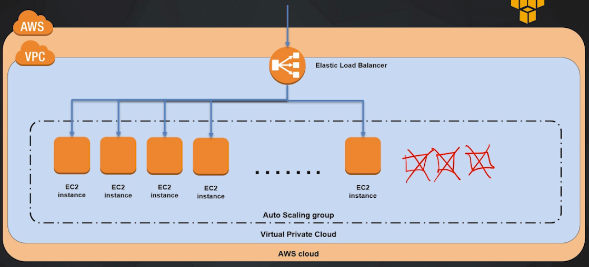
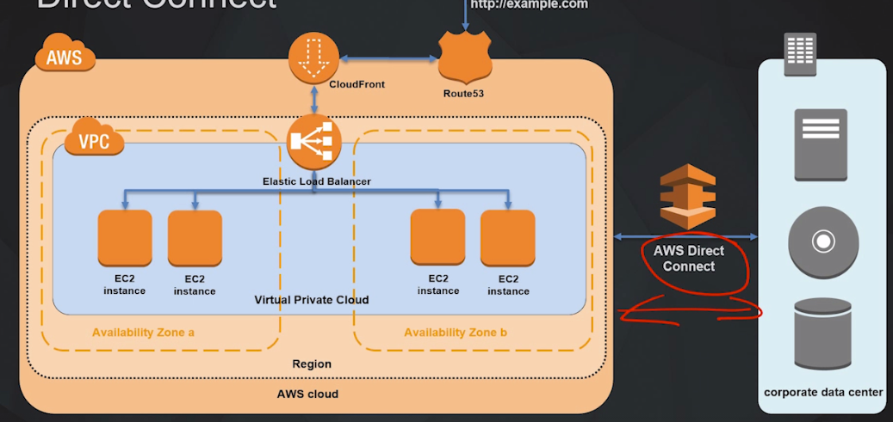

# Computing cases

## Case 1: Webserver

**EC2** instance where our applications are running. Eg. our wordpress

Problem: our single EC2 becomes overwhelmed, and we cannot satisfy the demand

Solution: 

*Vertical Scaling*: Tear down our instance, and pull up a bigger instance (more RAM/CPU). But this solution takes time to implement, and in the meantime our application will not be running. Also when the demand goes down we have to tear this down and have this problem again. 

*Horizontal Scaling*: adding more instances as demand goes up, and terminate them as demand goes down again. We will still have continuity of our application, it will never go down. 

Problem here is that we will have multiple endpoints for our webserver > not practical. 

To have one single endpoint for the user to access our application through, and to distribute the request between the available EC2 instances:

**Elastic Load Balancer**: Receives traffic from our end users, distributes that traffic to available EC2 instance. Balances the load to the instances, and if one of the instances becomes unhealthy it will file a health check against the ELB, and the ELB will know that it can no longer send traffic to that instance.

**Auto Scaling Service**: Launched EC2 instances automatically when the demand increases, and decrease instances when the demand goes down. It also performs health checks, and if an instance becomes unhealthy it can replace it with a healthy instance in a transparent way.

## Case 2: Networking

The above example is within in a single availability zone. If it goes down, our application goes down.
It is desirable to have our architecture distributed across multiple availability zones.

1. Launch EC2 instances in multiple availability zones
2. Have ELB distribute the traffic between the AZ
3. If one AZ goes down the ELB redirects traffic to the healthy AZ

Problem: we have some static content, and it's not efficient for us to continue delivering it from our EC2 instances. 

**CloudFront distribution**: Delivers frequently accessed content with High speed and low latency, and takes the load off the EC2 instances. It caches and distributes content across hundreds of edge locations. It also reduces significantly our cost. Request for dynamic content will be forwarded to the EC2 instances.

The CDN will have its own domain name at which we can access it from our web browsers, but this DN will be hard to write and remember. 

**Route 53**: Domain name service. Let's us link a custom domain name and forward it to our CDN. 

Our company keeps its data in its own corporate data center, because they want to reduce latency between the office where the employees work and the data storages.
But we also have resources in our AWS cloud that we want our employees to have high speed access to.

**AWS Direct Connect**: High speed fiber optic network from our data center to our AWS cloud. 
