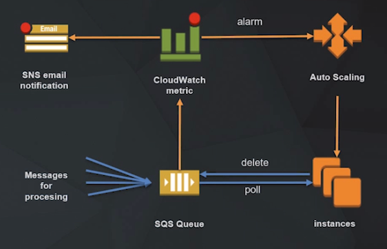

# Integration Cases

## Case 1: Process Decoupling

Integration services can be used to decouple our application from it's demand. 

We have an application running on an autoscaling group of EC2 instances. The application is a process server: Processes messages as they come in, each message have data (images, videos, encrypted messages, etc) that need to be processes.

As the demand increases then the autoscaling group will add more instances to cope with this increasing demand. 

Problem: If the increase occurs in a very short period of time (<1min) the autoscaling group wont be able to cope, because it takes 5-10 minutes for instances to launch and be up and running.

Solution:
**SQS Queue**: If the average demand exceeds processing capacity, queue can hold this messages and grow indefinitely until an instance is available to attend to the message.

This way we decouple our demand from our application. If spikes comes in our application can handle it.

Problem: If we have a whole heap of unhealthy instances (or maybe we made an faulty update to our application), and all of the sudden our capacity cannot be met, our SQS Queue will grow indefinitely.

Solution: We can set up a **CloudWatch metric** that will alert us with an **SNS email notification** that our SQS Queue is continuing to grow and that we need to look into this. It can also alert the **Auto Scaling** group that the SQS Queue is increasing, and action it to increase the EC2 instances. 

Again, when the queue is empty, cloudwatch can send a metric to the auto scaling group to reduce of number of instances so that we are not waisting those resources.