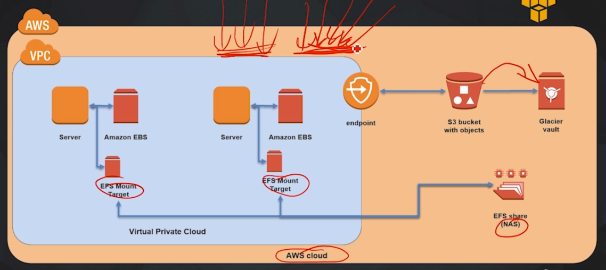
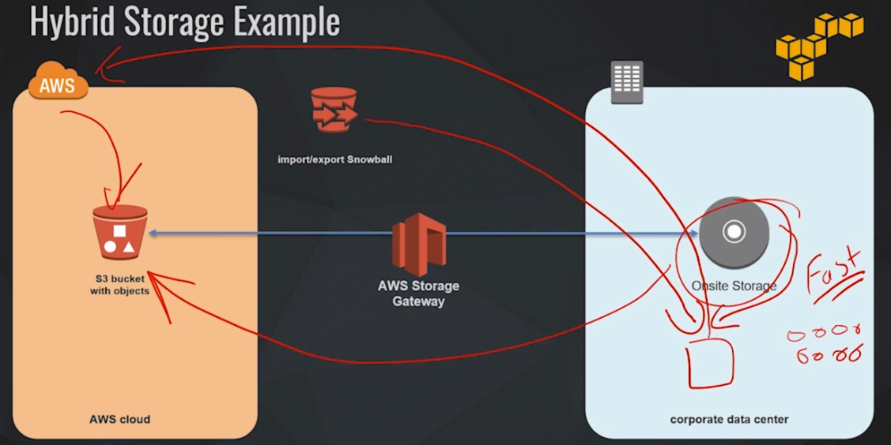
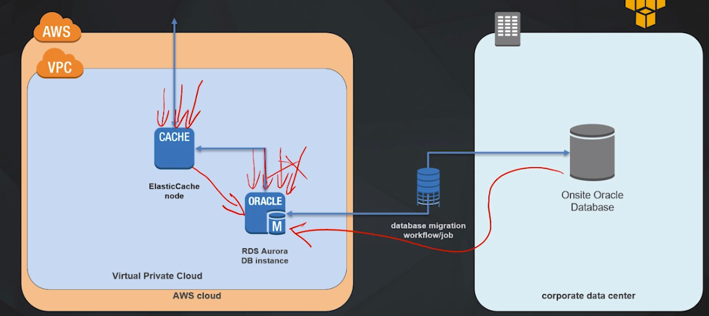

# Storage cases

## Case 1: Simple storage

**AWS** (orange): Amazon Web Services Cloud

**VPC** (blue): Virtual Private Cloud - our own private space within our aws cloud. Makes data and everything inside secure from the outside.

**EBS** (Elastic Block Storage): Storage devices attached to the Servers

**EFS** (Elastic File System): NAS: Network Attached Storage. To share data between both servers. 

Each server will have a EFS Mount Target to connect to EFS. Enables multiple servers to access one single data source.

---

If we want to migrate to a solution that allows us to upload objects too, and has an automated way of eventually migrating data to a lower cost /long term solution.

**S3**: we can store out objects on our buckets, and we can set up a lifecycle rule on that bucket so that when objects age they can be migrated over to **Glacier vault** for archiving. This way we will be using to lower cost storage. 

S3 can not be located inside our VPC. 

**VPC endpoint**: Allows traffic to flow from S3 storage to the VPC.

## Case 2: Hybrid Storage

On-site Storage in a corporate data center + S3 bucket with objects on AWS Cloud

Great for disaster recovery solutions:
- Provides high speed access to our data in a corporate data center
- We also are taking advantage of the availability and durability of AWS S3

Problem: 
How to transfer PB of data stored on-site via the Internet to S3?

Solution:
1. Amazon can send a Snowball device that can store PB of data
2. We upload our data from our on-site storage to this device
3. We send this device back to Amazon
4. Amazon uploads our data directly to our bucket

After that we need to make sure that data from the data center and from S3 stays synced.

Solution:
AWS Storage Gateway orchestrates synchronization between storages:
Gets content frequently accessed, and stores copies of that inside the On-site Storage AND on S3

## Case 3: Database

We have an on-site Oracle RDBMS, and we want to migrate to Amazon Aurora.

1. Launch an RDS instance on our VPC
2. Use a database migration service to migrate the data 

Problem: Our RDS becomes overwhelmed with requests for frequently accessed data, we would like a high speed way of accessing this data

Solution: ElastiCache: we can put an ElastiCache node in front of our RDS instance, and this will cache our frequently accessed data.
This delivers the data from memory with very low latency, and the load on our database will be massively reduced. 
Every request that cannot be found on ElastiCache will be forwarded to the RDS instance.

