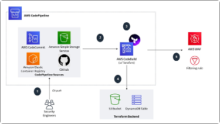

# Plataforma IoT

> Trabajo final curso Cloud Architect - Digital House

Esta plataforma IOT servirá para tomar mediciones de consumo energético en fábricas y a partir de las métricas que toman los sensores generar una base de datos explotable y tableros analíticos que sean útiles para monitoreo y la toma de decisiones. 

El objetivo final es optimizar el consumo energético en las fábricas.

## Terraform

La plataforma esta construida utilizando practicas :wqde IaC. 

- buildspec.yml - YAML file used to build terraform project with CodeBuild in an EC2 instance

**Root module.** 

Terraform files exist in the root directory of the repository. This is the primary entrypoint for the module. 

- main.tf - Main entrypoint. Call modules, locals and data-sources to create all resources
- variables.tf - contains declarations of variables used in main.tf
- outputs.tf - contains outputs from the resources created in main.tf

**Nested modules.** 

Nested modules should exist under the modules/ subdirectory. Nested modules are used to split complex behavior into multiple small modules that users can carefully pick and choose.

- Network
- Lakeformation
- Glue Crawlers
- Docker devices
- ECS cluster

### CI/CD para deployar y configurar servicios AWS con Terraform

[Guide](https://aws.amazon.com/blogs/security/how-use-ci-cd-deploy-configure-aws-security-services-terraform/)

